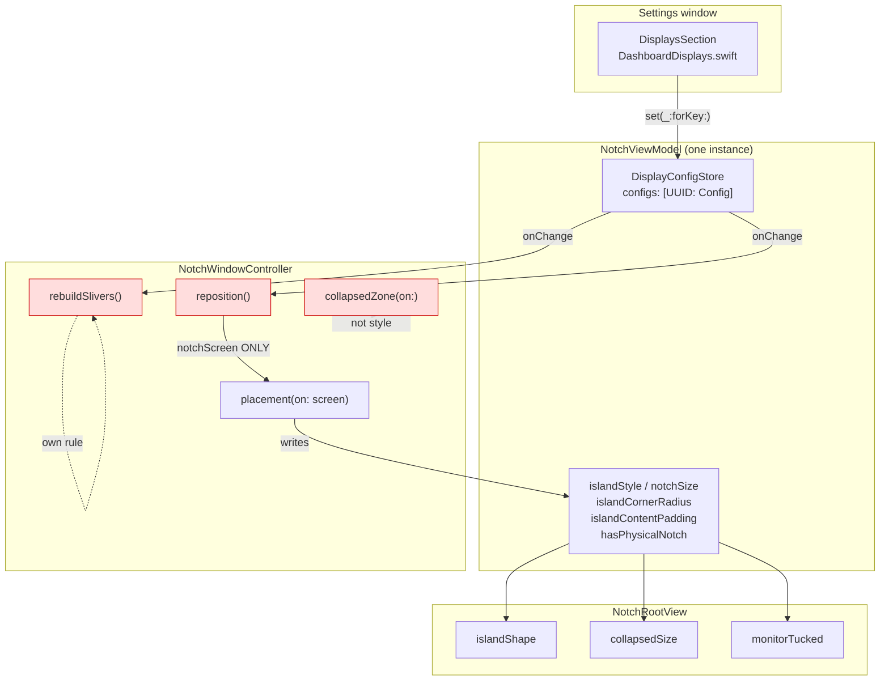
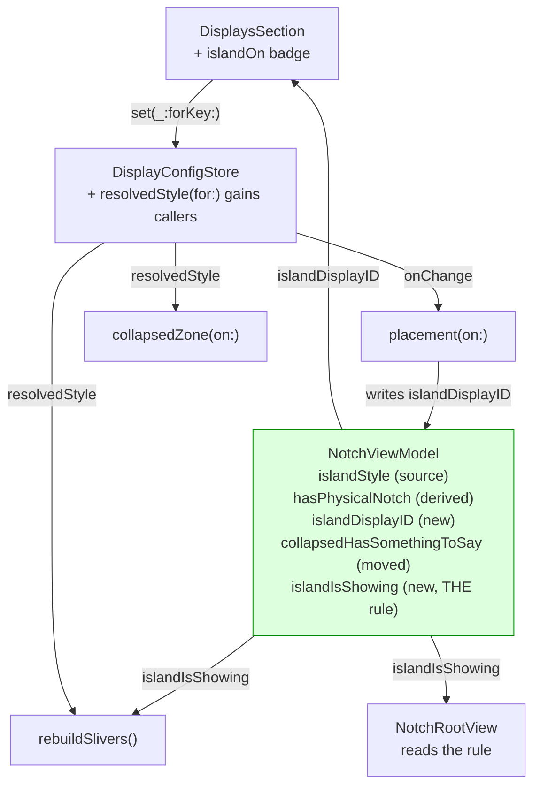
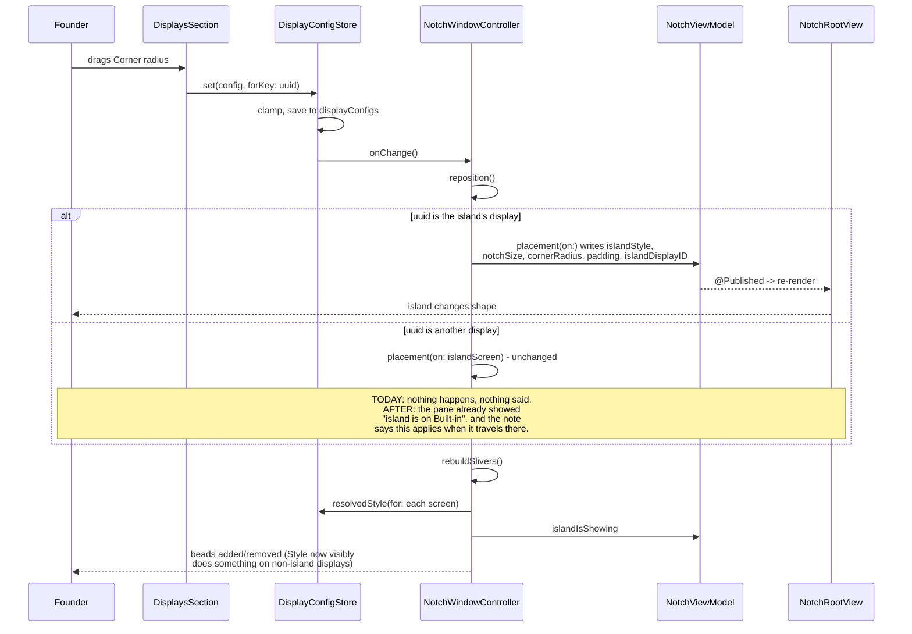
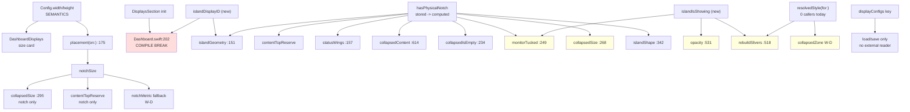

# Plan: Displays pane edits reach the island, and the collapsed island stops drawing twice

INNER-loop step 4 (architect). Input: `displays-not-applying-evidence-2026-08-01.md`.
Method: dependency-graph sub-skill, then edge-case-deep-dive sub-skill.
Status: **PLAN ONLY. No product code was modified.**

Everything below is cited to `file:line` against the tree at
`feat/island-sessions-displays` @ `4d6ccff`. Where I could not settle a
question by reading, I say so and give the experiment.

---

## Summary

Two defects, one seam. The seam is "what shape does this display wear, and
who gets to say so".

**D1** is not one bug, it is three, and only one of the evidence doc's two
hypotheses survives reading the code:

- **H1 (writes never land): REFUTED.** The write path is whole. The `{}`
  observed in defaults is the footprint of the pane's own Reset button, which
  is the only code path that can persist an empty map.
- **H2 (writes land, but the island is on one display): CONFIRMED.** The pane
  presents four displays as equals; `reposition()` only ever re-places the one
  the island is on. Editing any other display is correct, stored, and
  invisible, with nothing on screen saying why.
- **A third fault the evidence flagged as "unexplained": CONFIRMED, and it is
  the largest.** Width and Height write `viewModel.notchSize`, which on a
  **pill** display is read by nothing. The pane's own note tells the user to
  "Choose Pill to set a size by hand" - the one mode where those two sliders
  are inert. This exactly reproduces evidence fact 6, down to the observed
  40pt shape.

**D2** is the classic "two rules for one fact": the bead asks
`state != .collapsed || glanceToast != nil`, the island asks
`collapsedHasSomethingToSay`. Any state satisfying the second but not the
first draws both. Reading also turned up a **third** rule for the same fact -
the hover door is sized from hardware while the island is drawn from style -
which strands the island on a display set to Off.

## Goals

1. Every control in the Displays pane either changes something visible or
   says why it cannot.
2. The pane says which display the island is on, honestly, given it can only
   be on one.
3. One rule decides "is the island drawing on this display right now", read by
   the island, the bead, and (optionally) the hover door.
4. Configs already on disk keep working with no migration.

## Non-goals

- An island on more than one display at once. Out of scope and dishonest to
  imply; the plan's UX is built on the single-island fact.
- Reworking the collapsed pill's content rules, the layout store, or travel.
- New settings. Nothing here adds a stored key or a `Codable` field.

## Success criteria

- Moving any visible slider on the island's own display changes the island
  within one frame, seen on screen (not inferred from tests).
- Editing a non-island display never leaves the founder guessing: the pane
  names where the island is and what will happen to that edit.
- On a notchless display with music playing and no toast, exactly one shape
  is on the menu bar line. Photographed.
- `xcodebuild test` stays green: 173 today, 173 + new.

---

## D1 root cause

### H1 - "the pane's writes never reach the store": REFUTED

One store, shared, correctly keyed, with `onChange` wired:

| Link | Citation | Finding |
|---|---|---|
| Only non-test instantiation | `Chalant/NotchViewModel.swift:249` | `let displays = DisplayConfigStore()`. `grep 'DisplayConfigStore('` returns this and `ChalantTests/SessionStoreTests.swift:926` only. |
| The pane gets that instance | `Chalant/Views/Dashboard.swift:202` | `DisplaysSection(displays: model.displays)` |
| That model is the island's | `Chalant/ChalantApp.swift:214,217` | `guard let model = notchController?.viewModel`, then `DashboardWindowController(model: model)`. The settings window and the island share one `NotchViewModel`, therefore one `DisplayConfigStore`. |
| The binding writes | `Chalant/Views/DashboardDisplays.swift:172-183` | `displays.set(config, forKey: screen.id)` |
| The key cannot be nil here | `Chalant/Views/DashboardDisplays.swift:15, 210-213` | `Attached.id` is a non-optional `String`, produced by `compactMap` over `DisplayConfigStore.key(for:)`; nil-UUID screens are dropped before a row exists. So the `guard let key` at `Chalant/Features/DisplayConfigStore.swift:146` cannot fail from this call site. |
| The write persists and notifies | `Chalant/Features/DisplayConfigStore.swift:150-152` | `configs[key] = config.clamped; save(); onChange?()` |
| `onChange` is live | `Chalant/NotchWindowController.swift:305-308` | `reposition()` + `rebuildSlivers()` |
| Reader uses the same key function | `Chalant/Features/DisplayConfigStore.swift:115-117` vs `:211` of the pane | Both go through `DisplayConfigStore.key(for:)`. There is no second key. |

**So what wrote `{}`?** `save()` is called from exactly two places:
`set(_:forKey:)` at `DisplayConfigStore.swift:151` and `reset(forKey:)` at
`:164`. `set` can only ever grow the map. `load()`'s failure path *removes*
the key (`:181`), it does not write an empty blob. Therefore an on-disk `{}`
proves `save()` ran with an empty `configs`, which proves `reset(forKey:)` was
the last write - the pane's own "Reset this display" button,
`DashboardDisplays.swift:152-154`.

That is positive evidence the write path **works**, not that it is broken.

**What I cannot settle from code:** the order the founder pressed things in. I
do not need to - the fix does not depend on it - but the experiment that
settles it is one line, and it is in the verification plan below.

### H2 - "writes land but the island is on one display": CONFIRMED

- `reposition()` re-places on `notchScreen` and nothing else:
  `Chalant/NotchWindowController.swift:431`, then `:447` `placement(on: screen)`.
- `placement(on:)` reads exactly one screen's config:
  `Chalant/NotchWindowController.swift:164` `viewModel.displays.config(for: screen)`.
- `notchScreen` is travel-or-home, `Chalant/NotchWindowController.swift:478-484`;
  `homeScreen` is the first screen with a safe-area inset, `:473-476`. On this
  Mac that is the Built-in Retina, matching evidence fact 2.
- The pane renders all four screens identically and marks only `· main`:
  `Chalant/Views/DashboardDisplays.swift:40-44, 65-95, 80`. Nothing says where
  the island is.

Editing DELL or P2718EC therefore writes correctly, applies correctly, and is
invisible until the island travels there. **Severity: silent-nothing.**

### The third fault - Width and Height are inert in Pill style: CONFIRMED

This is what evidence fact 6 was seeing, and it is the biggest of the three.

1. Width/Height feed `viewModel.notchSize`:
   `Chalant/NotchWindowController.swift:175` then `:188`.
2. `notchSize` has exactly two render consumers (`grep notchSize`):
   - `Chalant/Views/NotchRootView.swift:294-297`, inside `collapsedSize`,
     reachable **only** when `model.hasPhysicalNotch` is true, because
     `:268` `if !model.hasPhysicalNotch` returns first.
   - `Chalant/NotchViewModel.swift:275` `contentTopReserve`, gated on
     `hasPhysicalNotch`.
3. `hasPhysicalNotch` is set to `style == .notch`:
   `Chalant/NotchWindowController.swift:171`.

So when the resolved style is `.pill` - which is what `.auto` becomes on every
notchless display (`Chalant/Features/DisplayConfigStore.swift:130-133`) and
what the founder forced in fact 6 - **`notchSize` is read by nothing.** The
collapsed size comes instead from `Chalant/Views/NotchRootView.swift:268-281`:

- nothing to say: `120 x 14` sliver (`:275`)
- something to say: `monitorContentWidth + 40 + 12*grow` by `18 + 10*grow`
  (`:277-280`), and `monitorContentWidth` is `0` when nothing is playing
  (`:215-225`).

That is a **40 x 18** shape. The evidence recorded "a small rounded shape
roughly 40pt wide". The numbers agree exactly.

**And the pane points the user straight at the broken mode.**
`Chalant/Views/DashboardDisplays.swift:123-127`:

> "This display has its own notch, so Chalant measures it rather than guessing.
> **Choose Pill to set a size by hand.**"

That last sentence is false today. In `.notch` style on a display with no
hardware notch, the measured-value override at
`Chalant/NotchWindowController.swift:179-187` does not fire (its
`screen.safeAreaInsets.top > 0` guard fails), `notchSize` keeps the configured
values, `hasPhysicalNotch` is true, and `collapsedSize` uses them. **Notch is
the mode where the size sliders work. Pill is the mode where they do not.**

### Control-by-control verdict

| Control | Applies? | Where | Note |
|---|---|---|---|
| Style | Yes | `NotchRootView.swift:317, 531`, `NotchViewModel.swift:570` | Works. |
| Width | **Only in Notch style** | `NotchWindowController.swift:175,188` -> `NotchRootView.swift:295` | Inert in Pill, which the pane recommends. |
| Height | **Only in Notch style** | same | same |
| Corner radius | Yes | `NotchRootView.swift:320-321` (pill), `:353` (notch) | Works in both. |
| Inner padding | Yes, expanded only | `ExpandedView.swift:86, 92` | Collapsed island ignores it, correctly. |

All five apply **only to the display the island is on**, per H2.

---

## D2 root cause

### Rule A - the bead's

`Chalant/NotchWindowController.swift:518-523`:

```
let showingContent = viewModel.state != .collapsed || viewModel.glanceToast != nil
let contentID = showingContent ? notchScreen?.displayID : nil
let targets = wantsEdge ? NSScreen.screens.filter {
    $0.safeAreaInsets.top == 0 && $0.displayID != contentID
} : []
```

### Rule B - the island's

`Chalant/Views/NotchRootView.swift:248-256` and `:259-262`:

```
monitorTucked  = !hasPhysicalNotch && state == .collapsed && !collapsedHasSomethingToSay
collapsedHasSomethingToSay = glanceToast != nil || leftWingNeed > 0
                           || notchSideNeed > 0
                           || (ambience.active != nil && !playing)
```

Rule B is strictly weaker than the negation of Rule A. Every state where
`collapsedHasSomethingToSay` is true and `glanceToast` is nil draws **both**:

| Trigger | Citation |
|---|---|
| music playing, wave signal | `leftWingNeed` 28, `NotchRootView.swift:148` |
| a focus/timer/stopwatch session | `leftWingNeed` 26, `:150` |
| an agent session running | `notchSideNeed` 44, `:180` via `:203` |
| a next event | `notchSideNeed` 112+, `:186-189` |
| battery glance on | `notchSideNeed` 44, `:191` |
| ambience with no music | `:261` |

Confirmed by reading; matches the evidence's photographed overlap.

### Rule C - the door's (not previously named)

The hover door is sized from **hardware**, `Chalant/NotchWindowController.swift:833`
(`guard screen.safeAreaInsets.top > 0`), while the island is drawn from
**style**. Three consequences, all reachable from the pane the founder is
editing:

- **External display set to Notch.** Island draws an emulated notch of
  `config.width - 8` (`NotchRootView.swift:295`), but the door is the 116pt
  bead room (`NotchWindowController.swift:834-838`). At width 420 the island's
  ends do not open it. **silent-nothing.**
- **MacBook set to Pill.** Island draws ~40pt; door is
  `notch.width + 116` = 312pt (`:845-849`). Uninvited blooms - the exact
  failure the comment at `:829-832` exists to prevent.
- **Any display set to Off.** Island is `opacity 0` (`NotchRootView.swift:531`)
  but the bead still draws (Rule A only tests hardware) and the door still
  exists. Hovering it travels the island there
  (`NotchWindowController.swift:599-601`), then `expand()` refuses
  (`NotchViewModel.swift:570`), so `state` never changes, so the walk-home
  timer at `:799-811` never arms. **The island is stranded on a display it
  will not appear on.** silent-nothing.

### A latent fourth copy

`collapsedSize` branches on `hasPhysicalNotch` (`NotchRootView.swift:268`)
while `islandShape` branches on `islandStyle` (`:317`). They agree only
because of the single assignment at `NotchWindowController.swift:171`. Two
consequences worth naming:

- `NotchRootView.swift:334-350` (the sliver-shape and compact-pill-shape
  branches) is **unreachable in any visible state**: reaching `:329` requires
  `islandStyle != .pill`; `.notch` forces `hasPhysicalNotch` true so both
  guards fail; `.off` reaches them but renders at opacity 0.
- The two defaults **contradict each other**: `islandStyle` defaults to
  `.notch` (`NotchViewModel.swift:256`) while `hasPhysicalNotch` defaults to
  `false` (`:245`). Only the fact that `placement(on:)` runs at
  `NotchWindowController.swift:238` before the hosting view is built at `:264`
  keeps that from rendering.

---

## Architecture

### Component view - the settings-change path today



Red = a place that decides something it should be reading.

### Component view - after



### Sequence - a slider moves



---

## Dependency graph

### Touch set

1. `DashboardDisplays.settings(for:)` size card + notes
2. `DisplaysSection` init signature (gains `islandOn:`)
3. `NotchViewModel.islandDisplayID` (new `@Published`)
4. `NotchViewModel.collapsedHasSomethingToSay` (moved in, with
   `leftWingNeed` / `notchSideNeed` / `collapsedWidth` / `winningCollapsedItem` /
   `agentGlance` / `upcomingEvent` / `sessionActive` / `sessionOnRight` /
   `showsSongBeside`)
5. `NotchViewModel.islandIsShowing` (new, THE rule)
6. `NotchViewModel.hasPhysicalNotch`: stored `@Published` -> computed from
   `islandStyle`
7. `NotchWindowController.islandGeometry`
8. `NotchWindowController.rebuildSlivers()` predicate + target filter
9. `NotchWindowController.wearsBead(...)` (new static, testable)
10. `NotchWindowController.collapsedZone(on:)` + `notchMetric(of:)` (W-D only)
11. `NotchRootView.monitorTucked` / `collapsedIsEmpty` / dead shape branches
12. `DisplayConfigStore.resolvedStyle(for:)` - **currently zero callers**,
    gains two

No persisted key changes. No `Codable` field changes.



### Consumer table

| # | Consumer | Reached via | What changes | Class |
|---|---|---|---|---|
| 1 | `Dashboard.swift:202` | direct call | `DisplaysSection` gains `islandOn:` | **compile break** (safe) |
| 2 | `NotchViewModel.swift:275` `contentTopReserve` | `hasPhysicalNotch` | stored -> computed, same value | none (identity) |
| 3 | `NotchRootView.swift:157` `statusWings` | `hasPhysicalNotch` | same value | none |
| 4 | `NotchRootView.swift:614` `collapsedContent` | `hasPhysicalNotch` | same value | none |
| 5 | `NotchRootView.swift:234` `collapsedIsEmpty` | rewritten onto the shared rule | identical truth table (`.off` is opacity-0 either way) | **silent** - verify visually |
| 6 | `NotchRootView.swift:249` `monitorTucked` | replaced by `islandIsShowing` | **intended** change: no longer disagrees with the bead | **silent** - this IS D2 |
| 7 | `NotchRootView.swift:268` `collapsedSize` | `hasPhysicalNotch` -> `islandStyle == .pill` | `.off` now takes the notch-size branch at opacity 0 | **silent**, invisible |
| 8 | `NotchRootView.swift:334-350` | deleted (unreachable) | none visible | none |
| 9 | `NotchRootView.swift:531` opacity | `.off \|\| monitorTucked` -> `islandIsShowing` | same truth table | **silent** - verify visually |
| 10 | `NotchWindowController.swift:518-523` `rebuildSlivers` | new predicate + style filter | beads leave `.off` and emulated-notch displays; a MacBook forced to Pill **gains** one | **silent** - founder decision, see Open Questions |
| 11 | `NotchWindowController.swift:151-157` `islandGeometry` | drop `hasPhysicalNotch` (now derived from `islandStyle`, already listed), add `islandDisplayID` | repaint check stays complete, per its own comment at `:148-150` | none |
| 12 | `NotchWindowController.swift:825-864` door (W-D) | style-shaped | `.off` gets no door; emulated notch gets a notch-sized door | **silent** - fixes stranding |
| 13 | `DisplayConfigStore.resolvedStyle(for:)` `:135` | gains 2 callers | was dead code | none |
| 14 | `pointerMoved()` `:565` | gains one `rebuildSlivers()` call | bead answer stays live for music/timer/session/event/battery | **silent** + a small cost, see EC-11 |
| 15 | `displayConfigs` defaults key | `load`/`save` only | unchanged | none |
| 16 | `migrateFromMoai` `ChalantApp.swift:228-254` | wholesale domain copy, could carry a `displayConfigs` from `com.cj.plum/cove/moai` | unchanged; runs at `:40`, **before** the store is constructed at `:69`, so a migrated blob is loaded not missed | none - verified ordering |
| 17 | out-of-process | `grep displayConfigs scripts/ .claude/` | **no hits.** `scripts/{chalant,chalant-hook,dev,devlog}` never read island geometry | none |
| 18 | `ChalantTests/SessionStoreTests.swift:895-928` | `Config.clamped`, JSON round trip, unreadable-blob drop | untouched by this plan | none |

### The silent-behaviour-change list (input to the edge-case pass)

#5, #6, #7, #9, #10, #12, #14.

---

## Edge cases and failure modes

| # | Edge case | State that reaches it | Severity | Handling |
|---|---|---|---|---|
| EC-1 | Editing a display the island is not on does nothing, silently | four displays attached, island on Built-in, founder edits DELL | **silent-nothing** (the reported bug) | **W-B.** Badge the island's row; a note says the edit applies when the island travels there. No code change to `reposition()` - the single-island fact stands. |
| EC-2 | Width/Height inert in Pill | any notchless display, default `.auto` -> pill | **silent-nothing** | **W-A.** Hide the two sliders in Pill and say a pill sizes itself; point at Notch for a hand-set size. Delete the false sentence at `DashboardDisplays.swift:126`. |
| EC-3 | Bead and island both draw | collapsed, no toast, music/timer/agent/event/battery/ambience | **silent-wrong** (D2) | **W-C.** One rule, `islandIsShowing`, read by both. |
| EC-4 | Island stranded on an Off display | founder sets a display Off, later hovers its top edge | **silent-nothing** | **W-D.** `.off` gets no door and no bead. Without W-D, W-C still removes the bead, which removes the *invitation*; the invisible door remains. |
| EC-5 | Emulated-notch island wider than its door | external display set to Notch, width > ~310 | **silent-nothing** | **W-D.** `notchMetric(of:)` falls back to the stored config instead of the static `defaultNotchSize` (`NotchWindowController.swift:858`). |
| EC-6 | MacBook set to Pill, 312pt invisible door for a 40pt island | founder forces Pill on the built-in | **silent-wrong** (uninvited bloom) | **W-D.** Door follows resolved style. |
| EC-7 | Display unplugged mid-edit | founder dragging a slider when a cable pops | silent-wrong (next drag writes to a different screen) | Already handled at `DashboardDisplays.swift:222-224`; the checkmark visibly moves in the same frame. **Deferred**, reason: the pane redraws the list and the selection, so it is not silent. |
| EC-8 | Island on a display that reports no UUID | a monitor/adapter that will not report one | **silent-nothing** - the pane lists 3 rows, the island is on the invisible 4th, every edit inert | **W-B fallback.** `refresh()` already drops such screens (`:210-211`). When `islandOn` matches no row, show one note: "The island is on a display that cannot be remembered." One `if`, no new state. |
| EC-9 | Config stored for a display no longer attached | monitor unplugged | none - by design | `configs` is keyed by UUID precisely so it survives (`DisplayConfigStore.swift:92-99`). Never pruned; bounded by displays ever owned. No change. |
| EC-10 | Unclamped values from disk | hand-edited defaults, or a future range change | handled | `clamped` applies on read (`:123`) **and** write (`:150`); test exists at `SessionStoreTests.swift:893-900`. No change. |
| EC-11 | `rebuildSlivers()` at 20 Hz resolves a UUID per screen | always, once W-C adds the poll call | cosmetic (cost) | 4 displays x 20 Hz = 80 `CGDisplayCreateUUIDFromDisplayID` calls/sec, local CoreGraphics, next to a poll that already walks `NSScreen.screens` with `collapsedZone` per screen (`:578-580`) and does a pasteboard IPC round trip twice a second (`:652-654`). Signature guard at `:529` means no panel churn. Leave a `ponytail:` comment naming the ceiling: cache the key on the store if it ever shows. |
| EC-12 | Bead answer goes stale | music starts while collapsed; today nothing re-runs `rebuildSlivers()` | **silent-wrong** - would make the D2 fix *look* fixed only sometimes | The poll call in EC-11 exists for exactly this. Without it W-C is half a fix. The alternative - eight Combine sinks on music/timer/focus/stopwatch/sessions/events/stats/ambience - is over-building. |
| EC-13 | Existing config on disk (`{}` right now) | today's machine | none | `load()` decodes `{}` to an empty map; every display gets `Config()`. No repair, no migration. |
| EC-14 | Downgrade to an older build | founder reverts | none | No schema change. Older build reads the same blob. |
| EC-15 | `islandDisplayID` stale during a reposition retry | screen list briefly empty at wake/lid (`:432-435`) | cosmetic, <= 1s | Badge may point at a gone display for one retry tick. **Deferred**, reason: self-heals on the next retry, and the pane is rarely open at wake. |
| EC-16 | Every display set to Off | founder switches all of them off | loud-wrong (nothing on screen) | Already survivable: the menu bar status item (`ChalantApp.swift:128-193`), the `openSettings` hotkey (`:98-100`), and reopen (`:205-209`) all still reach the pane. Name it in the Off style note so it is a choice, not a trap. |
| EC-17 | Two writers of `configs` | pane slider + a second settings window | none | `DisplayConfigStore` is `@MainActor`; `DashboardWindowController` is memoised at `ChalantApp.swift:217`. One window, one store. |
| EC-18 | Slider drag = one save + one reposition per tick | any drag | cosmetic | ~20 JSON encodes and 20 `placement()` calls per drag. Already true today; W-C adds the bead recompute, which is the signature guard again. **Deferred**, reason: no observed cost, and a debounce is machinery this does not need yet. |

**Deliberately deferred:** EC-7 (visible, not silent), EC-15 (self-heals in
1s), EC-18 (no measured cost). Everything in silent-wrong or silent-nothing is
handled by a workstream above.

---

## Exact change list

Four workstreams. **W-A, W-B, W-C are independent** and can be executed in any
order by different hands. **W-D depends on nothing but is the most
behaviour-visible**; the founder can drop it without breaking the others.

### W-A - the pane stops lying about size (D1, ~10 lines, one file)

**File:** `Chalant/Views/DashboardDisplays.swift`

1. `:119-137` - replace the single `resolved == .notch, screen.hasHardwareNotch`
   branch with three honest cases:
   - `.notch` + hardware notch -> keep the note at `:124-127` but **delete the
     sentence "Choose Pill to set a size by hand."** It is false
     (`NotchWindowController.swift:171` -> `NotchRootView.swift:268`).
   - `.notch` + no hardware notch -> keep both sliders unchanged. They work.
   - `.pill` -> no sliders; one `SettingNote`: a pill hugs what it is showing,
     so it sizes itself; choose Notch to set a size by hand.
2. Comment, house style, citing the failure it prevents: the Width and Height
   sliders write `notchSize`, which only the notch path reads, so offering them
   under Pill was a control that could not move anything.

Why this and not "make Width work for pills": `Config.width` defaults to 196
(`DisplayConfigStore.swift:50`) while today's monitor pill is 40pt wide
(`NotchRootView.swift:278`). Any wiring of one to the other resizes every
existing monitor pill by 5x the moment a user touches *any* slider, because
`config(forKey:)` cannot distinguish "stored 196" from "defaulted 196"
(`:123`). That is a visual regression traded for a control nobody asked for.
See Open Question 1 - the founder may want it anyway.

### W-B - the pane says where the island is (D1/H2, ~20 lines, three files)

**File:** `Chalant/NotchViewModel.swift`

3. After `:245`, add:
   ```swift
   /// Which display the island is dressing right now. The pane lists
   /// every attached screen as an equal, and the island can only be on
   /// one: without this, editing any other display was a correct write
   /// with no visible effect and nothing saying why (2026-08-01).
   @Published private(set) var islandDisplayID: CGDirectDisplayID?
   ```
   `private(set)` with a `fileprivate`/internal setter is not available across
   files - make it internal `@Published var` and note in the doc comment that
   `placement(on:)` is its only writer, matching how `notchSize` is documented
   at `:228-230`.

**File:** `Chalant/NotchWindowController.swift`

4. `:171` area - add `viewModel.islandDisplayID = screen.displayID` alongside
   the other four writes. One line, in the one place a screen becomes island
   geometry.
5. `:151-157` `islandGeometry` - add `viewModel.islandDisplayID`. The comment
   at `:148-150` demands it: a per-display value left out of the repaint check
   fails silently and looks like the setting doing nothing.

**File:** `Chalant/Views/Dashboard.swift`

6. `:202` - `DisplaysSection(displays: model.displays, islandOn: model.islandDisplayID)`.
   `DashboardView` already holds `@ObservedObject var model` (`:151`), so the
   badge updates live when the island travels.

**File:** `Chalant/Views/DashboardDisplays.swift`

7. `:11` - add `let islandOn: CGDirectDisplayID?`.
8. `:14-20` - add `let hasIsland: Bool` to `Attached`.
9. `:210-219` - in `refresh()`, `hasIsland: screen.displayID == islandOn`.
   The `NSScreen` is already in hand there.
10. `:80` - extend the caption. It already composes `· main`; add `· island here`.
11. `:39-48` - after the picker card, one `SettingNote`: the island lives on one
    display at a time; hover another display's top edge to bring it over, and
    it walks home when it closes. That is the shipped behaviour
    (`NotchWindowController.swift:578-606`, `:799-811`) - the note only tells
    the truth, it adds no code.
12. EC-8 fallback: if `islandOn != nil` and no row has `hasIsland`, add a second
    `SettingNote` saying the island is on a display that cannot be remembered.
    One `if`.

### W-C - one rule for "is the island drawing here" (D2, ~60 lines moved, 20 deleted)

**File:** `Chalant/NotchViewModel.swift`

13. Move these from `NotchRootView` verbatim, adjusting `model.` -> `self.` and
    `@AppStorage("x")` -> `UserDefaults.standard.object(forKey: "x") as? Bool ?? d`
    (the pattern already used at `NotchWindowController.swift:136, 508` and
    `NotchViewModel.swift:601, 635, 647`):
    `sessionActive` (`NotchRootView.swift:113`), `sessionOnRight` (`:118`),
    `showsSongBeside` (`:133`), `agentGlance` (`:74`), `upcomingEvent` (`:62`),
    `leftWingNeed` (`:147`), `winningCollapsedItem` (`:168`),
    `collapsedWidth(_:)` (`:176`), `notchSideNeed` (`:197`),
    `collapsedHasSomethingToSay` (`:259`).
    Every input is already a `let` on the model (`:184-204`) or a defaults key.
14. Add the one rule:
    ```swift
    /// The island is putting pixels on this display right now.
    ///
    /// One answer, read by the island's own opacity and by the bead. They
    /// used to carry a rule each - the bead asked "collapsed with no
    /// toast", the island asked "nothing to say" - so a collapsed island
    /// with a song playing drew its pill AND the bead on the same
    /// display (2026-08-01).
    var islandIsShowing: Bool {
        switch islandStyle {
        case .off: return false
        // A notch island dresses hardware; it is drawn whether or not it
        // has anything to say. .auto never reaches here, placement()
        // resolves it, but the switch has to be whole.
        case .auto, .notch: return true
        case .pill: return state != .collapsed || collapsedHasSomethingToSay
        }
    }
    ```
15. `:245` - `hasPhysicalNotch` becomes
    `var hasPhysicalNotch: Bool { islandStyle == .notch }`, deleting the stored
    `@Published`. It derives from a `@Published`, so observers still re-render.
    This also removes the contradiction between its `false` default and
    `islandStyle`'s `.notch` default (`:256`).

**File:** `Chalant/NotchWindowController.swift`

16. `:171` - delete `viewModel.hasPhysicalNotch = style == .notch` (now derived).
17. `:153` - drop `viewModel.hasPhysicalNotch` from `islandGeometry`;
    `viewModel.islandStyle` at `:154` already covers it.
18. New static beside `sliverRoom` (`:501`), mirroring
    `DashboardWindowController.isOnScreen(_:screens:)`, which is the house
    precedent for screen logic that must be checkable with nothing plugged in:
    ```swift
    /// Whether a display wears a resting bead. Static and screen-free so
    /// the rule can be checked without a monitor attached.
    static func wearsBead(
        style: DisplayConfigStore.Style,
        isIslandDisplay: Bool,
        islandShowing: Bool
    ) -> Bool {
        style == .pill && !(isIslandDisplay && islandShowing)
    }
    ```
19. `:518-523` - rewrite the target computation:
    ```swift
    let showing = viewModel.islandIsShowing
    let islandID = notchScreen?.displayID
    let targets = wantsEdge ? NSScreen.screens.filter {
        Self.wearsBead(
            style: viewModel.displays.resolvedStyle(for: $0),
            isIslandDisplay: $0.displayID == islandID,
            islandShowing: showing
        )
    } : []
    ```
    This is the first caller of `DisplayConfigStore.resolvedStyle(for:)`
    (`:135`), which has had zero until now.
20. `:565` `pointerMoved()` - after the `guard let screen = notchScreen`, add
    `rebuildSlivers()` with a `ponytail:` comment naming EC-11's ceiling. This
    is what keeps the answer live when music starts or a timer finishes;
    without it W-C is half a fix (EC-12).

**File:** `Chalant/Views/NotchRootView.swift`

21. Delete the moved members (`:62, 74, 113, 118, 133, 147, 168, 176, 197, 259`)
    and read `model.` versions instead at `:157-160, 234, 687, 792-816`.
    **Keep the `@AppStorage` declarations at `:28-37`** - they are what makes
    the island re-render when a glance switch flips, and the model reads the
    same defaults. Add a one-line comment saying so, or a coder will delete
    them as unused and silently break live updates.
22. `:233-235` `collapsedIsEmpty` ->
    `model.islandStyle == .pill && !model.collapsedHasSomethingToSay`.
23. `:248-256` - delete `monitorTucked` entirely.
24. `:531` - `.opacity(model.islandIsShowing ? 1 : 0)`. Two conditions collapse
    into the one rule.
25. `:268` `collapsedSize` - `if model.islandStyle == .pill` instead of
    `if !model.hasPhysicalNotch`. `.off` moves to the notch-size branch at
    opacity 0; invisible either way.
26. `:334-350` - **delete.** Unreachable in every visible state (proof in the
    D2 section). `if model.state == .collapsed` falls straight through to the
    notch shape at `:351`.

### W-D - the door matches the shape (optional, ~15 lines, one file)

**File:** `Chalant/NotchWindowController.swift`

27. `:825-850` `collapsedZone(on:)` - branch on
    `viewModel.displays.resolvedStyle(for: screen)` rather than
    `screen.safeAreaInsets.top`:
    - `.off` -> `.null`. Every caller guards on `contains` first
      (`:579-581, 595-596, 804`), and `CGRect.null.contains` is false by
      definition; `publishPointerUnit` (`:768-778`) divides by `zone.width`
      only after its own `contains` guard. No caller change needed.
    - `.pill` -> today's bead-room door (`:834-838`).
    - `.notch` -> today's notch door (`:845-849`).
28. `:854-864` `notchMetric(of:)` - the notchless fallback returns the stored
    config's size instead of the static `NotchViewModel.defaultNotchSize`
    (`:858`), so an emulated notch's door matches the emulated notch's width.
    Comment cites EC-5: at 420pt the island's own ends did not open it.

---

## Test plan

House style: tests never construct `NotchViewModel` - they exercise pure
statics and injectable stores (`NotchViewModel.redactedForLog`,
`NotchViewModel.isAvailable(_:in:)`,
`DashboardWindowController.isOnScreen(_:screens:)`,
`DisplayConfigStore(defaults:)`). New tests follow that, in
`ChalantTests/SessionStoreTests.swift` beside the existing display block at
`:890-929`.

| # | Test | Workstream | What it catches |
|---|---|---|---|
| T1 | `testABeadYieldsOnlyToAnIslandThatIsActuallyDrawing` | W-C | The D2 regression itself. `wearsBead(style: .pill, isIslandDisplay: true, islandShowing: true)` false; `islandShowing: false` **true**; and the island's own display with `islandShowing: true` never appears. This is the exact case that shipped wrong. |
| T2 | `testOnlyPillDisplaysWearABead` | W-C | `wearsBead(style: .off, ...)` and `wearsBead(style: .notch, ...)` are false for every combination. Catches EC-4 and the emulated-notch overlap regressing. |
| T3 | `testResolveTurnsAutoIntoTheHardwaresShape` | W-C | `DisplayConfigStore.resolve(.auto, hasHardwareNotch:)` both ways, and that an explicit `.notch`/`.pill`/`.off` is never overridden. `resolve` had zero direct tests despite being the whole of "detect the display". |
| T4 | `testAStoredConfigSurvivesAResetOfADifferentDisplay` | W-B | `DisplayConfigStore(defaults:)` with two keys; `reset(forKey: a)` leaves `b`. Locks the write/reset semantics that produced the `{}` this investigation started from, and proves `set` and `reset` do not fight. |
| T5 | `testWritingOneDisplayNeverTouchesAnother` | W-B | `set` for key A does not alter key B's stored `Config` after a round trip through defaults. The H2 invariant, in code. |
| T6 | `testAnEmptyStoredMapIsReadAsDefaultsNotAFailure` | none (EC-13) | Writes `Data("{}".utf8)` under `displayConfigs`, constructs the store, asserts `configs.isEmpty` **and** the key is still present (unlike the unreadable-blob path at `:920-928`, which removes it). Locks in that today's on-disk state is not treated as corruption. |

**Not tested, deliberately:** `islandIsShowing` and `collapsedHasSomethingToSay`
as instance properties - constructing a `NotchViewModel` spins up
`MusicController`, `VoiceController`, `EventKitService`, `ActivityServer` and
`SessionStore`, which is a permission-prompting, IO-touching object no test in
this repo builds. `wearsBead` is the boundary where the rule becomes checkable,
which is why it is a static. Say so in its doc comment.

**Command:** `xcodebuild -scheme Chalant -destination 'platform=macOS' test`.
Baseline is 173 (61 + 11 + 95 + 6 across the four test files).

---

## Verification plan - what must be SEEN

Tests cannot see any of this. `./scripts/dev` builds, kills, and relaunches;
`screencapture -D <n>` captures a numbered display. `osascript` is blocked in
this environment (see the session memory note), so drive the app with
`open -a` and the `com.cj.chalant.debug.submit` distributed notification
(`NotchViewModel.swift:327-331`), never with synthetic clicks.

**Display numbering for `screencapture -D`:** 1-4 in the order CoreGraphics
reports; the evidence table maps them. Confirm by capturing all four once.

### V0 - settle H1 for good (2 minutes, do this first)

Before any code change: `defaults delete com.cj.chalant displayConfigs`,
relaunch, move **one** slider on **one** display, then
`defaults read com.cj.chalant displayConfigs`. A populated blob confirms the
refutation; `{}` refutes my reading and the plan needs revisiting before W-A.
This is the one thing in the plan I could not prove by reading alone.

### V1 - W-A, the pane no longer offers a dead control

1. `./scripts/dev`, then `debug settings displays`.
2. Select an external display. Style **Pill**: capture. **Expected:** no Width
   or Height sliders; a note saying a pill sizes itself.
3. Style **Notch**: capture. **Expected:** both sliders present.
4. Drag Width to maximum with the island on that display. Capture that display.
   **Expected:** the emulated notch is visibly wider. This is the first time
   Width has ever been seen to do anything.

### V2 - W-B, the pane says where the island is

5. `debug settings displays`, capture. **Expected:** exactly one row reads
   `· island here`, and it is the Built-in.
6. Hover the top edge of a DELL until the island travels there, then capture
   the settings window again. **Expected:** the badge moved, live, without
   reopening the pane.

### V3 - W-C, one shape on the menu bar line (the D2 proof)

7. Island on a notchless display, collapsed, **music playing**, no toast.
   `screencapture -D <that display>`. **Expected:** exactly one shape. This is
   the photograph that closes D2; today it shows two.
8. Repeat with a running timer instead of music, and with an agent session in
   `needsInput`. Same expectation. Three captures, because three different
   inputs reach `collapsedHasSomethingToSay` by three different paths.
9. Stop the music and capture again. **Expected:** the bead returns, alone.
   This proves the poll call at step 20 keeps the answer live - without it,
   step 9 shows nothing at all until an unrelated event fires.
10. Set that display to **Off** and capture. **Expected:** nothing on its menu
    bar line. Today a bead remains.
11. Capture the Built-in with the island collapsed. **Expected:** unchanged
    notch island. Regression guard on the `hasPhysicalNotch` derivation.

### V4 - W-D, the door matches the shape

12. External display set to **Notch**, Width at maximum. Move the pointer to
    the far left end of the visible emulated notch. **Expected:** it opens.
    Today it does not.
13. Display set to **Off**. Sweep its top edge for five seconds, then capture
    every display. **Expected:** the island did not move and nothing appeared
    anywhere. Today the island travels there and vanishes.

### V5 - backward compatibility

14. Before building, save the current `displayConfigs`. After W-A..W-D, restore
    it, relaunch, capture. **Expected:** identical to the pre-change capture for
    every display. No migration ran because there is nothing to migrate.

---

## Open questions for the founder

1. **Should Width and Height work for pills at all, or should the pane just
   stop offering them?** W-A takes the second, because wiring `Config.width`
   (default 196) to the monitor pill (today 40pt) resizes every existing
   monitor island 5x the moment any slider is touched - the store cannot tell
   "stored 196" from "defaulted 196" (`DisplayConfigStore.swift:123`). If you
   want a hand-sizeable pill, say so and the plan grows a way to distinguish
   set-from-default, plus a defaults change, plus a migration. **Default if you
   say nothing: W-A as written.**

2. **A MacBook forced to Pill would gain a bead when the island travels away.**
   W-C's filter is style-shaped, so a built-in display wearing a pill becomes
   bead-eligible. That is arguably right (it is the findable handle the bead
   exists to be, `NotchWindowController.swift:493-500`) but it is new behaviour
   on the one display you look at most. Keep it, or special-case the built-in?
   **Default: keep it.**

3. **Do you want a "move the island here" button in the pane?** W-B only
   *describes* travel; it does not add a way to trigger it from settings.
   Adding one means exposing `travel(to:)` past the controller and deciding
   whether a settings-driven move should walk home like a hover-driven one
   does. That is a real feature, not a bug fix. **Default: no button, just the
   note.**

4. **Is W-D in this round or the next?** It fixes two silent-nothing bugs
   (EC-4, EC-5) and one silent-wrong (EC-6), all reachable from the pane you
   are editing, but it is the most behaviour-visible change here and it touches
   hover, which has field-failed twice before (`:120-124`, `:829-832`).
   **Default: in, as the last workstream, so it can be reverted alone.**

5. **The `{}` currently on disk** is harmless (EC-13) and will be overwritten
   by the first real edit. Leave it, or clear it as part of V0? **Default:
   clear it in V0, since V0 is the experiment that settles H1 anyway.**

---

# FOUNDER DECISIONS (2026-08-01) — orchestrator amendment

Approved. Answers to the open questions, plus one added requirement. These
override anything above that conflicts.

1. **Width/Height in Pill mode: drop the sliders.** Do not build the
   set-vs-default distinction, do not migrate, do not resize existing pills.
   The Size card must not offer a control that nothing reads. Delete the note
   that currently says "Choose Pill to set a size by hand" — it points at the
   one mode where those sliders are inert, which is the exact lie the comment
   above it claims to be avoiding.
   Say plainly instead what governs a pill's size.

2. **W-B, W-C, W-D all in scope this round**, including the hover-door
   workstream. Run V0 before coding.

3. **"Move island here" — yes**, alongside the honest note naming the display
   the island is currently on.

4. **A MacBook forced to Pill keeps the bead** when the island travels away.
   No special case.

5. **NEW REQUIREMENT — clamshell (lid closed, on power, externals only).**
   This is a first-class case, not an edge case, and it is how this machine is
   often used.
   - With the lid shut the built-in leaves `NSScreen.screens` entirely, so
     every remaining screen has `safeAreaInsets.top == 0` and `.auto` resolves
     every one of them to `.pill`. There is no notch anywhere.
   - `notchScreen` must still choose a sensible display, and must never leave
     the island homeless or resolve onto a display the user set to Off. If
     every attached display is Off, that is a real state and must be handled
     deliberately rather than by accident.
   - Opening and closing the lid must be treated like any other display
     change: geometry re-derived, beads rebuilt, no stale frame from the
     display that just left.
   - Verify: the island appears, as a pill, on a sensible external display with
     the lid shut and power connected; and it survives lid open -> shut -> open
     without needing a relaunch.

