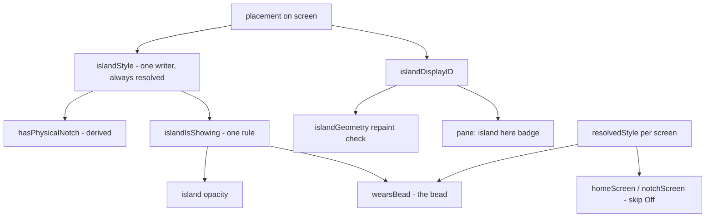

# Summary: the Displays pane did not reach the island

Milestone closed 2026-08-01. Commits `56cd56c` and `7ffcafc` on
`feat/island-sessions-displays`. 178 tests passing, independently run.

## What was actually wrong

The report was "updating anything here is not updating the changes". Three
separate faults sat behind it, and only the second was the one being described.

1. **Width and Height were read by nothing under Pill.** They write
   `notchSize`, whose consumers were gated on `hasPhysicalNotch`, which was set
   to `style == .notch`. So the two controls a pill user reaches for first were
   inert - and the pane's own note pointed them there: "Choose Pill to set a
   size by hand" named the single mode in which it did nothing.
2. **The island dresses one display; the pane presented four as equals.**
   Editing any other display was a correct write with no visible effect, and
   nothing on screen said why.
3. **The collapsed island drew two overlapping shapes.** The bead's "should I
   yield" rule and the island's "should I draw" rule were computed separately.
   One was changed and the other was not, so both drew.

Underneath all three: the same fact stored twice. `hasPhysicalNotch` was a
stored default of `false` for a question `islandStyle` already answered with a
default of `.notch`. They agreed only because `placement(on:)` happens to run
before the first render.

## The shape of the fix

- `islandIsShowing` is the single answer both the island's opacity and the bead
  now read. `monitorTucked` is gone.
- `hasPhysicalNotch` is computed from `islandStyle`. The second default is gone.
- `islandDisplayID` joins the repaint signature - it is the per-display value
  the check was missing.
- `wearsBead(style:isIslandDisplay:islandShowing:)` is static and screen-free,
  so the rule is testable without a monitor attached.
- `homeScreen` and `notchScreen` refuse displays resolved to Off.

## Clamshell

Lid shut on power, the built-in leaves `NSScreen.screens` entirely and every
remaining display resolves to `.pill` - there is no notch anywhere to prefer.
The island must not land on a display set to Off, where it would never draw and
nothing would reach it. If every attached display is Off, that is a real state
rather than an accident: the island still gets a real screen and sits there
invisible instead of going homeless.

Traced, not observed. Confirming it needs a lid physically shut with the app
running.

## Found in review, not in the report

The composer reported the work complete and the tests green, and both were
true. Reading the diff turned up one more, of exactly the class the milestone
existed to remove:

**The "island here" badge would have gone stale the moment it mattered.**
`hasIsland` is baked into `@State` by `refresh()`, which runs on appear and on
screen-parameter changes. The island travelling is neither. So pressing "Move
island here" would move the island and leave the pane showing the badge on the
old display and the button on the new one - a control that works and shows no
evidence of working. Fixed with `.onChange(of: islandOn)`.

Two smaller things worth recording as checked rather than assumed:

- `rebuildSlivers()` now runs at 20 Hz from the pointer poll. That poll is a
  repeating timer, not a movement monitor, so the bead does stay live when
  music starts under a stationary pointer. The signature guard early-returns,
  and `CGDisplayCreateUUIDFromDisplayID` is taken with `takeRetainedValue()`,
  so the hot path neither rebuilds panels nor leaks.
- The deleted `islandShape` branches really were unreachable: `.pill` returns
  before them, `islandStyle` has exactly one writer, and that writer always
  assigns a resolved style, so `.auto` can never arrive.

## Not done

**None of this has been seen on a screen.** The founder was using the machine,
so the app was never relaunched and the composer's V0 check could not run
live. Every claim above is from reading, building and testing. On a branch
whose standing rule is that a visual change is not done until it has been seen,
this milestone is code-complete and unverified, and the original report was a
visual one.
