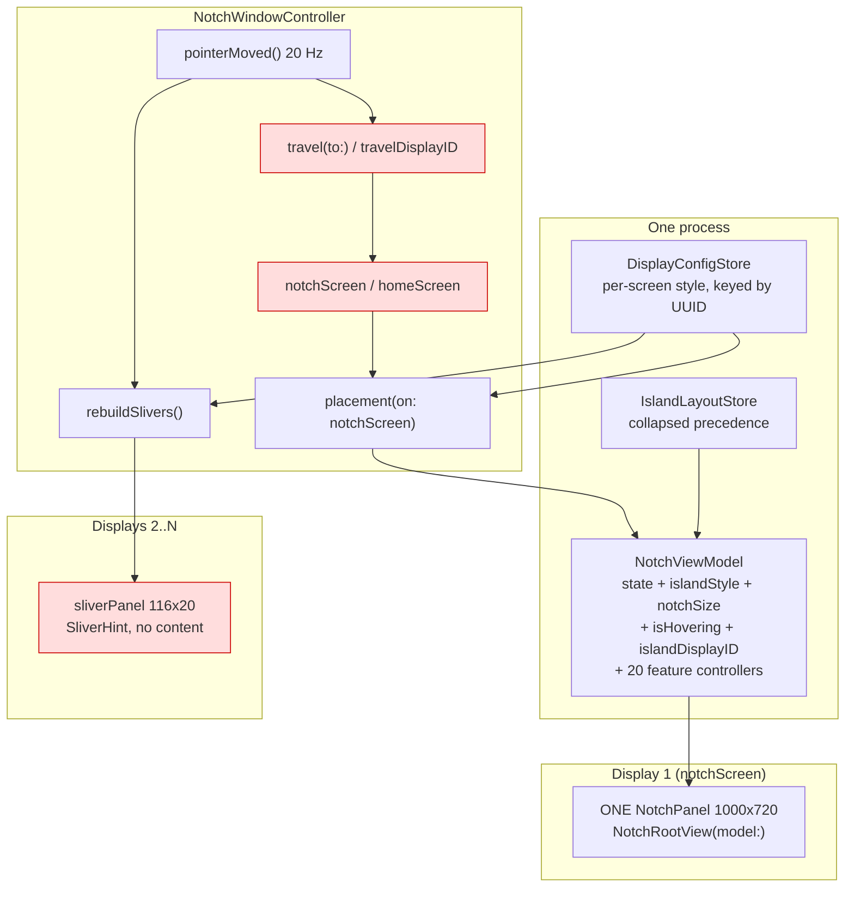
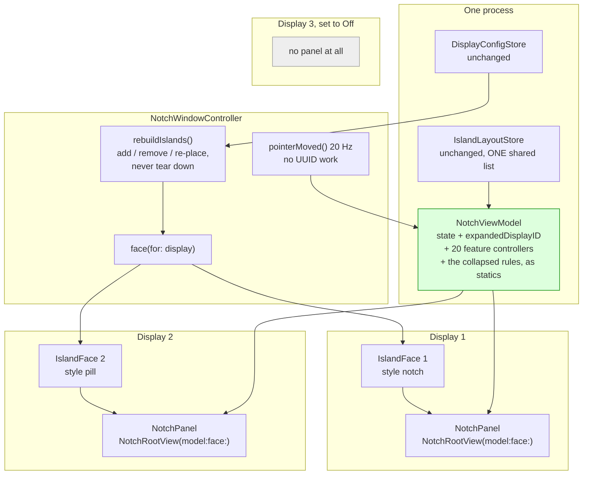
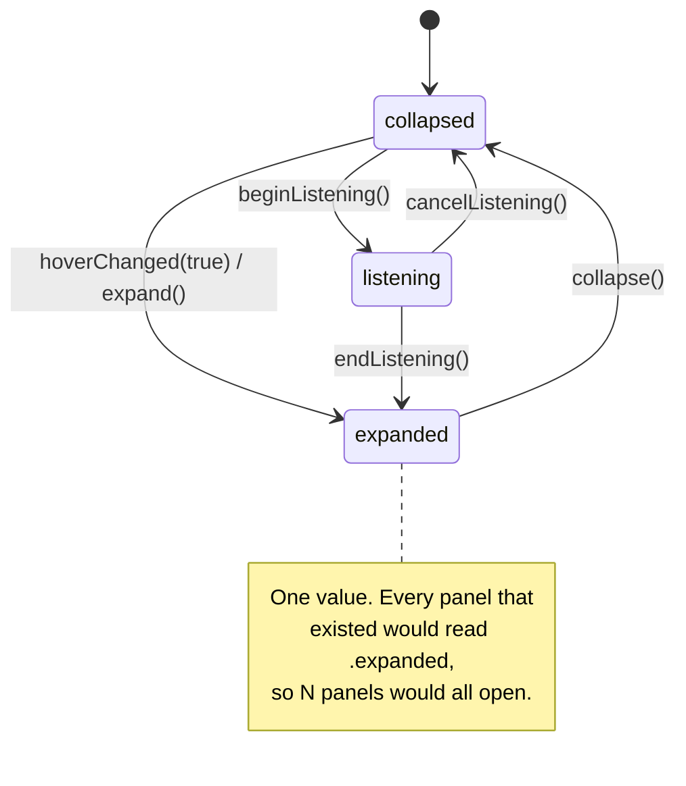
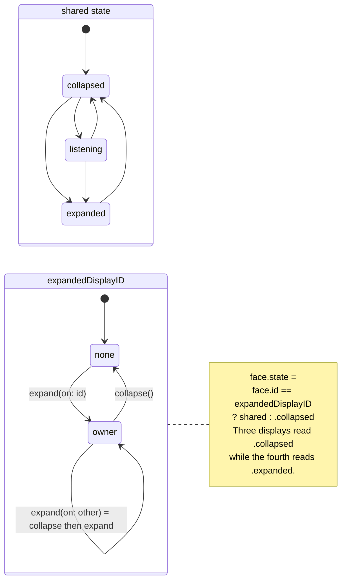

# Plan: an island on every display, each with its own live content

INNER-loop step 4 (architect). Input:
`island-per-display-evidence-2026-08-02.md`.
Method: dependency-graph sub-skill, then edge-case-deep-dive sub-skill.
Status: **PLAN ONLY. No product code was modified. Nothing was launched.**

Everything below is cited to `file:line` against the **working tree** on
`feat/island-sessions-displays`, HEAD `682a77c`, as read at 18:30 on
2026-08-02. Where I could not settle a question by reading, I say so and
give the experiment that would.

**Citation drift, named up front.** The messaging milestone is being
implemented in this same session and is editing four of the files this
plan cites: `NotchViewModel.swift`, `Views/AgentSessions.swift`,
`Views/ExpandedView.swift`, `Features/SessionStore.swift`. In
`NotchViewModel.swift` everything **up to line 500 is exact** (the
collapsed-glance rules, the geometry fields, `islandIsShowing`, which is
all of the crux); **past line 500 the numbers drift** and were between 4
and 16 lines stale within seven minutes of writing this. The **symbol
name is the authority**, not the number. To re-resolve any citation:

```
grep -n "<symbol>" Chalant/NotchViewModel.swift
```

No citation in this plan depends on a line number being right; each one
names what lives there.

The decision is the founder's and is not reopened here. What follows is
how, what it costs, and what has to come out with it.

---

## Summary

The founder's three reports are one architecture and one bug, and they
are separable, which is the most useful thing reading turned up.

**The architecture.** There is one island `NSPanel`
(`NotchWindowController.swift:103`) built once in `show()` (`:228-437`),
placed on `notchScreen` (`:511-523`), and moved between displays by
`travel(to:)` (`:525-530`). Every other display gets a 116x20 bead
(`:540`, `:563-621`) rendering `SliverHint` (`:994-1013`), which draws no
content by construction. "Only one monitor" and "in the middle of
nowhere" both follow from that single fact, exactly as the evidence says.

**The bug, which is not about panels at all.** On a display resolved to
`.pill`, the collapsed island runs a **second, poorer copy** of the
collapsed-content system, and the two copies disagree. The rule that
decides *whether* to draw (`NotchViewModel.collapsedHasSomethingToSay`,
`:448-451`) is computed from the notch system's numbers
(`leftWingNeed`, `notchSideNeed`). The rule that decides *what* to draw
on a pill (`NotchRootView.monitorPill`, `:501-517`) reads a different,
shorter list. They agree by accident and disagree by construction:

- An agent session running, nothing else: `notchSideNeed` is 44
  (`NotchViewModel.swift:444` via `collapsedWidth(.agents)` `:418-419`),
  so `islandIsShowing` is true and the bead yields. `monitorPill` renders
  a `NowPlayingBars` that is not shown, an ambience symbol that is nil, a
  toast that is nil, and a session block that is false. **A 40x18 empty
  black lozenge, and the bead suppressed.** That is the founder's
  photograph of a bead "in the middle of nowhere", except it is not the
  bead, it is the island drawing nothing.
- Music playing with the signal set to Quiet and "What's playing" off:
  `leftWingNeed` is 0 (`:392-401`), `notchSideNeed` is 0, so the island
  hides and the bead returns. But `monitorPill` would have drawn bars.
  Music plays and nothing on that display says so.
- `showsSongBeside` (`:369-384`) is written **specifically for the pill
  case** (`islandStyle == .pill`) and is read at
  `NotchRootView.swift:668` inside `wingsContent`, which
  `collapsedContent` (`:488-498`) only ever reaches when
  `hasPhysicalNotch` is true, which is `islandStyle == .notch`
  (`NotchViewModel.swift:287`). **The song title on a pill is written,
  reachable by no path, and has never rendered.**

So "the collapsed pill should show the Claude session and the Spotify
song" is not blocked by there being one panel. It is blocked by a dead
branch on the panel that already exists, and it can be fixed and
photographed on the founder's own DELL before a single new panel is
built. That is W-A, and it goes first.

**The crux, per the evidence: `NotchViewModel.state` cannot stay one
value.** It also does not have to become a map. The answer reading
supports is smaller than either option the evidence named: `state` stays
one value and gains a companion, `expandedDisplayID`. Only one island can
be open at a time in any case (one keyboard, one `WKWebView`
`ChatController.swift:96`, one `VoiceController`), so "which one" is a
single optional, not a map, and every existing behavioural reader of
`state` keeps working untouched. What genuinely becomes per-display is
the *render* state, and that is a different, smaller set of fields, all
of them already per-display in meaning and singular only because there is
one panel. Section "The crux" below names them and proves the set is
complete.

**What dissolves.** `travel(to:)`, `travelDisplayID`, `notchScreen`,
`homeScreen`, `sliverRoom`, `wearsBead`, `sliverPanels`, `SliverHint`,
`NotchViewModel.islandDisplayID`, `travelToDisplay`, and with them the
"island here" badge and the "Move island here" button shipped in
`7ffcafc`. Those two were the right fix for a world with one travelling
island and are lies in a world without one. They come out in W-E, and
W-E must land with W-C, never before it.

---

## Goals

1. Every display that is not switched Off wears a real island, drawn from
   that display's own resolved style.
2. A resting island on any display shows the same live content the
   built-in one does: the running Claude session, the playing song, the
   timer, the next event, in the precedence order the founder already
   drags in Settings.
3. Hovering one display opens that display's island and no other.
4. Nothing on screen still offers to move an island that no longer moves.
5. No comment in the tree still argues for a constraint its owner has
   withdrawn.
6. 186 tests stay green, and the new rules are checkable without a
   monitor attached.

## Non-goals

- **A per-display collapsed layout.** The content is global state (one
  Spotify, one set of sessions, one calendar), so `IslandLayout.collapsed`
  (`IslandLayout.swift:108`) stays one shared precedence list read by
  every face. Per-display *shape* comes from `DisplayConfigStore`, which
  already does it. Nothing here adds a stored key or a `Codable` field.
- **Drag-and-drop arrangement inside the island (R1).** Out of scope by
  instruction, and correctly so: direct manipulation on a surface that is
  about to become N surfaces needs to know first which surface a drag
  binds to and whether a rearrangement on one display applies to all.
  That question is only askable after W-C. It gets its own round.
- **NotchBox feature parity (R5).** Backlog, not this milestone.
- **Two islands expanded at once.** Refused on evidence, not taste: the
  chat pane hands the same `WKWebView` instance to `makeNSView`
  (`ChatController.swift:273-280`), and an `NSView` cannot be in two view
  hierarchies. See EC-9, which is about this happening *accidentally*
  during a handoff.
- **Making Width and Height work under Pill.** Settled by the founder on
  2026-08-01 and unchanged by this plan.

## Success criteria

Every one of these is a photograph, not a test:

- Four displays attached, three of them notchless. A capture of each
  shows one island, at that display's own resolved style, with the same
  collapsed content. Today three of the four show a bead.
- A Claude session in `needsInput`, nothing else. Every non-Off display
  shows the agent mark. Today the built-in shows it and every monitor
  shows a 40x18 empty lozenge or a bead.
- Spotify playing. Every pill display shows the song title beside the
  bars. Today no display has ever shown it.
- Hover the top edge of display 3. Display 3's island opens. Captures of
  1, 2 and 4 taken during that open show them still collapsed.
- The Displays pane contains no "island here" badge and no "Move island
  here" button, and says nothing about travel.
- `grep -rn "sliverPanel\|SliverHint\|wearsBead\|travelDisplayID\|notchScreen\|homeScreen" Chalant/`
  returns nothing.
- `xcodebuild -scheme Chalant -destination 'platform=macOS' test`: 186
  today, 186 + new, zero removed except the two bead tests W-C makes
  meaningless (named in the test plan).

---

## The crux: what has to become per-display, and what does not

`NotchViewModel` (`NotchViewModel.swift:6`) is already two objects bolted
together, and the seam is clean enough to cut along.

### Group 1: shared, one per app, correctly

The feature stores (`:184-211`), `layout` (`:246`), `displays` (`:243`),
`tab`, `pane`, `draftPrompt`, `answer`, `errorText`, `isWorking`,
`lastHeard`, `pendingContext`, `glanceToast`, `voiceDestination`,
`composingSessionID`, `welcomeStep`, and `state` itself. Every one of
these is a fact about the app, not about a screen. `activityServer`
(`:199`) binds a port; `sessionDiscovery`/`sessionRegistry`/
`cursorDiscovery` (`:205-210`) scan the filesystem; `events` (`:188`)
holds an EventKit authorisation. **Four of these objects is not an
option**, which is why "a view model per panel" is refused below.

### Group 2: per-display, singular only by accident

| Field | Line | Written by | Why it is per-display |
|---|---|---|---|
| `islandStyle` | `:250` | `placement(on:)` `:174` | The whole point. Each screen resolves its own. |
| `notchSize` | `:234` | `placement(on:)` `:198` | Measured from that screen's cutout. |
| `islandCornerRadius` | `:252` | `placement(on:)` `:175` | `DisplayConfigStore.Config.cornerRadius`, per key. |
| `islandContentPadding` | `:254` | `placement(on:)` `:176` | Same. |
| `islandDisplayID` | `:262` | `placement(on:)` `:177` | Becomes the face's identity, not a field. |
| `isHovering` | `:72` | `hoverChanged` | The pointer is on one screen. |
| `pointerUnit` | `:142` | `publishPointerUnit` `:835` | Same. |
| `isDropTargeted` | `:82` | `hosting.onTargeted` `:277` | A drag is over one panel. |
| `dragExpanded` | `:137` | `onDragEntered` `:283` | Same. |

That table is the complete write set of `placement(on:)` plus the
complete write set of hover and drag. There is nothing else: `grep` for
assignments to `viewModel.` in `NotchWindowController.swift` returns
`islandStyle`, `islandCornerRadius`, `islandContentPadding`,
`islandDisplayID`, `notchSize`, `pointerUnit`, `isDropTargeted`,
`dragExpanded`, and the closures on `onExpandChange`,
`displays.onChange`, `travelToDisplay`, `onDebugDropDock`.

### The three options, and why the third wins

**Option A: N `NotchViewModel`s.** Refused. Four `ActivityServer`s
fighting for one port (`:199`, started at `:501`), four filesystem
scanners, four EventKit prompts, four `MusicController`s polling. Also
every mutation site in the app (`model.tab = tab`,
`ChalantApp.swift:121`; `model.submit`, `:739`) would have to pick one of
four. Not a trade, a wall.

**Option B: `state` becomes `[CGDirectDisplayID: IslandState]`.** Refused
as more diff than the problem needs. There are around 26 `model.state` /
`viewModel.state` / `self.state` reads across four files (fifteen of them
in `NotchRootView` alone), and **most of the rest are behavioural, not
per-display**: the click monitor
(`NotchWindowController.swift:347`), the hotkey
(`ChalantApp.swift:85-93`), the hover-collapse guards
(`NotchViewModel.scheduleHoverCollapse` and `scheduleVoiceCollapse`),
`beginListening`, `receiveDrop`, `showWelcomeIfFirstRun` (`:99`, exact).
Every one of those means "the island, wherever it is" and would have to
grow a display argument it has nothing to do with.

**Option C, recommended: `state` stays; `expandedDisplayID` joins it;
group 2 moves to a per-panel `IslandFace`.**

```swift
/// Which display's island is open, when one is.
///
/// `state` stays one value because only one island can ever be open:
/// there is one keyboard, one WKWebView (ChatController.swift:96) and
/// one VoiceController. What was missing was not a second state, it
/// was WHICH display the one state applies to - without it, hovering
/// one display expanded all of them, because every face read the same
/// `state` (2026-08-02).
@Published private(set) var expandedDisplayID: CGDirectDisplayID?

/// What a given face should render as. The one function that turns a
/// global state into a per-display one.
static func state(
    _ shared: IslandState,
    expandedOn: CGDirectDisplayID?,
    face: CGDirectDisplayID?
) -> IslandState {
    guard let face, face == expandedOn else { return .collapsed }
    return shared
}
```

and a small per-panel object holding group 2:

```swift
/// One display's island: everything about how it is drawn here, and
/// nothing about what the app is doing. The shared half stays on
/// NotchViewModel, which is one object because the things on it
/// (an HTTP server, a filesystem scanner, an EventKit grant) can only
/// be one (2026-08-02).
@MainActor
final class IslandFace: ObservableObject {
    let displayID: CGDirectDisplayID
    unowned let model: NotchViewModel

    @Published var style: DisplayConfigStore.Style = .pill
    @Published var notchSize = NotchViewModel.defaultNotchSize
    @Published var cornerRadius: CGFloat = Theme.Island.radiusCollapsed
    @Published var contentPadding: CGFloat = Theme.Space.xl
    @Published var isHovering = false
    @Published var pointerUnit: CGFloat?
    @Published var isDropTargeted = false
    var dragExpanded = false

    var state: NotchViewModel.IslandState {
        NotchViewModel.state(
            model.state, expandedOn: model.expandedDisplayID, face: displayID
        )
    }
    var hasPhysicalNotch: Bool { style == .notch }
    var contentTopReserve: CGFloat { hasPhysicalNotch ? notchSize.height : Theme.Space.m }
}
```

**Why the derived rules stay statics on `NotchViewModel`, not methods on
`IslandFace`.** `IslandFace` holds `unowned let model`, so it cannot be
constructed in a test without building a `NotchViewModel`, which spins up
the port-binding, permission-prompting object no test in this repo
builds. The house has already solved this once: `wearsBead`
(`NotchWindowController.swift:550-556`),
`DashboardWindowController.isOnScreen` (`Dashboard.swift:140-145`) and
`NotchViewModel.isAvailable` are statics precisely so the
rule is checkable with nothing plugged in. Every rule this plan adds
follows that, and every rule this plan moves keeps it.

**Observation still works.** `NotchRootView` already `@ObservedObject`s
twelve controllers directly in its `init` (`NotchRootView.swift:54-67`),
which is why `model.collapsedHasSomethingToSay` re-evaluates when a song
starts even though `NotchViewModel` never republishes for it. Adding
`@ObservedObject var face: IslandFace` changes nothing about that; it
adds one more publisher for the four geometry fields that used to
republish through `model`.

---

## The withdrawn constraint, comment by comment

The rule is: **a comment that argues for a position its owner abandoned
is worse than no comment**, because the next reader treats it as a
constraint and re-derives the bug. Every site below rests on "we cannot
show anything on external monitors" (user, 2026-07-22).

| # | Site | What it asserts | Verdict |
|---|---|---|---|
| 1 | `NotchRootView.swift:118-121` `monitorMiddleWidth` | "The monitor pill exists only for a passing toast now." | **The live remnant.** This is not a comment, it is the code: it returns 148 for a toast and 0 for everything else, which is why a session, an event and the charge cannot appear on a pill. **Deleted in W-A.** |
| 2 | `NotchRootView.swift:109-113` | "On a monitor there is no hardware to mimic, so the pill hugs its content exactly... Song titles do not ride the middle here; they were width without value." | Last sentence is withdrawn; the first is still true. **Rewrite in W-A.** |
| 3 | `NotchRootView.swift:501-517` `monitorPill` | The whole second content system. | **Deleted in W-A.** |
| 4 | `NotchRootView.swift:130-141` `collapsedIsEmpty` | Already says the rule became a choice on 2026-08-01. | Accurate. Keep, retarget from `model` to `face`. |
| 5 | `NotchRootView.swift:688-691` `wingsContent` | "gating this meant the toast, the session mark, the next event and the charge were all invisible on an external display." | Already withdrawn and correct. Keep. |
| 6 | `NotchViewModel.swift:369-377` `showsSongBeside` | "This reverses an earlier call... Both objections were about a screen pretending to be a MacBook." | Already withdrawn. The gate (`islandStyle == .pill`) is **not** the withdrawn constraint, it is a layout fact: a real notch has hardware in the middle. Keep the gate, trim the paragraph to one sentence in W-F. |
| 7 | `NotchWindowController.swift:532-540` `sliverRoom` | "Resting hints on every display the island is not dressing... The sliver is a handle, never a display." | **Deleted with the beads in W-C.** |
| 8 | `NotchWindowController.swift:994-1001` `SliverHint` | "pure hint, no content." | **Deleted in W-C.** |
| 9 | `NotchWindowController.swift:543-556` `wearsBead` | The whole bead rule. | **Deleted in W-C.** |
| 10 | `NotchWindowController.swift:487-509` `homeScreen` | "The island rests on the notched display." | **Deleted in W-D.** |
| 11 | `NotchWindowController.swift:906-913` `collapsedZone` `.pill` | "The door is exactly the bead's room." | Survives as a rule (a small door is still the right door on a pill), but its justification must stop citing the bead. **Reworded in W-D.** |
| 12 | `Components.swift:216-221` `MarqueeText` | "on an external display the sliver is narrow enough that a name spends most of its journey behind the edge fade" | This is about the *sliver*, which is going away, but the underlying call (glide off by default) was the user's on 2026-07-28 and is not withdrawn. **Reword only**, keep the default, in W-F. |
| 13 | `NotchViewModel.swift:437-444` `notchSideNeed` | "every one of them stretched the pill past the hardware (user, 2026-07-23, 'it should not be too wide on the Mac')" | About the **Mac's own** notch, not monitors. Not withdrawn. Keep. |

Sites 1 and 3 are code, not prose, and they are what W-A exists to
delete. The rest is W-F.

---

## Architecture

### Component, today



Red = dissolves.

### Component, after



### State, today: one value, read by every view



### State, after: one value plus an owner



### Sequence: the pointer crosses to a second display

```mermaid
sequenceDiagram
    participant U as Pointer
    participant C as NotchWindowController
    participant M as NotchViewModel
    participant FA as IslandFace A (open)
    participant FB as IslandFace B

    U->>C: mouseLocation lands in B's collapsedZone
    C->>C: hit = B; faces[A].isHovering = false
    C->>FB: isHovering = true
    Note over C: openDwell (0.18s default) work item
    C->>C: still in B's zone?
    C->>M: expand(on: B)
    M->>M: expandedDisplayID != nil, so collapse() first
    M-->>FA: state -> .collapsed (ExpandedView unmounts)
    Note over M: one run-loop turn, so the shared<br/>WKWebView is released before it<br/>is claimed again (EC-9)
    M->>M: expandedDisplayID = B; state = .expanded
    M-->>FB: state -> .expanded (ExpandedView mounts)
    M->>C: onExpandChange(true)
    C->>C: panels[B].makeKeyAndOrderFront(nil)
```

---

## Dependency graph

### Touch set

1. `NotchViewModel.state` semantics (unchanged value, new companion)
2. `NotchViewModel.expandedDisplayID` (new)
3. `NotchViewModel.state(_:expandedOn:face:)` (new static, THE rule)
4. `NotchViewModel.expand(takeKey:)` -> `expand(on:takeKey:)`
5. `NotchViewModel.collapse()` (clears the owner)
6. `NotchViewModel.hoverChanged(_:)` -> `hoverChanged(_:on:)`
7. Group-2 fields move off `NotchViewModel` to `IslandFace` (nine fields)
8. `NotchViewModel.hasPhysicalNotch` / `contentTopReserve` move to `IslandFace`
9. `NotchViewModel.showsSongBeside` / `leftWingNeed` / `notchSideNeed` /
   `collapsedHasSomethingToSay` / `islandIsShowing` gain a style-and-state
   argument, backed by statics
10. `NotchViewModel.collapsedWidth(_:)` gains a style argument (W-A)
11. `NotchViewModel.islandDisplayID` (deleted)
12. `NotchViewModel.travelToDisplay` (deleted)
13. `NotchWindowController.panel` -> `panels: [CGDirectDisplayID: NotchPanel]`
14. `NotchWindowController.faces: [CGDirectDisplayID: IslandFace]`
15. `NotchWindowController.placement(on:)` -> `apply(_ screen:to face:) -> NSRect`
16. `NotchWindowController.islandGeometry` -> per face
17. `rebuildSlivers` -> `rebuildIslands` (shape reused, body replaced)
18. `sliverRoom` / `wearsBead` / `sliverPanels` / `sliverSignature` /
    `SliverHint` (deleted)
19. `travel(to:)` / `travelDisplayID` / `notchScreen` / `homeScreen` (deleted)
20. `pointerMoved()` (hit becomes owner, no travel, no 20 Hz UUID work)
21. `stateChanged(_:)` (no walk-home)
22. `collapsedZone(on:)` (unchanged logic, reworded)
23. `NotchRootView` gains `face:`, loses the monitor system
24. `ExpandedView` reads `face.contentPadding` / `face.contentTopReserve`
25. `DisplaysSection` loses `islandOn` and `onTravel`
26. `Dashboard.swift:202-206` (compile break)

```mermaid
graph TD
    T1["expandedDisplayID + state(_:expandedOn:face:)"] --> C1["NotchRootView 15 state reads"]
    T1 --> C2["ExpandedView.islandWidth"]
    T1 --> C3["expand / collapse / hoverChanged"]
    T1 --> C4["showsSongBeside :382"]

    T2["IslandFace: 9 fields moved"] --> C5["placement(on:) writes"]
    T2 --> C6["islandGeometry :157"]
    T2 --> C7["NotchRootView collapsedSize / islandShape / opacity"]
    T2 --> C8["ExpandedView :86 :87"]
    T2 --> C9["contentTopReserve, 3 read sites"]

    T3["monitorPill system deleted"] --> C10["collapsedContent :488"]
    T3 --> C11["collapsedSize pill branch :150"]
    T3 --> C12["sessionCompact :529"]

    T4["rebuildIslands"] --> C13["show() :436"]
    T4 --> C14["screen-params observer :391"]
    T4 --> C15["wake observers :415"]
    T4 --> C16["defaults observer :402"]
    T4 --> C17["toast sub :433"]
    T4 --> C18["stateChanged :854"]
    T4 --> C19["pointerMoved :633 DELETED"]

    T5["travel / notchScreen / homeScreen deleted"] --> C20["pointerMoved :624 :666"]
    T5 --> C21["stateChanged :866-878 walk home"]
    T5 --> C22["onDebugDropDock :330"]
    T5 --> C23["show() :241"]
    T5 --> C24["reposition() :451 :460"]

    T6["islandDisplayID + travelToDisplay deleted"] --> C25["Dashboard.swift:202 COMPILE BREAK"]
    T6 --> C26["DashboardDisplays islandOn/onTravel/hasIsland"]

    style C25 fill:#fdd
    style C19 fill:#dfd
    style C7 fill:#ffd
    style C10 fill:#ffd
    style C21 fill:#ffd
    style C4 fill:#ffd
```



### Consumer table

Every consumer of the touch set, classified. **Compile break** = the
compiler stops you. **Silent** = it builds and behaves differently.

| # | Consumer | Reached via | What changes | Class |
|---|---|---|---|---|
| 1 | `Dashboard.swift:202-206` | direct call | `DisplaysSection` loses two arguments | **compile break** (safe) |
| 2 | `DashboardDisplays.swift:17,22,31,61,86,132,145-175,305` | fields and body | badge, note, button, `hasIsland`, `onChange(of: islandOn)` all deleted | **compile break** for the fields, **silent** for the deleted card. W-E |
| 3 | `NotchRootView.swift` 15 `model.state` reads (`:187,200,211,306,310,325,335,342,368,395,420,422,438,456,464,470`) | `model.state` -> `face.state` | three displays now read `.collapsed` where they would have read `.expanded` | **compile break** if `state` is removed from the model; it is not, so **this is the one place that must be swept by hand.** See W-B risk. |
| 4 | `ExpandedView.swift:47` `model.tab == .chat && model.pane == .none && chatFull` | unchanged | only the owner mounts it | none |
| 5 | `ExpandedView.swift:86` `model.islandContentPadding` | -> `face.contentPadding` | per-display padding finally applies | **compile break** (field moved) |
| 6 | `ExpandedView.swift:87` `model.contentTopReserve` | -> `face.contentTopReserve` | same | **compile break** |
| 7 | `NotchViewModel.swift:382` `showsSongBeside` reads `state` | -> takes state | on a non-owner face, `state` is `.collapsed`, which is what it wants | **silent**, and correct |
| 8 | `NotchViewModel.swift:99` `showWelcomeIfFirstRun` | `state == .collapsed` | still means "the island, wherever" | none |
| 9 | `NotchViewModel` collapse guards: `scheduleHoverCollapse`, `scheduleVoiceCollapse`, the `debug listen` verb | `state == .expanded` | same | none |
| 10 | `NotchViewModel.beginListening` | `state == .collapsed` | same, but must set an owner. See EC-11 | **silent** |
| 11 | `ChalantApp.swift:85-93` toggle hotkey | `model.state` | `expand()` with no display: must pick one. See EC-12 | **silent** |
| 12 | `ChalantApp.swift:121-122` per-tab hotkeys | `model.expand()` | same | **silent** |
| 13 | `NotchWindowController.swift:284-291` drag open/close | `viewModel.state` + `expand(takeKey:)` | each panel's closure carries its own display | **compile break** (signature) |
| 14 | `NotchWindowController.swift:347-350` click monitor | `viewModel.state` | unchanged: a click anywhere closes whatever is open | none |
| 15 | `NotchWindowController.swift:300-304` `onExpandChange` | `panel?.makeKeyAndOrderFront` | must key **the owner's** panel | **silent-wrong if missed**: the wrong window takes focus and typing goes nowhere |
| 16 | `NotchWindowController.swift:330` `onDebugDropDock` | `self.notchScreen` | -> the owner's screen, or `NSScreen.main` | **compile break** |
| 17 | `NotchWindowController.swift:315-318` `displays.onChange` | `reposition()` + `rebuildSlivers()` | -> `rebuildIslands()`, which now re-derives every face | **silent**, and this is the fix: today only the island's own display re-derives |
| 18 | `NotchWindowController.swift:433-435` `toastSub` | `rebuildSlivers()` | a toast no longer changes the panel set at all | **silent**, a deletion |
| 19 | `NotchWindowController.swift:402-408` defaults observer | `rebuildSlivers()` | `idleEdgeOn` no longer adds or removes panels, only edge opacity (`NotchRootView.swift:326,342`) | **silent**: "Show edge when idle" stops being able to make an island vanish. See OQ-2 |
| 20 | `NotchWindowController.swift:633` 20 Hz `rebuildSlivers()` | poll | **deleted.** Its stated reason (`:625-632`) was keeping the bead's answer live; there is no bead | **silent**, a straight win: 80 `CGDisplayCreateUUIDFromDisplayID` calls/sec go away |
| 21 | `NotchWindowController.swift:866-878` walk home | `travelDisplayID` | deleted whole | **silent**, intended |
| 22 | `NotchWindowController.swift:460-463` "visited display vanished" | `travelDisplayID` | deleted whole | **silent**, intended |
| 23 | `NotchWindowController.swift:892-933` `collapsedZone` | `viewModel.displays.resolvedStyle(for:)` | unchanged logic. Still the right door per style | none |
| 24 | `NotchWindowController.swift:942-953` `notchMetric` | unchanged | none | none |
| 25 | `NotchWindowController.swift:955-958` `expandedZone` | `viewModel.expandedSize` | correct: only the owner is expanded | none |
| 26 | `DisplayConfigStore` (whole file) | | **untouched.** It already resolves per screen (`:135-137`) and is already keyed by stable UUID (`:100-105`) | none |
| 27 | `IslandLayout` / `IslandLayoutStore` | `winningCollapsedItem` `:409` | **untouched.** One shared precedence list, by design | none |
| 28 | `IslandShape` (whole file) | `NotchRootView.islandShape` | **untouched.** It already draws both shapes | none |
| 29 | `ChalantTests/SessionStoreTests.swift` bead tests (`f1799d1`, 5 tests) | `wearsBead` | the function is deleted, so the tests are | **compile break**, deliberate. Replaced 1-for-1 in the test plan |
| 30 | `scripts/` | `grep -rn "sliver\|notchScreen\|travel" scripts/` | **no hits** | none |
| 31 | `displayConfigs` defaults key | `load`/`save` only | unchanged, no migration | none |

### The silent-behaviour-change list, input to the edge-case pass

#3, #7, #10, #11, #12, #15, #17, #18, #19, #20, #21, #22.

---

## Edge cases and failure modes

Ranked silent-wrong > silent-nothing > loud-wrong > cosmetic.

| # | Edge case | State that reaches it | Severity | Handling |
|---|---|---|---|---|
| EC-1 | **A pill island draws an empty 40x18 lozenge and suppresses the bead** | any notchless display, collapsed, an agent session running (or a next event, or the battery glance on) and nothing else | **silent-wrong** | **W-A.** This is live today and is what the founder photographed. One rule for "how wide" and "is there anything", so they cannot disagree. |
| EC-2 | **The song title on a pill has never rendered** | any notchless display, music playing, "What's playing" on | **silent-nothing** | **W-A.** `showsSongBeside` (`NotchViewModel.swift:369-384`) is read only inside `wingsContent`, which `collapsedContent` (`:488-498`) reaches only when `hasPhysicalNotch`. Rendering `wingsContent` on pills too makes the existing code reachable; nothing new is written. |
| EC-3 | **Music playing with Quiet signal and the song off: island hides, bead shows, nothing says music is playing** | notchless display, `playingSignal == "quiet"`, `collapsedSong` off | **silent-nothing** | **W-A.** Once the show/hide rule and the render read the same numbers, "bars are drawn" and "the island is showing" become the same fact. |
| EC-4 | **Hovering one display expands all four** | the naive N-panel implementation | **silent-wrong**, and it is the whole crux | **W-B.** `NotchViewModel.state(_:expandedOn:face:)` is the single function that prevents it, and T-B1 is the test that fails if it breaks. |
| EC-5 | **The wrong panel takes key focus** | expand on display 3; `onExpandChange` keys `panels.first` or a stale panel | **silent-wrong**: typing lands in the user's previous app | **W-D.** `onExpandChange` resolves the panel through `expandedDisplayID` at call time, never a captured one. |
| EC-6 | **A display unplugged while its island is expanded** | four displays, island open on 3, cable pulled | **silent-wrong**: `expandedDisplayID` names a gone display, so `face.state` is `.collapsed` everywhere while `model.state` is `.expanded`. `isWorking`/`pendingContext` guards keep it there. Nothing on any screen is open, and hover cannot collapse what it cannot see. | **W-C.** `rebuildIslands()` removes gone panels **and** calls `collapse()` if `expandedDisplayID` is no longer in `NSScreen.screens`. One `if`, at the one place the screen list is walked. |
| EC-7 | **A display plugged in mid-expansion** | island open on 1, monitor 2 arrives | **silent-wrong** if `rebuildIslands` rebuilds all panels: the open island's hosting view is torn down, `WKWebView` reloads, a voice session dies mid-capture | **W-C.** `rebuildIslands` must **add, remove and re-place**, never tear down and rebuild. This is the one place `rebuildSlivers`' body (`:589-590`, `orderOut` then `removeAll`) cannot be reused; only its shape can. |
| EC-8 | **Clamshell: lid shut on power, built-in leaves `NSScreen.screens`** | the founder's normal use | **silent-nothing** today would be an island that vanished; under this plan, **none**: every remaining display already has its own panel, so shutting the lid removes one panel and changes nothing else. | **W-C**, and this is the strongest argument for the design: `homeScreen`'s entire clamshell paragraph (`:495-503`) becomes unnecessary because there is no "home". Verify V4. |
| EC-9 | **Two `ExpandedView`s hold the same `WKWebView` during a cross-display handoff** | chat tab open on display A, dwell on display B's door | **silent-wrong**: `ChatWebView.makeNSView` (`ChatController.swift:277-280`) returns one shared instance, an `NSView` cannot be in two hierarchies, and the outgoing panel keeps its content mounted for the 0.1s removal fade (`NotchRootView.swift:483`). The chat goes blank on both. | **W-D.** `expand(on:)` collapses the current owner and schedules the new expansion one run-loop turn later. One `DispatchQueue.main.async`, with a comment naming this. Cheaper and more honest than teaching `ChatController` to vend per-face web views, which would mean N logged-in sessions. |
| EC-10 | **A display set to Off still hosts an invisible, long-pressable island** | today, and it would be N times more surface | **silent-wrong**, live now: the island renders at `opacity 0` (`NotchRootView.swift:407`) but `.contentShape(Rectangle())` (`:408`) still hit-tests, so a long press on that display's top centre runs `beginListening()` (`:431`) and starts a real voice session with no visible UI. `islandIsShowing` returns false for `.off` regardless of state (`NotchViewModel.swift:462`), so nothing ever appears. | **W-C.** An Off display gets **no panel at all**, which deletes the surface rather than guarding it. `expand()`'s `guard islandStyle != .off` stays as belt and braces. |
| EC-11 | **A voice session with no owner** | the `.talk` hotkey (`ChalantApp.swift:96`) while everything is collapsed | **silent-wrong**: `state` becomes `.listening` with `expandedDisplayID` nil, so `state(_:expandedOn:face:)` returns `.collapsed` for every face and the listening UI appears nowhere. The mic is live and the room is ducked (`NotchViewModel.quietTheRoom`). | **W-D.** `startListening()` sets an owner if there is none, by the same rule as EC-12. |
| EC-12 | **`expand()` called with no display** | toggle hotkey (`ChalantApp.swift:87`), per-tab hotkeys (`:122`), `showWelcomeIfFirstRun` (`:102`), `askAbout`, `receiveDrop`, 9 debug verbs | **silent-nothing**: nothing opens anywhere | **W-D.** One default owner rule, in one place: the display under the pointer, else the display that was last hovered, else `NSScreen.main`, else `NSScreen.screens.first`. Written as a static so it is testable, and every no-argument `expand()` routes through it rather than each caller choosing. |
| EC-13 | **Four displays at once** | the founder's desk plus one | cosmetic (cost) | Measured, not asserted. See "What N panels cost". `rebuildIslands` is keyed by display id, so the fourth is the same code path as the second. |
| EC-14 | **A display that reports no stable UUID** | an adapter that will not report one | **silent-nothing** for its *settings* (`DisplayConfigStore.key(for:)` returns nil, `config(forKey: nil)` returns defaults, `DashboardDisplays.refresh` drops the row, `:298`) | Unchanged and acceptable: it still gets an island, at default style. What it loses is a Settings row, which is already true today. The EC-8 fallback note in the pane (`DashboardDisplays.swift:57-66`) becomes meaningless and is deleted with the badge in W-E. |
| EC-15 | **Every display set to Off** | the founder switches them all off | loud-wrong (nothing on screen), and deliberate | Already survivable and must stay so: the menu bar item (`ChalantApp.swift:128-193`), the `openSettings` hotkey (`:98`) and reopen (`:204-209`) all still reach the pane. Under this plan it is now literally "no panels exist", which is cleaner than today's "one invisible panel somewhere". Name it in the Off style note. |
| EC-16 | **Expansion granted to two displays in the same turn** | two dwell work items in flight, pointer crossed A then B inside `openDwell` | **silent-wrong**: the second `expand(on:)` lands while the first is mid-handoff | **W-D.** `openIntentWork` is already a single work item cancelled on every miss (`:689-690`, `:850-851`); keep it single and key the pending hit by display id so a second hit replaces rather than queues. |
| EC-17 | **The hover door and the shape disagree on a display the island is not on** | today: a non-island display set to **Notch** gets no bead (`wearsBead` requires `.pill`, `:555`) and no island, but `collapsedZone` still opens a notch-sized door (`:919-931`) | **silent-nothing**, live now, and it is R4's sibling | **Dissolved by W-C**: every non-Off display has an island, so a door always has a shape under it. No code needed beyond W-C. |
| EC-18 | **`idleEdgeOn` off used to remove beads; now it removes nothing** | "Show edge when idle" switched off | **silent** behaviour change | The switch's own text is about the *edge*, and it still dims it (`NotchRootView.swift:326,342`). But R96's "total invisibility" is currently delivered by beads vanishing. See OQ-2: this is a founder call, not mine. **Default: the switch keeps dimming the edge and no longer removes islands; an island with nothing to say already renders `Color.clear` in a 120x14 sliver (`:152-157`), which is close to what it delivered.** |
| EC-19 | **Sleep and wake with a changed display set** | lid closed on battery, opened on a dock | cosmetic to silent-nothing | Already handled shape: the wake observers (`:415-430`) call `reposition()` + `rebuildSlivers()` + `orderFrontRegardless()`. They become `rebuildIslands()` + a re-front of every panel. The retry-in-1s pattern (`:239-245`, `:451-455`) must survive: `NSScreen.screens` is briefly empty at wake, and `rebuildIslands` seeing zero screens must **not** tear every panel down. Guard: an empty screen list is a no-op, not an instruction. |
| EC-20 | **A slider drag re-derives four faces per tick** | dragging Corner radius in Settings | cosmetic | ~20 saves/sec today already (`DisplayConfigStore.set` `:150-152`), now fanning to 4 faces. Each face compares its own `islandGeometry` and only the edited display's differs, so three faces do nothing. No debounce. |
| EC-21 | **The 1000x720 panel, times N** | four displays | cosmetic (memory), unmeasured | Named in the cost section with the mitigation and its risk. Not built without a measurement. |
| EC-22 | **A brief frame with the new geometry and the old shape** | today, during `travel(to:)`; after W-C, gone | cosmetic | Deleted with travel. Worth naming because it is one of the "it flickered" reports that will stop happening. |

**Deliberately deferred:** EC-20 (no measured cost), EC-22 (fixed as a
side effect). Everything in silent-wrong or silent-nothing is handled by
a workstream.

---

## What N panels cost, and what I would measure

Nothing has been profiled. What follows is what reading shows is
*capable* of costing, and the exact measurement that settles each. The
house has done this once before and the note is still in the tree:
`NowPlayingBars` (`IslandRows.swift:262-266`) records "measured at ~30%
of main-thread time while collapsed" for the layout-invalidating version
it replaced. That is the method and the bar.

### What actually multiplies

Only the **collapsed** island multiplies. `ExpandedView` mounts only
under `state == .expanded` (`NotchRootView.swift:470`), and exactly one
face is ever expanded, so the expensive subtree (chat web view, panels,
lists) still exists once. The claim "four displays means four live views
re-rendering on every music tick" is true only of the collapsed shell.

Per collapsed island, the per-frame drivers, all cited:

| Driver | Rate | Gated on | Line |
|---|---|---|---|
| `NowPlayingBars` | 30 Hz | music playing, Canvas-drawn, no layout | `IslandRows.swift:237` |
| Breathing accent ring | 15 Hz | `glowOn` and ambient feel and collapsed and (session or playing). **Three `IslandShape.path(in:)` builds per tick** | `NotchRootView.swift:370-384` |
| `agentMarkGlance` pulse | 12 Hz | an agent working and not waiting | `NotchRootView.swift:92` |
| `MarqueeText` countdown | 1/min | a next event | `NotchRootView.swift:616` |

The one to watch is the breathing ring: it re-evaluates a hand-built
`Path` three times per tick, and `IslandShape.path(in:)` is not trivial
(`IslandShape.swift`, curves and clamps). Four displays with music
playing is **180 path builds per second** where there is one today at 45.

### What W-C deletes

Against that, W-C removes the 20 Hz `rebuildSlivers()` call
(`NotchWindowController.swift:633`), whose own `ponytail:` comment
(`:625-632`) names the ceiling: four `CGDisplayCreateUUIDFromDisplayID`
calls per tick, 80/sec, gone. It also removes N-1 `NSPanel`s and their
hosting views (the beads) and adds N-1 different ones. So the panel count
does not change; what changes is what is inside them.

### The measurements

1. **Idle main-thread time, three ways.** Instruments Time Profiler,
   60 seconds each, app collapsed, music playing, one agent working:
   (a) today's build, one island plus three beads; (b) after W-C, four
   islands; (c) after W-C with `glowOn` off. Compare main-thread
   percentage. **The number that matters is (b) minus (a).** If (b) minus
   (c) is most of it, the breathing ring is the cost and the fix is to
   hoist the ring into a single `Canvas` the way `NowPlayingBars` already
   was, which is a known-good move in this codebase.
2. **SwiftUI body evaluations.** `SWIFTUI_VIEW_BODY_SIGNPOSTS=1` with
   the SwiftUI instrument, same three runs. Confirms whether the extra
   cost is body re-evaluation or path rasterisation.
3. **Window server backing store.** `Activity Monitor` on
   `WindowServer`, and `sudo memory_pressure` before and after. Four
   1000x720 transparent panels is not obviously free and I have no
   basis for a number.
4. **Battery.** `pmset -g rawlog` or the Energy Impact column, 10
   minutes idle, one island versus four. This app declares a
   long-running activity to dodge App Nap (`:364-367`), so an idle cost
   is a real idle cost.

### The mitigation I would not build yet

Every panel is `panelSize` 1000x720 (`:145`), sized to clear the tallest
*expanded* island. A collapsed island needs a fraction of that. Growing
the panel only when it becomes the expansion owner would cut the backing
store by roughly 90% on three of four displays. I am **not** planning it,
because the panel comment (`:139-145`) says the fixed size exists so the
window never resizes while the island animates inside it, and R74's law
("never swap the shell's identity mid-bloom") has bitten this code
before. A resize one run-loop turn *before* the state flip is not
mid-bloom, but that is an argument, not a photograph. **Build it only if
measurement 3 says the memory matters, and photograph the expansion
morph on the display it happens on.**

---

## Workstreams

**W-A is independent and goes first.** **W-B, W-C, W-D are a chain** and
must land in order. **W-E must land with or after W-C**, never before:
removing the "island here" badge while the island still travels would
regress `7ffcafc` back to the bug it fixed. **W-F and W-G are
independent of everything.**

### W-A: the collapsed pill shows what the island already knows

**Why first:** it is the founder's stated content requirement, it is
visible on the DELL today with one panel, and it is a deletion.

**Files:** `Chalant/Views/NotchRootView.swift`,
`Chalant/NotchViewModel.swift`.

1. **Delete** `monitorPlaying` (`:115`), `monitorSession` (`:116`),
   `monitorMiddleWidth` (`:118-121`), `monitorContentWidth` (`:123-128`),
   `monitorPill` (`:501-517`), `monitorMiddle` (`:519-526`). Delete the
   section comment at `:109-113` and write one line in its place saying a
   pill and a notch now carry the same glance, and the only difference is
   that a notch has hardware in its middle.
2. **`collapsedContent` (`:488-498`) becomes two cases,** not three:

   ```swift
   @ViewBuilder
   private var collapsedContent: some View {
       // The resting sliver is a handle, not a display.
       if collapsedIsEmpty { Color.clear } else { wingsContent }
   }
   ```

   `wingsContent` (`:666-694`) is unchanged. Its `showsSongBeside` branch
   (`:668`) becomes reachable for the first time; its `notchSideContent`
   branch (`:691`) already carries the agent mark, the event and the
   charge and already reads the founder's precedence list
   (`NotchViewModel.winningCollapsedItem` `:408-410`).
3. **`collapsedWidth(_:)` (`NotchViewModel.swift:416-434`) gains a style
   argument**, because a pill has room a notch does not:
   - `.timers` returns 30 on a notch (`sessionOnRight` only, ring alone)
     and 90 on a pill (the countdown with digits). The "one symbol, never
     digits" rule (`:387-390`, `NotchRootView.swift:643-646`) was
     explicitly about digits clipping in a notch's narrow wing; a pill has
     no such constraint, and deleting `sessionCompact` outright would
     take the countdown off monitors, which is a regression nobody asked
     for.
   - `collapsedGlance(.timers)` (`NotchRootView.swift:574-577`) renders
     `sessionCompact` (`:529-554`) on a pill and `sessionMark`
     (`:647-664`) on a notch. `sessionCompact` is **kept**, not deleted,
     for exactly this.
4. **One function for "how wide" and "is there anything",** so they can
   never disagree again. This is the contract:

   ```swift
   /// What the resting island carries, in points, or nil when it has
   /// nothing to say.
   ///
   /// One function, because two used to answer it: the show/hide rule
   /// read the notch system's wing widths while a pill rendered from a
   /// different, shorter list, so a pill with an agent running grew to
   /// a 40x18 lozenge with nothing drawn in it and suppressed the bead
   /// that would at least have been findable (2026-08-02).
   ///
   /// A notch widens symmetrically because the camera sits at the
   /// screen's centre and content would otherwise slide under it. A
   /// pill has no middle to clear, so its two wings sit adjacent.
   static func collapsedSpan(
       left: CGFloat, right: CGFloat, style: DisplayConfigStore.Style
   ) -> CGFloat? {
       guard left > 0 || right > 0 else { return nil }
       return style == .notch ? 2 * max(left, right) : left + right
   }
   ```

   `collapsedHasSomethingToSay` becomes
   `collapsedSpan(left: leftWingNeed, right: notchSideNeed, style: style) != nil
   || (ambience.active != nil && music.nowPlaying?.isPlaying != true)`,
   `statusWings` (`NotchRootView.swift:99-107`) becomes
   `model.collapsedSpan(...) ?? 0`, and the pill branch of `collapsedSize`
   (`:150-164`) uses the same value plus its padding.
5. Keep `collapsedIsEmpty` (`:130-144`) and the 120x14 sliver
   (`:152-157`): an island with nothing to say still yields the chrome.

**The one runnable check (T-A1):**
`testAPillIsOnlyAsWideAsItActuallyDraws`, in
`ChalantTests/SessionStoreTests.swift` beside the display block.
Asserts `collapsedSpan(left: 0, right: 0, style:)` is nil for both
styles; `collapsedSpan(left: 0, right: 44, style: .pill)` is 44 and not
nil; `.notch` with the same inputs is 88. **The case that shipped wrong
is `left: 0, right: 44` returning non-nil while the renderer drew
nothing**, so the test's real job is to lock the pairing: whatever makes
this non-nil is what `wingsContent` draws, and there is now only one
list of what that is.

**Seen on screen (per display):** on the DELL and the P2718EC
separately, with one Claude session in `needsInput` and nothing else, a
capture showing the agent mark inside the island. Then with Spotify
playing, a capture showing the song title. Then with a 5-minute timer,
a capture showing the countdown. Today all three show either a bead or
an empty lozenge.

---

### W-B: `IslandFace`, with one panel still

**Why second:** it is a pure refactor with a behaviour-identical
outcome, which makes it the only safe place to move nine fields and
sweep fifteen `model.state` reads. Ship it, photograph that nothing
changed, then build on it.

**Files:** new `Chalant/Features/IslandFace.swift` (~70 lines),
`Chalant/NotchViewModel.swift`, `Chalant/NotchWindowController.swift`,
`Chalant/Views/NotchRootView.swift`, `Chalant/Views/ExpandedView.swift`.

1. New `IslandFace` as sketched in "The crux". One per display, held by
   the controller.
2. `NotchViewModel` gains `expandedDisplayID` and the static
   `state(_:expandedOn:face:)`. It **keeps** `state`.
3. Move the nine group-2 fields off `NotchViewModel` onto `IslandFace`,
   plus `hasPhysicalNotch` (`:287`) and `contentTopReserve` (`:301-303`),
   which derive from them.
4. The collapsed rules that read style or state gain arguments:
   `showsSongBeside(style:state:)`, `leftWingNeed(style:state:)`,
   `notchSideNeed` (unchanged, reads neither), `collapsedHasSomethingToSay
   (style:state:)`, `islandIsShowing(style:state:)`. Each is a thin
   instance method over a static, so the static is what tests call:

   ```swift
   /// The island is putting pixels on this display right now.
   ///
   /// Style-shaped and state-shaped, and now display-shaped: three
   /// displays read this as false at the same instant a fourth reads
   /// it as true, which is the whole of "hovering one display must not
   /// expand four" (2026-08-02).
   static func islandIsShowing(
       style: DisplayConfigStore.Style, expandedHere: Bool, hasSomethingToSay: Bool
   ) -> Bool {
       switch style {
       case .off: return false
       // A notch island dresses hardware; it is drawn whether or not it
       // has anything to say. `.auto` never reaches here, the store
       // resolves it, but the switch has to be whole.
       case .auto, .notch: return true
       case .pill: return expandedHere || hasSomethingToSay
       }
   }
   ```
5. `placement(on:)` (`:167-205`) becomes `apply(_ screen: NSScreen, to
   face: IslandFace) -> NSRect`, writing the face rather than the model.
   `islandGeometry` (`:157-163`) becomes a computed property on
   `IslandFace` and the repaint check compares a face against itself. Its
   existing comment (`:147-156`) stays and gains a line: it is now a
   per-face check, so adding a per-display setting still cannot quietly
   miss it.
6. `NotchRootView` gains `@ObservedObject var face: IslandFace` and its
   `init` takes both. **Sweep all fifteen `model.state` reads to
   `face.state`** (`:187,200,211,306,310,325,335,342,368,395,420,422,438,456,464,470`)
   and the geometry reads to `face.` (`:103,150,156,159,165,177,178,201,
   202,205,222,224,407,490` plus the two `model.contentTopReserve` reads
   in `listeningContent`, around `:746` and `:755`).
7. `ExpandedView` reads `face.contentPadding` (`:86`) and
   `face.contentTopReserve` (`:87`). It gains a `face:` parameter.
8. The controller builds exactly one face, for `notchScreen`, and passes
   it. Everything else is untouched. **This step must be
   indistinguishable on screen.**

**The risk, named:** step 6 is a hand sweep with no compiler help,
because `model.state` still exists and still compiles. A missed read is
a display that expands when another is hovered, which is exactly EC-4.
Mitigation: after the sweep,
`grep -n "model\.state" Chalant/Views/NotchRootView.swift Chalant/Views/ExpandedView.swift`
must return **zero**, and that grep belongs in the workstream's
definition of done, not in someone's head.

**The one runnable check (T-B1):**
`testOnlyTheDisplayThatWasOpenedReadsAsOpen`.

```swift
let a: CGDirectDisplayID = 1, b: CGDirectDisplayID = 2
XCTAssertEqual(NotchViewModel.state(.expanded, expandedOn: a, face: a), .expanded)
XCTAssertEqual(NotchViewModel.state(.expanded, expandedOn: a, face: b), .collapsed)
XCTAssertEqual(NotchViewModel.state(.listening, expandedOn: a, face: b), .collapsed)
// No owner means nobody is open, however loud the shared state is.
XCTAssertEqual(NotchViewModel.state(.expanded, expandedOn: nil, face: a), .collapsed)
// A face with no id never inherits an expansion.
XCTAssertEqual(NotchViewModel.state(.expanded, expandedOn: a, face: nil), .collapsed)
```

That is EC-4 in five lines, and it fails if anyone reintroduces a global
read.

**Seen on screen:** captures of all four displays before and after,
byte-comparable modulo the clock. The point of W-B is that there is
nothing new to see.

---

### W-C: a panel per display

**Files:** `Chalant/NotchWindowController.swift`.

1. `panel: NotchPanel?` becomes `panels: [CGDirectDisplayID: NotchPanel]`
   and `faces: [CGDirectDisplayID: IslandFace]`.
2. `rebuildSlivers()` (`:563-621`) becomes `rebuildIslands()`. **Reuse
   its shape** (enumerate `NSScreen.screens`, keep a keyed collection,
   guard on a signature). **Do not reuse its body**: `orderOut` +
   `removeAll` + rebuild (`:589-590`) would tear down the open island's
   hosting view on every screen change (EC-7). The body becomes a
   three-way diff:

   ```swift
   /// Which displays wear an island, and where each panel sits.
   ///
   /// Static and screen-free so the rule can be checked with nothing
   /// plugged in, the same reason wearsBead was (it is gone: there is
   /// no bead to decide about any more, every display that is not Off
   /// gets a real island).
   ///
   /// An Off display gets no panel rather than an invisible one. An
   /// island at opacity 0 still hit-tests its contentShape, so the
   /// top centre of an Off display could start a voice session with
   /// nothing on screen ever appearing (EC-10, 2026-08-02).
   static func islandFrames(
       for screens: [(id: CGDirectDisplayID, frame: CGRect, style: DisplayConfigStore.Style)],
       panelSize: CGSize
   ) -> [CGDirectDisplayID: CGRect]
   ```

   then: add panels for keys in the new map and not in `panels`; order
   out and drop panels for keys in `panels` and not in the new map;
   `setFrame` the rest only where the frame differs.
3. **An empty screen list is a no-op**, not an instruction to remove
   everything (EC-19). One guard, with the comment naming wake.
4. **If `expandedDisplayID` is no longer a key in the new map, call
   `collapse()`** (EC-6). One `if`.
5. Delete `sliverRoom` (`:540`), `wearsBead` (`:543-556`),
   `sliverPanels` (`:558`), `sliverSignature` (`:561`), `SliverHint`
   (`:991-1013`).
6. Delete the 20 Hz `rebuildSlivers()` from `pointerMoved` (`:633`) and
   its `ponytail:` comment (`:625-632`). Its reason no longer exists.
7. `displays.onChange` (`:315-318`) calls `rebuildIslands()` only:
   `reposition()` is subsumed. This is where a Displays-pane edit finally
   reaches every display rather than one.
8. The toast subscription (`:433-435`) is deleted: a toast no longer
   changes the panel set.

**The one runnable check (T-C1):** `testEveryDisplayButAnOffOneWearsAnIsland`.
Feeds `islandFrames(for:panelSize:)` four synthetic screens, one of them
`.off`, and asserts three keys, that the Off id is absent, that each
frame is centred on its screen and hangs from `maxY`, and that an empty
input returns an empty map. Replaces the five `wearsBead` tests from
`f1799d1`, which the deletion in step 5 removes.

**Seen on screen (per display):** `screencapture -D 1..4`, collapsed,
one agent running. **Four captures, four islands, no beads.** Then set
display 3 to Off in Settings and capture all four again: three islands,
and nothing at all on 3, including no invisible one (verify by
long-pressing 3's top centre for two seconds and confirming no voice
session starts, `defaults read com.cj.chalant voiceLog` unchanged).

---

### W-D: hover and expansion ownership

**Files:** `Chalant/NotchWindowController.swift`,
`Chalant/NotchViewModel.swift`, `Chalant/ChalantApp.swift`.

1. Delete `travelDisplayID` (`:484`), `travel(to:)` (`:525-530`),
   `notchScreen` (`:511-523`), `homeScreen` (`:504-509`), the
   vanished-display cleanup (`:460-463`), the walk-home block
   (`:866-878`), and `reposition()` itself (`:444-477`), which
   `rebuildIslands` now covers.
2. `pointerMoved()` (`:623-701`):
   - `guard let screen = notchScreen` (`:624`) becomes: resolve the
     owner's screen for the expanded case, and nothing for the collapsed
     case, which already scans all screens (`:645-647`).
   - The collapsed branch keeps the all-screens door scan and the dwell,
     and **drops the travel** (`:666-668`). The dwell's confirmation
     becomes `viewModel.expand(on: hitID)`.
   - Hover is set on the hit face and cleared on every other face. Today
     `hoverChanged` is a model-wide flag; it becomes
     `hoverChanged(_:on:)`, setting `face.isHovering` and, only for the
     true case, running the expand-on-hover rule.
   - `publishPointerUnit` (`:835-845`) writes the hit face's
     `pointerUnit` and nils every other face's.
3. `NotchViewModel.expand(on:takeKey:)`:

   ```swift
   func expand(on display: CGDirectDisplayID?, takeKey: Bool = true) {
       guard let display, styleOfFace(display) != .off else { return }
       // Handing the island from one display to another is a collapse
       // and an expansion, one run-loop turn apart, never a swap of
       // `expandedDisplayID` under a live view. ExpandedView holds
       // ChatController's single WKWebView (ChatController.swift:96),
       // an NSView cannot be in two hierarchies, and the outgoing
       // panel keeps its content mounted for the 0.1s removal fade
       // (NotchRootView.swift:483). Swapped in place, the chat went
       // blank on both (EC-9, 2026-08-02).
       if let current = expandedDisplayID, current != display {
           collapse()
           DispatchQueue.main.async { [weak self] in self?.expand(on: display, takeKey: takeKey) }
           return
       }
       guard state != .expanded else { return }
       expandedDisplayID = display
       state = .expanded
       restoreLastTabIfWanted()
       music.expandedVisible = true
       if takeKey { onExpandChange?(true) }
   }
   ```
4. **One default-owner rule**, for every caller that has no display
   (EC-12): the toggle hotkey (`ChalantApp.swift:87`), the nine per-tab
   hotkeys (`:122`), `showWelcomeIfFirstRun` (`:102`), `askAbout`
   `receiveDrop` and the debug verbs.

   ```swift
   /// Where an island opens when nothing said which display.
   ///
   /// The pointer's display, else the one last hovered, else the main
   /// one. Written once rather than at each of the fifteen callers of
   /// the old no-argument expand(): fifteen answers to one question is
   /// how hasPhysicalNotch and islandStyle came to contradict each
   /// other (56cd56c).
   static func defaultOwner(
       pointerOn: CGDirectDisplayID?, lastHovered: CGDirectDisplayID?,
       main: CGDirectDisplayID?, any: CGDirectDisplayID?
   ) -> CGDirectDisplayID? {
       pointerOn ?? lastHovered ?? main ?? any
   }
   ```

   `expand()` with no argument routes through it. So does
   `startListening()`, which fixes EC-11.
5. `collapse()` clears `expandedDisplayID`.
6. `onExpandChange` (`:300-304`) resolves through `expandedDisplayID` at
   call time: `panels[viewModel.expandedDisplayID ?? 0]?.makeKeyAndOrderFront(nil)`
   (EC-5).
7. Each panel's drag closures (`:277-295`) capture their own display id,
   so a drag over display 3 expands display 3.
8. `stateChanged` (`:849-887`) keeps the hover bookkeeping and the
   cooldown, loses the walk-home, and calls `rebuildIslands()` only
   because an expansion can change which islands draw (a pill with
   nothing to say is hidden collapsed and shown expanded).
9. `collapsedZone(on:)` (`:892-933`) keeps its logic exactly and loses
   its bead justification in prose (`:906-913`): the pill door is small
   because a small door is right, not because a bead is that size.
   `Self.sliverRoom` is inlined as a named constant, `pillDoor`, so the
   deletion in W-C does not strand it.

**The one runnable check (T-D1):** `testAnOpenIslandNeverOpensASecondOne`.
Asserts the ownership handoff invariant using
`state(_:expandedOn:face:)` and `defaultOwner`: with `expandedOn: a`,
faces `b`, `c`, `d` all read `.collapsed`; `defaultOwner` prefers the
pointer over the last hovered over main; and `defaultOwner(nil, nil,
nil, nil)` is nil, so an `expand()` with nowhere to go does nothing
rather than crashing.

**Seen on screen (per display):** hover display 2's top edge, hold. A
capture of 2 shows the island open; simultaneous captures of 1, 3 and 4
show them collapsed. Then, without collapsing, move to display 4's top
edge and hold: 4 opens, 2 closes, and a capture of 4 with the Chat tab
selected shows the conversation, not a blank card (EC-9). Then press
the `.talk` hotkey with everything collapsed and confirm the listening
UI appears on the display under the pointer (EC-11), not nowhere.

---

### W-E: remove the affordances that no longer mean anything

**Must land with or after W-C.** Landing it earlier reintroduces the bug
`7ffcafc` fixed.

**Files:** `Chalant/Views/DashboardDisplays.swift`,
`Chalant/Views/Dashboard.swift`, `Chalant/NotchViewModel.swift`.

1. `DisplaysSection` loses `islandOn` (`:17`) and `onTravel` (`:22`) and
   `Attached.hasIsland` (`:31`, `:305`).
2. Delete the "Island" card whole (`:145-175`): the travel note, the
   Off note, and the "Move island here" button.
3. Delete `rowCaption`'s `· island here` (`:132-133`). `· main` stays.
4. Delete the EC-8 orphan note (`:57-66`) and the
   `.onChange(of: islandOn)` refresh (`:79-86`) with its comment.
5. Delete `NotchViewModel.islandDisplayID` (`:256-262`) and
   `travelToDisplay` (`:264-270`), and the controller's
   `viewModel.travelToDisplay` closure (`:320-328`).
6. `Dashboard.swift:202-206` back to `DisplaysSection(displays: model.displays)`.
7. **Add one honest note in the Shape card**, because the pane now
   presents four displays as equals and they finally are: a line saying
   each display keeps its own shape and every one of them wears an
   island, and that Off is how you take one away. Two sentences, no new
   state.

**The one runnable check:** none, and say so. There is no logic here.
The compiler catches items 1, 5 and 6; the check for the rest is
`grep -rn "island here\|Move island here\|travelToDisplay\|islandDisplayID" Chalant/`
returning nothing, which belongs in the definition of done.

**Seen on screen:** the Displays pane, captured. No badge on any row, no
Island card, no button. Four rows that differ only by name, resolution
and `· main`.

---

### W-F: the comments stop arguing for a withdrawn position

**Files:** `Chalant/NotchViewModel.swift`, `Chalant/Views/Components.swift`,
plus whatever W-A and W-C left behind.

Sites 2, 6 and 12 from the withdrawn-constraint table. Sites 1, 3, 7, 8,
9, 10 and 11 are deleted by W-A, W-C and W-D as code. Sites 4, 5 and 13
are already accurate and stay.

The rewrite rule: keep the date and the user's words where they still
describe a live constraint (the notch has hardware in its middle; a name
gliding in a narrow strip reads as broken text), and delete every clause
whose subject is "we cannot show content on a monitor". Where a comment
records a reversal, one sentence is enough; the history lives in git.

**No test.** Comments.

---

### W-G: R2, R3, R4

**R2, remember the last opened tab: already shipped.** Reading settles
it completely:

- The switch exists: `DashboardSections.swift:57`, "Remember last tab",
  under "Opening the island", with a note.
- The store exists: `NotchViewModel.rememberLastTabKey` and
  `lastTabKey`, written on `collapse()`.
- The restore exists: `restoreLastTabIfWanted()`, called from `expand()`.
- **The rule for an unavailable tab is already there and already
  correct**: the last line of `restoreLastTabIfWanted()` falls back to
  `.today` through `isAvailable(_:in:)`, and the comment above it
  explains why it falls back rather than returning early. That is
  exactly the rule the brief asks to define, written and reasoned.

(All five symbols are in `NotchViewModel.swift`'s drifting region, around
lines 760 to 820 at the time of writing. `grep -n rememberLastTab` finds
the block.)

So R2's plan is **one line or none**: the default is `false`
(`DashboardSections.swift:12`). If the founder wants it on out of the
box, flip that default and the two `bool(forKey: Self.rememberLastTabKey)`
reads (one in `restoreLastTabIfWanted`, one in `collapse`) to
`object(forKey:) as? Bool ?? true`, matching the pattern used for every
other on-by-default switch in this file. **Default if nothing
is said: leave it off.** Report to the founder that the feature they
asked for exists and where its switch is; that is more useful than
building it twice.

**R3, the sidebar toggle.** What reading proves:

- There is exactly **one** sidebar in the app: `NavigationSplitView` at
  `Dashboard.swift:157-176`.
- There is **no** `.toolbar` modifier, no `ToolbarItem`, and no
  `toggleSidebar` anywhere in the tree
  (`grep -rn "toolbar\|Toolbar\|toggleSidebar" Chalant/` returns one
  unrelated hit in `ShortcutStore.swift:96` about the system screenshot
  toolbar).
- Therefore the toggle the founder saw is **SwiftUI's own automatic
  one**, and there is no second toggle for it to be inconsistent with.

What that means: what moved is one control, not two, and SwiftUI moves
it as the sidebar collapses. **I could not settle by reading whether it
lands right of the sidebar divider when open and hard left when closed,
because that is AppKit's placement at runtime and this environment must
not launch the app.**

The macOS authority is clear on the destination even if not on the
current behaviour: the sidebar toggle belongs at the **leading edge**,
next to the traffic lights, and it holds still. That is Finder, Mail,
Notes and Xcode. The fix, if the capture confirms it moves:

```swift
@State private var columns: NavigationSplitViewVisibility = .automatic
NavigationSplitView(columnVisibility: $columns) { ... }
```

with one explicit `ToolbarItem(placement: .navigation)` button toggling
`columns` between `.all` and `.detailOnly`, so there is one toggle in
one place. **Caveat to verify before building:** this window is a plain
`NSWindow` with an `NSHostingView` content view
(`Dashboard.swift:83-110`) and `titlebarAppearsTransparent = true`, and
SwiftUI's `.toolbar` reaching an `NSWindow` it did not create is not
something I can confirm by reading. If it does not, the fallback is an
`NSToolbar` on the window with a single item, which is more code but is
the AppKit-native answer for an AppKit-native window.

**The one experiment that settles R3, before any code:** open Settings,
capture the window with the sidebar shown, collapse it, capture again.
Two captures, thirty seconds. If the toggle is in the same place in
both, R3 is not about this control and the founder should be asked which
two surfaces they meant, with the two captures attached. **I am
proposing here, not reporting, and the plan says so.**

**R4, can a notch shape and a pill still draw on one display?** Settled
by reading: **no**, and here is the proof.

- Only two things draw a shape: the island panel
  (`NotchRootView.islandShape`, one panel, on `notchScreen`) and the
  beads (`SliverHint`, on `targets`).
- `targets` (`:575-583`) excludes any screen where
  `wearsBead(style:isIslandDisplay:islandShowing:)` is false, and
  `wearsBead` (`:555`) is
  `style == .pill && !(isIslandDisplay && islandShowing)`.
- On the island's own display: `.pill` + showing gives no bead and a
  drawn island; `.pill` + not showing gives a bead and an island at
  opacity 0 (`NotchRootView.swift:407` reads the same
  `islandIsShowing`); `.notch` gives no bead and a drawn island; `.off`
  gives no bead and opacity 0. **Four cases, at most one shape in each.**
- On every other display there is no island panel at all, so a bead is
  the only thing that can draw.
- The two rules read the **same** `viewModel.islandIsShowing` in the
  same turn (`:573` and `NotchRootView.swift:407`), so they cannot
  disagree the way they did before `56cd56c`.

**One sibling gap the same reading found, and it is not two shapes but
none:** a display the island is not on, set to **Notch**, gets no bead
(`wearsBead` requires `.pill`) and no island, while `collapsedZone`
still opens a notch-sized door for it (`:919-931`). Hovering that
display's top edge summons nothing, because there is nothing to summon
and travel only moves the island after the dwell. Severity
silent-nothing. **W-C dissolves it** without a line of its own: every
non-Off display gets an island, so no door is ever over an empty space.

---

## Test plan

House style, unchanged: tests never construct `NotchViewModel` (it would
start `ActivityServer`, `SessionDiscovery`, `EventKitService` and
`MusicController`). They exercise pure statics and injectable stores.
Every new rule in this plan is a static for that reason, and each says so
in its doc comment.

| # | Test | Workstream | What it catches |
|---|---|---|---|
| T-A1 | `testAPillIsOnlyAsWideAsItActuallyDraws` | W-A | EC-1 and EC-3. The show/hide rule and the width rule are one function; a glance that makes the island appear is a glance that has width to draw in. |
| T-A2 | `testACountdownKeepsItsDigitsOnAPillAndLosesThemInANotch` | W-A | The `collapsedWidth(_:style:)` split. Guards against deleting `sessionCompact` and silently taking the countdown off every monitor. |
| T-B1 | `testOnlyTheDisplayThatWasOpenedReadsAsOpen` | W-B | EC-4, the crux. Five assertions, including the two nil cases. |
| T-B2 | `testAnOffDisplayNeverShowsAndANotchAlwaysDoes` | W-B | `islandIsShowing(style:expandedHere:hasSomethingToSay:)` across all four styles and both booleans. Replaces the truth-table half of the deleted bead tests. |
| T-C1 | `testEveryDisplayButAnOffOneWearsAnIsland` | W-C | EC-10 and the panel-set rule. Four synthetic screens, one Off, plus the empty-input case (EC-19). |
| T-C2 | `testThePanelSetIsADiffAndNotARebuild` | W-C | EC-7. Given a before-map and an after-map, asserts the computed add/remove/move sets: a screen present in both with an unchanged frame appears in none of the three. This is what stops a tear-down from killing an open island. |
| T-D1 | `testAnOpenIslandNeverOpensASecondOne` | W-D | EC-5, EC-12. Ownership handoff plus `defaultOwner` precedence, including the all-nil case. |
| T-G1 | `testAStoredTabThatIsSwitchedOffReopensOnToday` | W-G (R2) | Already-shipped behaviour with no test on it: `isAvailable` is tested, the fallback on the last line of `restoreLastTabIfWanted` is not. Two lines, and it locks the rule the brief asked to define. |

**Deleted, deliberately:** the five `wearsBead` tests added in `f1799d1`.
`wearsBead` does not exist after W-C. T-B2 and T-C1 between them cover
every behaviour those five asserted, expressed against the rules that
replace it. **Net: 186 - 5 + 8 = 189.**

**Not tested, deliberately:** `IslandFace` as an object. It holds
`unowned let model`, so constructing one means constructing a
`NotchViewModel`. Every rule that would be worth asserting about a face
is a static that takes the face's values as plain arguments, which is
where the rule becomes checkable. Say so in `IslandFace`'s doc comment,
so the next reader does not try.

**Command:**
`xcodebuild -scheme Chalant -destination 'platform=macOS' test`.

---

## What must be SEEN on screen, per display

Tests see none of this. `./scripts/dev` builds, kills and relaunches;
`screencapture -D <n>` captures a numbered display. `osascript` is
blocked in this environment, so drive the app with `open -a` and the
`com.cj.chalant.debug.submit` distributed notification
(the `debugObserver` block in `NotchViewModel.start()`), never synthetic
clicks.

Confirm the display numbering once, by capturing all four, before
anything else. The evidence doc's mapping (d1 built-in, d2 DELL, d3
P2718EC) is the starting point.

### V0: the R3 experiment, before any code (2 minutes)

Open Settings, capture. Collapse the sidebar, capture. If the toggle
moved, R3 is the platform's automatic toggle and the fix above applies.
If it did not, R3 is about two surfaces I have not identified, and the
founder needs to be asked with both captures attached. **This is the one
thing in the plan I could not settle by reading at all.**

### V1: W-A, the collapsed pill finally says something

Island on the DELL (hover its top edge to bring it there; travel still
exists at this point).

1. One Claude session in `needsInput`, nothing else playing or running.
   `screencapture -D 2`. **Expected:** the agent mark, in the accent,
   inside the island. **Today:** a 40x18 empty black lozenge.
2. Spotify playing, no session. Capture. **Expected:** bars and the song
   title. **Today:** bars alone, at best.
3. A 5-minute timer running, no music. Capture. **Expected:** the ring
   and the countdown. **Today:** nothing.
4. Session, song and timer at once. Capture. **Expected:** the song on
   the left wing and the winning glance on the right, in the precedence
   order the Arrangement pane shows. Reorder that list and capture again:
   the right-hand glance must change.
5. Nothing playing, nothing running, no toast. Capture. **Expected:** the
   120x14 sliver, unchanged.
6. Capture the built-in with the island there. **Expected:** unchanged
   from today. Regression guard on the notch path.

### V2: W-B, nothing changed

7. Captures of all four displays, before and after. **Expected:**
   identical. Then `grep -n "model\.state" Chalant/Views/NotchRootView.swift
   Chalant/Views/ExpandedView.swift` returns nothing.

### V3: W-C, four islands

8. Four displays attached, one agent running. `screencapture -D 1`
   through `-D 4`. **Expected:** four islands, each at its own resolved
   style, all showing the agent mark. **Today:** one island and three
   beads.
9. Set display 3 to **Off**. Capture all four. **Expected:** three
   islands, and on 3 nothing at all.
10. With 3 still Off, long-press its top centre for two seconds, then
    `defaults read com.cj.chalant voiceLog`. **Expected:** unchanged. No
    session started on a display with no island (EC-10). **Today:** it
    would.
11. Set display 2 to **Notch** with Width at maximum. Capture 2.
    **Expected:** an emulated notch, that width, with content in its
    wings. **Today:** nothing on that display at all (the R4 sibling
    gap).
12. Unplug display 4 while capturing 1 through 3. **Expected:** three
    islands, unchanged, no flicker on the survivors. Replug: four again.

### V4: W-D, one island opens

13. Hover display 2's top edge and hold. Capture 2, then 1, 3 and 4
    while it is open. **Expected:** 2 open, the other three collapsed.
    **This is the photograph that closes the crux.**
14. Without collapsing, cross to display 4's top edge and hold. Capture
    4. **Expected:** 4 open, 2 collapsed.
15. Repeat 14 with the Chat tab open on 2 first. Capture 4 with Chat
    selected. **Expected:** the conversation, not a blank card (EC-9).
16. Everything collapsed. Put the pointer over display 3 and press the
    `.talk` hotkey. Capture 3. **Expected:** the listening UI on 3
    (EC-11).
17. **Clamshell.** Lid open, four displays, capture all. Shut the lid on
    power. Capture the three externals. **Expected:** three islands,
    each a pill, unchanged in place. Open the lid. Capture all four.
    **Expected:** four islands, no relaunch needed (EC-8). This is the
    founder's normal use and it is a first-class case, not an edge one.
18. Every display set to Off. Capture all. **Expected:** nothing
    anywhere, and the menu bar item still opens Settings (EC-15).

### V5: W-E, the pane tells the truth

19. `debug settings displays`, capture. **Expected:** no badge on any
    row, no Island card, no "Move island here". Four equal rows.

### V6: cost

20. The four measurements in "What N panels cost", run at this point and
    written into the workstream's notes as numbers, not adjectives.

### V7: backward compatibility

21. Save `displayConfigs` before starting. Restore it at the end,
    relaunch, capture every display. **Expected:** each display wears
    exactly the style it was configured with. No migration ran, because
    there is nothing to migrate: this plan adds no key and changes no
    `Codable` field.

---

## Not implementable as asked, and the nearest thing that is

Three, and the founder has been told once already that a requested thing
was not buildable as asked, so these are named plainly rather than
quietly worked around.

1. **"Each showing its own live content" cannot mean *different* content
   per display**, because the content is one Spotify, one set of Claude
   sessions, one calendar. Four islands will show the same song and the
   same session, at four different shapes and sizes. **The nearest thing
   that is buildable, and what this plan builds:** every display shows
   the same live content, drawn at that display's own resolved style,
   with its own hover and its own expansion. If the founder wants
   *different* glances per display (say, sessions on the left monitor and
   music on the right), that is a per-display copy of
   `IslandLayout.collapsed`, a stored-key change, and a migration. It is
   a real feature and it is not this one. Say the word and it gets its
   own round.

2. **Two islands cannot be expanded at once.** Not a policy: the chat
   pane hands one `WKWebView` instance to `makeNSView`
   (`ChatController.swift:273-280`) and an `NSView` lives in one view
   hierarchy. Voice is the same shape (one `VoiceController`, one
   microphone). **The nearest thing:** one expansion at a time, handed
   between displays by hover, which is what W-D builds. Two at once would
   need per-face web views (N logged-in claude.ai sessions) and a
   destination for every voice session, which is the exact class of bug
   `NotchViewModel.VoiceDestination` exists to prevent.

3. **R1, drag-and-drop arrangement inside the island, cannot be planned
   now.** It is out of scope by instruction and would be out of scope by
   reading anyway: a drag on one island has to decide whether it
   rearranges that display or all of them, and that question is not
   answerable until faces exist. **The nearest thing that is:** the
   Arrangement pane's drag already works (`DashboardLayout.swift:106-117`,
   `:142-153`) and already drives both the row order and the collapsed
   precedence. After W-C, R1 gets a round of its own with the question
   "one arrangement or one per display" asked first, not assumed.

---

## Open questions for the founder

1. **Does "Show edge when idle" still get to remove islands?** Today off
   removes every bead (`NotchWindowController.swift:564`, `:575`), which
   is how R96's total invisibility is delivered. After W-C there are no
   beads, and the switch would dim the edge strokes only
   (`NotchRootView.swift:326,342`). An island with nothing to say already
   renders `Color.clear` in a 120x14 sliver, which is close but not
   nothing. **Default if you say nothing: the switch dims the edge and no
   longer removes islands.** If you want total invisibility back, the
   honest control is a per-display Off, which already exists.

2. **Should a collapsed island with nothing to say draw the sliver, or
   nothing at all, now that every display has one?** The sliver exists
   because "a fully invisible island reads as not installed" (user,
   2026-07-23) when there was one island and three beads. With four
   islands, four slivers on four quiet displays may read as clutter
   rather than reassurance. **Default: keep the sliver.** It is one line
   to change if the captures at V3 say otherwise.

3. **R2 is already built.** The switch is "Remember last tab" under
   General, default off. Do you want it on out of the box? **Default:
   leave it off.**

4. **R3 needs your screenshot.** Two captures (sidebar open, sidebar
   closed) settle whether the toggle you saw move is SwiftUI's own, or
   whether you meant two different surfaces. V0 is that experiment and it
   takes two minutes. **Default if the toggle does move: pin it at the
   leading edge, one explicit toolbar item, macOS convention.**

5. **The 1000x720 panel, times four.** I am not planning the
   collapsed-small-panel optimisation without a measurement, because the
   fixed panel size exists so the island can animate inside a window that
   never resizes, and that rule has been broken before. If V6's memory
   number is uncomfortable, say so and it gets planned properly with the
   expansion morph photographed. **Default: leave the panels at full size
   and measure first.**
