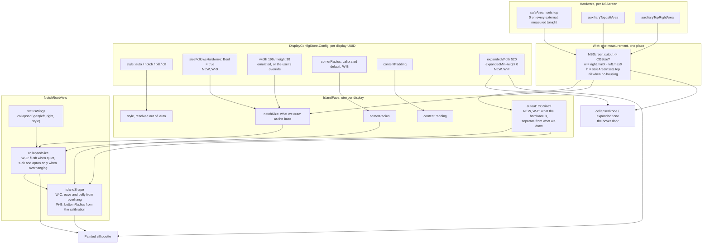

# Plan: the notch is the notch, and the island earns every pixel outside it

INNER-loop step 4 (architect). Scope: `BACKLOG.md` section A, items A1
to A5. Builds on `island-per-display-plan-2026-08-02.md`, whose
`IslandFace` (one per display, holding `style`, `notchSize`,
`cornerRadius`, `contentPadding`) is the surface this plan writes to.

Status: **PLAN ONLY. No product code was modified. Nothing was launched.
Nothing was committed.**

Citations are `file:line` against the **working tree** on
`feat/island-sessions-displays`, HEAD `138484c`, read at 02:20 on
2026-08-02. Five files are dirty in the tree right now
(`ClipboardStore`, `SessionDiscovery`, `SessionStore`, `NotchViewModel`,
`SessionStoreTests`), so line numbers in `NotchViewModel.swift` and
`SessionStoreTests.swift` will drift. **The symbol name is the
authority, not the number.** Re-resolve with:

```
grep -n "<symbol>" Chalant/NotchViewModel.swift
```

---

## Measured, inferred, proposed

The brief asked me to establish rather than assume. Here is the split,
up front, so nothing downstream has to guess which is which.

### Measured, on this machine, tonight

I ran a throwaway AppKit probe (scratchpad, not in the repo) that reads
`NSScreen` directly. Output:

| Screen | frame | `safeAreaInsets.top` | `auxiliaryTopLeftArea` | `auxiliaryTopRightArea` |
|---|---|---|---|---|
| DELL S2725QC (2), main | 2560x1440 | 0 | nil | nil |
| DELL S2725QC (1) | 2560x1440 | 0 | nil | nil |
| P2718EC | 2560x1440 | 0 | nil | nil |

`system_profiler`: **Mac16,7, MacBook Pro, M4 Pro.** Three externals
attached, the built-in absent from `NSScreen.screens`.

Two things follow, and both matter to this milestone:

1. **This Mac is in clamshell right now.** There is no notched screen
   attached, so **A1, A2 and A3 cannot be seen on this machine in its
   current configuration.** Every "what must be SEEN" item below that
   involves a real cutout requires the lid open. This is not a
   hypothetical edge case in a table, it is the founder's normal desk
   (`island-per-display-plan`, EC-8) and it is the verification
   bottleneck for the whole of section A.
2. **`auxiliaryTop*Area` returns nil on a screen with no camera
   housing**, confirmed three times over. So the nil branch is not
   theoretical either.

### Measured, from the code

- The hardware measurement **already exists and already ships**.
  `NotchWindowController.apply(_:to:)` at
  `Chalant/NotchWindowController.swift:205-213` takes the width from
  `screen.frame.width - left.width - right.width` and the height from
  `screen.safeAreaInsets.top` whenever the style resolves to `.notch`
  and the screen reports a cutout. A second, near-identical copy lives
  at `notchMetric(of:)`, `Chalant/NotchWindowController.swift:884-895`.
- `Config.width = 196` / `height = 38`
  (`Chalant/Features/DisplayConfigStore.swift:50-57`) are therefore
  **not** used on a MacBook. They are used on notchless screens and on
  emulated notches, which is correct, and they are the fallback when the
  aux areas come back nil, which is not (see EC-6).
- The Displays pane already hides the Width and Height sliders on a
  screen with a cutout and says why
  (`Chalant/Views/DashboardDisplays.swift:135-149`).

**So A1 as literally worded is largely already done for the collapsed
size.** What is *not* done, and what the founder is actually looking at,
is that the island then draws a shape that is deliberately bigger than
what it measured. That is A2 and A3, and section A1's remaining work is
theirs.

### Inferred, and flagged as inference

- **Cutout width is not a published API.** Nothing on `NSScreen` returns
  it. Deriving it from the two auxiliary areas is the standard
  technique, is what Chalant already does, and is sound: those two
  rectangles are documented as the menu bar area to the left and right
  of the camera housing, so the gap between them is the housing. I am
  proposing one change to the arithmetic (below) that makes the
  derivation depend on fewer assumptions.
- **The current form assumes the aux areas start and end at the screen
  edges.** `frame.width - left.width - right.width` is only the cutout
  width if `left.minX == frame.minX` and `right.maxX == frame.maxX`.
  `right.minX - left.maxX` measures the gap directly and assumes
  nothing. It also yields the cutout's **x origin** (`left.maxX`), which
  Chalant never computes and which the centring code silently assumes
  (see EC-7).
- **Aux-area behaviour under display mirroring is unestablished.** I
  could not test it (clamshell). Treated as a nil case, which is already
  handled.

### Not knowable, stated as such

**Apple does not publish the notch's corner radius, and no API returns
it.** Anyone who gives you a number for it is quoting a measurement or a
guess, not a spec. Community implementations converge somewhere around
12 to 13pt for the lower corners at the default scaled mode. I am not
presenting that as a measurement and neither should the code.

Chalant currently ships `Config.cornerRadius = 16`
(`Chalant/Features/DisplayConfigStore.swift:59`) and
`Theme.Island.radiusCollapsed = 16` (`Chalant/Views/Theme.swift:170`).
16 is larger than every value I have seen reported, and on a cutout
around 32 to 38pt tall it is close to half the height. That alone would
make the island's bottom read as noticeably rounder than the hardware,
which is part of what A3 is about.

**How to get closest, proposed as a procedure, not a number** (W-B):

1. Lid open. Quit Chalant, so nothing is drawn over the cutout.
2. Set a plain white desktop picture. The cutout region has no pixels,
   so it captures as black against white with a hard edge.
3. `screencapture -R <x>,<y>,<w>,<h> -t png cutout.png` over the top
   strip of the built-in display, at native backing scale.
4. Fit a circular arc to each lower corner of the black region in native
   pixels, divide by `screen.backingScaleFactor` to get points.
5. That number becomes the default. The existing per-display
   `cornerRadius` slider
   (`Chalant/Views/DashboardDisplays.swift:158-166`) stays as the
   calibration knob, because a scaled resolution or a different chassis
   may not agree.

**If the calibration cannot be run** (which is the case tonight), ship
13 as an interim with a comment naming it as uncalibrated and pointing
at this procedure. Do not ship a number from this document as though it
were measured.

### Verified by experiment

`DisplayConfigStore.Config`'s synthesized `Codable` **does not fall back
to property defaults for a missing key.** I checked rather than
recalling:

```
THREW: DecodingError.keyNotFound: Key 'expandedWidth' not found
```

Which means: **adding any field to `Config` makes every existing stored
blob fail to decode, and `load()` at
`Chalant/Features/DisplayConfigStore.swift:176-189` catches that failure
and deletes the key.** Every user's per-display settings are silently
wiped on the launch after the upgrade. A5 adds fields. This is the
migration landmine the brief asked about, it is live, and W-A exists to
defuse it before anything else touches `Config`.

(The existing comment at `:51-57` claiming a stored height survives a
default change is accurate for its own case, because `height` already
existed as a key. It is only *new* keys that detonate.)

---

## Summary

The founder's five items are three separable pieces of work.

**One: the island draws bigger than what it measured, on purpose, and
the reasons have expired.** At rest with nothing to say, the collapsed
frame is `measured.width - 8` by `measured.height + 3`
(`Chalant/Views/NotchRootView.swift:179-182`), and `IslandShape` then
flares `eave = 12` past each side
(`Chalant/Views/NotchRootView.swift:247`,
`Chalant/Views/Theme.swift:168`) and sags `belly = 1.5` below
(`Chalant/Views/Theme.swift:174`). Painted silhouette:

```
width  = (W - 8) + 2*12 = W + 16      (8pt of ink outside the cutout on each side)
height = (H + 3) + 1.5  = H + 4.5     (4.5pt of ink below the cutout)
```

Every one of those numbers has a comment defending it, and each comment
is a founder instruction from **2026-07-22**: the 3pt apron because
flush-exact "read as the border touching the hardware", the 8pt tuck
because "the reported gap sits a hair wider than the glass". A2, dated
**2026-08-02**, asks for the opposite. **This is a direct contradiction
between two founder instructions and I am not going to paper over it.**
The resolution is not to delete the apron; it is to make the apron and
the tuck apply only when the island is already outside the cutout
anyway. Flush at rest, apron on the way out. Both instructions survive.

**Two: A2 is achievable exactly, not approximately, because of a
physical fact.** The MacBook cutout is an absence of display. There are
no pixels there. `NSScreen.frame` covers it, `safeAreaInsets.top` warns
you off it, and anything drawn inside it is eaten by the hardware. So an
island whose painted silhouette is exactly the cutout rect is
**invisible by construction**, not merely well matched. That turns A2
into a falsifiable success criterion: at rest with nothing to say, a
screenshot of the top strip with Chalant running must be
indistinguishable from one with Chalant quit. Everything the founder can
currently see is spill onto real pixels outside the hole.

**Three: the wings are the genuine tension, and the founder's own words
resolve it.** A notch widens symmetrically
(`NotchViewModel.collapsedSpan`, `Chalant/NotchViewModel.swift:486-491`)
so glances clear the camera, so a single 44pt agent glance adds 88pt of
frame plus 24pt of eave: 52pt of ink outside the cutout on each side.
"Hide under the cutout" and "carry glances in the wings" cannot both be
true at the same instant. They do not have to be. A2 says "**by
default** the notch should essentially hide" and "**on hovering**
expands". By default means quiet and untouched. So:

| Resting state | Silhouette |
|---|---|
| Quiet, not hovered, real cutout | **exactly the cutout.** No eave, no belly, no apron, no tuck. Invisible. |
| Something to say | grows by the wings, and the eave and belly come back with the growth |
| Hovered | grows by 14x4, same rule |

The growth *is* the signal. An island that is invisible until it has
news, then emerges from the hardware, is what a Dynamic Island does.
Expressed as one rule over the existing `IslandShape` parameters:

```
overhang = (paintedWidth - cutoutWidth) / 2
eave     = min(Theme.Island.eaveCollapsed, max(0, overhang))
belly    = overhang > 0 ? Theme.Island.bellyCollapsed : 0
```

No new shape, no new abstraction. `IslandShape` already parameterises
all of it.

**A3's arc is `belly`.** `IslandShape.path(in:)` at
`Chalant/Views/IslandShape.swift:135-139` bows the bottom edge with a
cubic whose control points are pushed down by `belly`. That is a slight
downward arc across the whole bottom edge, 1.5pt at rest, and "slight
arc at the bottom" describes it precisely. `bottomRadius` is the
secondary offender: it turns the two corners, and at 16 it turns them
much harder than the hardware does. The eave meniscus
(`Chalant/Views/IslandShape.swift:121-126, 149-153`) is at the **top**,
at the screen edge, and is not what the founder is pointing at. Both
`belly` and `bottomRadius` are addressed; the meniscus is left alone
except that A2 zeroes it at rest.

**A4 is a spacing system that has drifted, and one number that
disagrees with itself.** `NotchViewModel.leftWingNeed` reserves **156**
points for the song beside the wave (`Chalant/NotchViewModel.swift:400`)
and `NotchRootView.songBeside` clamps the render to **140**
(`Chalant/Views/NotchRootView.swift:734`). Sixteen points reserved and
never filled, on the surface the founder says is too tight. Same bug
class as EC-1 in the previous plan: two numbers for one fact. Beyond
that, the notch clearance is written three different ways
(`+ Theme.Space.m`, `+ 6`, `+ Theme.Space.xs`) for the same job, the
expanded island uses the same 12pt gap *between* rows as it does
*inside* a two-up row, and `Theme`'s own doc comment says "a raw number
in a view is always a bug" (`Chalant/Views/Theme.swift:138-139`) while
the island carries eight of them.

**A5 needs `Config` to be extensible, which it currently is not.** The
collapsed half is one bool, not a migration. The expanded half is a
width override plus a height **floor**, never a ceiling: a ceiling would
clip the chat pane and the notes list, which is a bug wearing a
preference's clothes.

---

## Goals

1. On a MacBook, a quiet untouched island paints **zero pixels outside
   the cutout**, and that is checkable by screenshot diff, not by eye.
2. Reaching for the island, or the island having something to say, grows
   it out of the cutout with the meniscus and the belly arriving as it
   grows.
3. The collapsed silhouette's corners match the hardware's, from a
   calibration rather than from a number someone liked.
4. No arc across the bottom edge when the island is flush.
5. Content inside the island sits on a spacing system with a stated
   internal-versus-external rhythm, and the reserved width for a thing
   equals the drawn width of that thing.
6. Collapsed size is adjustable on **every** display, including one with
   a cutout, without stomping a size any existing user has stored.
7. Expanded width is a dial; expanded height has a floor and no ceiling.
8. Adding a field to `Config` stops being a data-loss event.
9. 192 tests stay green. Every new rule is checkable with no notched
   display attached, because tonight there is not one.

## Non-goals

- Making the island's expanded top reserve follow the cutout's actual
  width. Today a 520pt-wide open island reserves the full cutout height
  across its entire width, wasting roughly 38 by 320 points either side
  of a ~200pt cutout. It is real, it is space the founder is asking for,
  and fixing it needs a per-row shape inset. **Named and deferred**; it
  is a second milestone, not a line in this one.
- Per-display expanded content. Already ruled out (`BACKLOG.md`, "Not
  buildable as asked").
- Touching `DisplayConfigStore`'s resolve-and-clamp
  (`Chalant/Features/DisplayConfigStore.swift:121-143`) or
  `IslandShape`'s path construction. Both already do their job. This
  plan adds fields and changes what is passed in, not how either works.
- A new shape type. `IslandShape` already parameterises eave, belly,
  bottomRadius, topRadius, topOverscan and tipRadius. A plan that adds a
  seventh silhouette is a wrong plan.
- Removing `autoHideIsland`
  (`Chalant/Views/NotchRootView.swift:52, 201-207`). A2 makes it nearly
  redundant on a MacBook and it still does real work on a pill display.

## Success criteria

| # | Criterion | How it is settled |
|---|---|---|
| SC-1 | Quiet island paints nothing outside the cutout | `screencapture -R` over the cutout plus 20pt each side, Chalant running versus Chalant quit, images compare equal |
| SC-2 | Hover grows it visibly out of the hardware | seen, lid open, one capture at rest and one hovering |
| SC-3 | No bottom arc when flush | unit test: with `belly` 0 and `eave` 0, path bounding `maxY == rect.maxY` |
| SC-4 | Corner radius comes from a calibration | the capture from W-B is attached to the commit, or the interim value carries the "uncalibrated" comment |
| SC-5 | Reserved width equals drawn width for every glance | unit test pairing `leftWingNeed` against the render clamp |
| SC-6 | An existing user's stored per-display settings survive the upgrade | unit test: decode a blob written by today's build with the new `Config` |
| SC-7 | Width and Height sliders move a MacBook's island | seen, lid open |
| SC-8 | Expanded width slider moves the open island; content taller than the floor still fits | seen, on any display, plus a unit test on the floor rule |
| SC-9 | 192 tests green, plus the new ones | `xcodebuild test` |

---

## The geometry pipeline



The one structural change to the pipeline: **`IslandFace` learns
`cutout`, the hardware's own size, kept separate from `notchSize`, the
size we choose to draw.** Today those are the same field, which is why
"match the hardware" and "grow past the hardware" cannot both be
expressed. Everything else is a value change or a new stored field.

---

## Dependency graph

### Touch set

| # | Symbol | File | Why |
|---|---|---|---|
| T1 | `Config` struct and its defaults | `Chalant/Features/DisplayConfigStore.swift:46-83` | tolerant decode, three new fields |
| T2 | `load()` | `Chalant/Features/DisplayConfigStore.swift:176-189` | the blob-drop path T1 defuses |
| T3 | `clamped` | `Chalant/Features/DisplayConfigStore.swift:73-82` | must cover the new fields or a hand-edited blob escapes |
| T4 | `apply(_:to:)` | `Chalant/NotchWindowController.swift:182-221` | measurement, and where `sizeFollowsHardware` is honoured |
| T5 | `notchMetric(of:)` | `Chalant/NotchWindowController.swift:884-895` | the second copy of the measurement, deleted into T7 |
| T6 | `islandGeometry(of:)` | `Chalant/NotchWindowController.swift:164-166` | the repaint check; new face fields must join it or the setting looks dead |
| T7 | `NSScreen.cutout` | new, beside `NSScreen.displayID` at `Chalant/NotchWindowController.swift:936-940` | the one measurement |
| T8 | `expandedZone(on:)` | `Chalant/NotchWindowController.swift:897-899` | reads a measured width that is about to become a stored one |
| T9 | `collapsedZone(on:)` | `Chalant/NotchWindowController.swift:834-874` | door width is `notch.width + 116`; if the island shrinks to flush, the door must not |
| T10 | `IslandFace` fields | `Chalant/Features/IslandFace.swift:39-47` | gains `cutout` |
| T11 | `IslandFace.contentTopReserve` | `Chalant/Features/IslandFace.swift:86-88` | reads `notchSize.height`; must read the cutout, not the drawn size |
| T12 | `NotchRootView.collapsedSize` | `Chalant/Views/NotchRootView.swift:149-183` | the tuck, the apron, the grow |
| T13 | `NotchRootView.islandShape` | `Chalant/Views/NotchRootView.swift:217-257` | eave, belly, bottomRadius |
| T14 | `Theme.Island` | `Chalant/Views/Theme.swift:167-176` | eave and belly constants become ceilings rather than values |
| T15 | `Theme.Space.wingInset` | `Chalant/Views/Theme.swift:142-154` | its stated reason is the 8pt tuck A2 removes |
| T16 | `NotchViewModel.defaultNotchSize` | `Chalant/NotchViewModel.swift:279` | 196x34, while `Config` says 196x38. Two numbers, one fact |
| T17 | `NotchViewModel.leftWingNeed` | `Chalant/NotchViewModel.swift:400` | 156 against `songBeside`'s 140 |
| T18 | `NotchRootView.songBeside` | `Chalant/Views/NotchRootView.swift:725-735` | the 140 |
| T19 | `NotchRootView.listeningContent` and its close button | `Chalant/Views/NotchRootView.swift:771, 780-781` | two more notch clearances |
| T20 | `ExpandedView` paddings | `Chalant/Views/ExpandedView.swift:64, 72, 88-94` | row gap, column gap, insets |
| T21 | `ExpandedView.islandWidth` | `Chalant/Views/ExpandedView.swift:48-50` | 520 / 680 hardcoded |
| T22 | `ExpandedView` GeometryReader | `Chalant/Views/ExpandedView.swift:102-139` | the one-pass-late publication A5 interacts with |
| T23 | `NotchViewModel.expandedSize` | `Chalant/NotchViewModel.swift:133` | the measured size |
| T24 | `DisplaysSection.settings(for:)` | `Chalant/Views/DashboardDisplays.swift:123-168` | where the sliders live and where they are hidden |
| T25 | `DisplaysSection.Attached` and `refresh()` | `Chalant/Views/DashboardDisplays.swift:14-20, 228-244` | must carry the measured cutout so a slider can seed from it |
| T26 | glance type sizes | `Chalant/Views/NotchRootView.swift:91, 651, 729` | 11, 12, 11 in one strip |
| T27 | island geometry tests | `ChalantTests/SessionStoreTests.swift:967-1025` | extended, not replaced |
| T28 | per-display config tests | `ChalantTests/SessionStoreTests.swift:1029-1130` | must still pass across T1 |

### Consumer table

**Compile break** means the compiler stops you. **Silent** means it
builds and behaves differently.

| # | Consumer | Reached via | What changes | Class |
|---|---|---|---|---|
| C1 | `DisplayConfigStore.config(forKey:)` `:128-130` | `Config()` then `.clamped` | new fields flow through untouched | none |
| C2 | `load()` `:176-189` | `JSONDecoder` | **stops deleting the blob** when a key is missing | **silent**, and this is the fix. Without T1 it is silent-wrong the other way: total data loss |
| C3 | `set(_:forKey:)` `:151-159` | `configs[key] = config.clamped` | writes the new fields | none |
| C4 | `reset(forKey:)` `:167-172` | `configs[key] = nil` | now also restores "follow the hardware" | **silent**, intended, and the founder's route to seeing the new defaults |
| C5 | `resolvedStyle(for:)` `:141-143` | `safeAreaInsets.top > 0` | should route through T7 for one definition of "has a cutout" | **silent**, cosmetic, but it is the fourth site asking the same question |
| C6 | `apply(_:to:)` `:182-221` | T4, T7, T10 | writes `face.cutout` as well as `face.notchSize` | **compile break** once `IslandFace` gains the field non-optionally; make it `CGSize?` and it is additive |
| C7 | `islandGeometry(of:)` `:164-166` | array literal | **must gain `face.cutout`.** If it does not, a lid-open or scaling change that alters the cutout without altering the drawn size will not repaint | **silent-wrong.** The file's own comment at `:157-163` warns about exactly this |
| C8 | `notchMetric(of:)` callers, `collapsedZone` `:868` | T5 -> T7 | the door keeps sizing from the cutout, not from the drawn island | **compile break** (function deleted), then none |
| C9 | `collapsedZone` `.notch` branch `:868-873` | `notch.width + 116` | **unchanged on purpose.** The island shrinks to flush; the door must not shrink with it or a flush island becomes unreachable | none, but see EC-2 |
| C10 | `expandedZone(on:)` `:897-899` | `viewModel.expandedSize` | width comes from the owner's `config.expandedWidth`, height stays measured | **silent-wrong if missed**: during a width-slider drag the zone is one layout pass stale and the island can collapse under the pointer |
| C11 | `IslandFace.contentTopReserve` `:86-88` | `notchSize.height` | becomes `cutout?.height ?? Theme.Space.m` | **silent**, and correct: it reserves room for *hardware*, so a user who enlarges the drawn island must not push content further down |
| C12 | `ExpandedView.swift:89` `face.contentTopReserve` | C11 | inherits it | none |
| C13 | `NotchRootView.swift:771, 780` `face.contentTopReserve` | C11 | inherits it | none |
| C14 | `NotchRootView.collapsedSize` `:149-183` | T12 | the `.pill` branches are **untouched**; only the `.notch` return changes | **silent**, intended |
| C15 | `NotchRootView.islandShape` `.pill` branch `:222-233` | T13 | **untouched.** A pill has no hardware to hide under | none |
| C16 | `NotchRootView.islandShape` collapsed `.notch` branch `:234-250` | T13 | eave and belly become derived | **silent**, intended |
| C17 | `NotchRootView.islandShape` expanded `:252-256` | T13 | **untouched.** An open island is meant to be seen | none |
| C18 | The seven rim strokes `:345-417` | `islandShape` | all use `strokeBorder`, which insets, so a flush island's strokes land **inside** the cutout and are eaten by the hardware | none, and this is load-bearing for SC-1. A plain `.stroke` would straddle the edge and leak half a point of ink |
| C19 | The breathing accent ring `:399` | `lineWidth: 4` | 4pt, inset, still inside a 32pt cutout | none. Verify in SC-1: it only runs when music or a session is active, which is also when the island is no longer quiet |
| C20 | `.shadow(...)` `:418-421` | opacity 0 when collapsed | already zero at rest | none |
| C21 | `contentLayer` `:496-519` | `.frame(width: collapsedSize...)` then `.clipShape(islandShape)` | a flush island clips its own content to the cutout, so a glance arriving is what grows the frame that reveals it | none, and it is the correct order |
| C22 | `statusWings` `:115-119` | `collapsedSpan` | **untouched.** Still `2 * max(left, right)` for a notch | none |
| C23 | `NotchViewModel.collapsedSpan` | `Chalant/NotchViewModel.swift:486-491` | **untouched.** Three tests pin it (`:1239-1249`) | none |
| C24 | `NotchViewModel.collapsedHasSomethingToSay` | `:509-514` | **untouched.** It is exactly the "is the island quiet" predicate A2 needs, already written | none. Reuse, do not rewrite |
| C25 | `hiddenUntilReachedFor` `:201-207` | `autoHideIsland` | still works, now mostly redundant on a MacBook | **silent**, acceptable. See OQ-3 |
| C26 | `ExpandedView.islandWidth` `:48-50` | T21 | reads `config.expandedWidth`; the 680 chat threshold survives as a `max` | **compile break** (needs the face) |
| C27 | `ExpandedView` GeometryReader `:102-139` | T22 | still measures **height**; width is now imposed by `.frame(width:)` above it, so the measured width equals the configured one by construction | **silent**, and it removes a source of the one-pass-late problem rather than adding one |
| C28 | `NotchRootView.islandSize` `:209-215` | `model.expandedSize` | unchanged. Only the owner face renders `.expanded` | none |
| C29 | `DisplaysSection` Size card `:135-149` | T24 | sliders appear on a cutout screen too, behind a "Match the notch" toggle | **compile break** (needs `Attached.cutout`) |
| C30 | `DisplaysSection.slider` `:204-226` | `binding` | unchanged, reused for the two new dials | none |
| C31 | `NotchViewModel.defaultNotchSize` `:279` | `IslandFace.notchSize` initial value | only ever visible between `init` and the first `apply`. Delete it and initialise from `Config()` | **compile break**, deliberate |
| C32 | `Theme.Space.wingInset = 7` `:154` | `wingsContent` `:690, 693, 701, 709, 717` | its comment derives 7 from the 8pt tuck. The tuck survives (only when overhanging), so the number stands; the **comment** must stop claiming a rule that now has a condition | **cosmetic**, but a stale reason is how the next round gets it wrong |
| C33 | `SessionStoreTests` silhouette block `:967-1025` | `IslandShape` directly | all four still pass: they construct shapes with explicit parameters | none |
| C34 | `SessionStoreTests` config block `:1029-1130` | `Config()`, `clamped`, JSON round trip | all pass across optional-free new fields. `testConfigsRoundTripThroughJSON` gains coverage for free | none |
| C35 | `scripts/` | `grep -rn "notch\|cutout\|expandedWidth" scripts/` | no hits on geometry | none |
| C36 | `displayConfigs` defaults key | T1, T2 | **the blast radius of this whole plan.** Covered by EC-1 | see EC-1 |

### The silent-behaviour-change list, input to the edge-case pass

C2, C5, C7, C10, C11, C14, C16, C25, C27, C32.

---

## Edge cases

Ranked silent-wrong > silent-nothing > loud-wrong > cosmetic.

| # | Edge case | State that reaches it | Severity | Handling |
|---|---|---|---|---|
| EC-1 | **Every existing user's per-display settings are wiped by the upgrade** | any install with a non-empty `displayConfigs`, first launch after A5 adds a field to `Config` | **silent-wrong**, total, and verified by experiment above | **W-A, and it gates every other workstream.** Explicit `init(from:)` using `decodeIfPresent(...) ?? <default>` for every field. Test T-A1 writes a blob in today's exact shape and decodes it with the new struct. Without this, A5 ships as data loss |
| EC-2 | **A flush island is unreachable** | MacBook, quiet, A2 landed, door shrunk with the island | **silent-wrong**: the island is invisible and now also cannot be summoned, which reads as uninstalled | **W-C.** `collapsedZone`'s `.notch` branch keeps sizing from the **cutout**, `notch.width + 116` (`Chalant/NotchWindowController.swift:868-873`), never from the drawn size. C9. The door is coordinate math, exactly as `autoHideIsland` already relies on (`Chalant/Views/NotchRootView.swift:48-52`) |
| EC-3 | **`safeAreaInsets.top > 0` but the aux areas are nil** | a notched screen under mirroring, or a chassis that reports one and not the others | **silent-wrong**: today `apply` skips the whole measurement block (`:205-213`), so `notchSize` stays `(config.width, config.height)` = 196x38 while the real cutout is, say, 32 tall. Six points of permanent spill, and A2 quietly fails with no symptom anyone can name | **W-A.** `NSScreen.cutout` returns `CGSize(width: config.width, height: safeAreaInsets.top)` in this case: **take the height, which is available, even when the width is not.** Height is the dimension A2 is most sensitive to. Log it once so the case is discoverable |
| EC-4 | **A display with no notch at all** | every screen on this desk tonight, measured | **none**, and this is the majority case | Resolves to `.pill` (`DisplayConfigStore.resolve`, `:136-139`). `face.cutout` is nil, the `.pill` branches of `collapsedSize` and `islandShape` are untouched (C14, C15), `contentTopReserve` falls back to `Theme.Space.m` (C11). **A2 does not apply and must not be applied**: a pill has nothing to hide under |
| EC-5 | **An emulated notch on a notchless screen** | user picks Notch on a DELL | **silent-wrong if A2 is written against `style == .notch` instead of against `cutout != nil`** | **W-C.** The flush rule keys on `face.cutout != nil`, never on the style. An emulated notch has no hardware to hide inside, so it keeps the eave, the belly and the apron, and stays visible. Getting this backwards makes the island vanish entirely on an external set to Notch, with no way to find it. T-C2 pins it |
| EC-6 | **A user who has already stored a custom width or height** | anyone who moved the emulated-notch sliders | **silent-wrong** under a naive A1 that makes measured always win, or under a naive A5 that adds `sizeIsCustom: Bool = false` and so tells every existing blob "you were not custom" | **W-D.** One new field, `sizeFollowsHardware: Bool = true`, and the semantics are chosen so **every existing blob is already correct**: on a screen with a cutout, `true` means measured wins, which is today's behaviour; on a screen without one there is no hardware to follow, so the stored width is used, which is also today's behaviour. **No migration, no sentinel, no version field.** T-D1 |
| EC-7 | **An off-centre cutout** | not on any shipping Mac, but the code assumes centred in three places | **silent-wrong** if it ever happens: the panel is centred on `screen.frame.midX` (`:216`), `hoverZone` centres on `midX` (`:907-914`), and the island centres inside the panel. A flush island would sit beside the hole rather than in it | **W-A**, cheaply: `cutout` derives width as `right.minX - left.maxX`, which also yields the origin. Assert `abs(left.width - right.width) < 1` in a debug log rather than building a centring system nobody needs. Named so the next person does not have to rediscover the assumption |
| EC-8 | **The founder cannot see A1, A2 or A3** | clamshell, which is his normal desk and is the state of this machine right now | **loud-wrong** for the review gate: the milestone cannot be signed off | Stated in "What must be SEEN". **The lid has to be open for V1, V2 and V3.** No amount of code changes this |
| EC-9 | **Display scaling changed while running** | System Settings, Displays, a different "looks like" | **silent-wrong** if `islandGeometry` does not include the cutout: the cutout changes in points, the drawn size may not, the repaint check sees no difference, and the island is left flush to the wrong hole | **W-C.** C7: `face.cutout` joins `islandGeometry(of:)` (`:164-166`). The file already warns that forgetting this is silent and looks like the setting doing nothing |
| EC-10 | **Content taller than the user's expanded floor** | floor set to 200, chat pane wants 390 (`Theme.Panel.chatFull`) | would be **silent-wrong** as a ceiling: the pane clips with no scrollbar and no indication | **W-F.** The setting is a **floor**, never a ceiling: `height = max(measured, config.expandedMinHeight)`. Content always wins. Say so in the setting's own note, and T-F2 pins it |
| EC-11 | **Expanded width dragged while the island is open** | the founder doing exactly what A5 asks for | **silent-wrong**: `expandedZone` reads `viewModel.expandedSize` (`:898`), which lands one layout pass after the content re-lays out, so for one frame the hover-out zone is the old width and the pointer can fall outside it and collapse the island mid-drag | **W-F.** `expandedZone` takes its **width from the owner's config** (a value known before any layout) and only its height from the measurement. C10 |
| EC-12 | **Two defaults for one fact** | `defaultNotchSize` 196x34 (`:279`) against `Config` 196x38 (`:50-57`) | **cosmetic** today, because `apply` overwrites within a frame | **W-A.** Delete `defaultNotchSize`, initialise `IslandFace.notchSize` from `Config()`. C31. It is one line and it removes a trap |
| EC-13 | **156 reserved, 140 drawn** | music playing, song glance on, any display | **silent-nothing**: 16pt of the island is reserved for a title and never filled, on the surface the founder says is too tight | **W-E.** One constant, read by both `leftWingNeed` (`:400`) and `songBeside` (`:734`). T-E1 |
| EC-14 | **Three clearances for one relationship** | `+ Theme.Space.m` (8) in `ExpandedView:89`, `+ 6` in `NotchRootView:771`, `+ Theme.Space.xs` (4) in `NotchRootView:780` | **cosmetic**, but it is why the founder sees different gaps in different states | **W-E.** One `Theme.Space.notchClearance`, used by all three |
| EC-15 | **Row gap equals column gap** | `ExpandedView:64` `spacing: Theme.Space.l` and `:72` `spacing: Theme.Space.l`, both 12 | **cosmetic**, and it is the named failure mode in the spacing guidance: internal and external spacing at the same value means nothing reads as grouped | **W-E.** Columns tighten, rows stay, so the between-group gap is at least twice the within-group gap |
| EC-16 | **Every display switched Off** | `BACKLOG` A-series has no bearing, but the flush rule must not assume a face exists | none | Unchanged: `rebuildIslands()` builds no face for an Off display (`island-per-display-plan`, W-C), so nothing in this plan is reachable there |
| EC-17 | **A clamped hand-edited blob with the new fields out of range** | someone edits `defaults` | **loud-wrong** without it | **W-A.** `clamped` (`:73-82`) gains the two new dials with ranges, in the same shape as the existing four. T-A2 |
| EC-18 | **Changing a default reaches almost nobody** | the founder, who has been changing styles all week, so every one of his displays has a stored config | **silent-nothing**, and it will read as "the fix did not work" | Named, not fixed. `set(_:forKey:)` writes the whole struct (`:151-159`), so touching *style* pins *every* default. The route is the existing "Reset this display" button (`Chalant/Views/DashboardDisplays.swift:170-177`). **Tell the founder this explicitly at review time**, or W-B and W-E will look like no-ops on his own machine |
| EC-19 | **The breathing accent ring leaks outside a flush island** | music playing on the MacBook, island quiet otherwise | cannot happen: music playing means `collapsedHasSomethingToSay` is true, so the island is not flush | Verified by construction, C19, and re-checked in SC-1 |
| EC-20 | **`tipRadius` on a zero eave** | flush island, `eave = 0`, `tipRadius` defaults to 5 | none: already clamped, `tr = max(0, min(tipRadius, e))` (`Chalant/Views/IslandShape.swift:111`), and pinned by `testAnEaveSmallerThanTheTipRadiusDoesNotInvertTheShape` (`:987-997`) | Nothing to do. The clamp was written for the sliver and covers this for free |
| EC-21 | **Wake with the lid opening** | clamshell to lid-open, the founder's morning | **silent-wrong** if the new cutout is not re-measured: the built-in arrives as a new screen | Already handled: `rebuildIslands()` runs on the wake observers and `apply` re-measures. EC-9's `islandGeometry` fix is what makes it repaint |
| EC-22 | **`wingInset`'s reason expires** | reading the code next round | cosmetic | **W-E.** C32. The 7 stays, the comment stops asserting an unconditional 8pt tuck |

**Deliberately deferred:** EC-7 (assert and log, do not build), EC-16
(nothing to do), EC-20 (already covered). Everything in silent-wrong or
silent-nothing has a workstream.

---

## Workstreams

Order is a dependency order, not a preference. **W-A gates everything**:
until `Config` decodes tolerantly, any workstream that adds a field is a
data-loss event (EC-1).

### W-A: one measurement, one tolerant store

**Files:** `Chalant/Features/DisplayConfigStore.swift`,
`Chalant/NotchWindowController.swift`, `Chalant/NotchViewModel.swift`,
`Chalant/Features/IslandFace.swift`.

**Contracts:**

- `extension NSScreen { var cutout: CGSize? }`, beside `displayID`
  (`Chalant/NotchWindowController.swift:936-940`). Returns nil when
  `safeAreaInsets.top == 0`. Width from `right.minX - left.maxX` when
  both aux areas exist; **height from `safeAreaInsets.top`
  regardless** (EC-3). Logs once, at `.info`, when the height is
  available and the width is not.
- `apply(_:to:)` (`:205-213`) and `notchMetric(of:)` (`:884-895`) both
  call it. `notchMetric` is deleted; its one caller (`:868`) calls
  `screen.cutout ?? CGSize(config.width, config.height)`.
- `Config` gains an explicit `init(from decoder:)`. Every property:
  `decodeIfPresent(...) ?? <the property's default>`. The synthesized
  `encode(to:)` stays.
- `defaultNotchSize` deleted (EC-12). `IslandFace.notchSize` initialises
  from `DisplayConfigStore.Config()`.
- `IslandFace` gains `@Published var cutout: CGSize?`. `apply` writes
  it. `islandGeometry(of:)` (`:164-166`) gains it (C7, EC-9).
- `contentTopReserve` (`Chalant/Features/IslandFace.swift:86-88`) reads
  `cutout?.height ?? Theme.Space.m` (C11).

**Runnable check (T-A1):** decode a JSON blob written in *today's exact
key set* into the new `Config`, assert every value survives and the
absent new keys take their defaults. This is the one test that would
have caught EC-1.

```
xcodebuild test -scheme Chalant -destination 'platform=macOS' \
  -only-testing:ChalantTests/SessionStoreTests/testAStoredBlobFromAnOlderBuildKeepsItsValues
```

**Also (T-A2):** `clamped` covers the fields W-D and W-F add.

**Behaviour change:** none intended. If anything visibly moves in W-A,
something is wrong.

### W-B: A3, the corners come from the hardware

**Files:** `Chalant/Features/DisplayConfigStore.swift`,
`Chalant/Views/Theme.swift`.

**Contracts:**

- Run the calibration in "Not knowable, stated as such" above. Attach
  the capture to the commit.
- `Config.cornerRadius`'s default moves from 16 to what the calibration
  returns. If it cannot be run, 13, with a comment naming it as
  uncalibrated and citing this section.
- `Theme.Island.radiusCollapsed` (`:165`) stays 16: it is the pill's
  floor when expanded (`Chalant/Views/NotchRootView.swift:225`) and a
  pill is not hardware.
- The `belly` half of A3 is W-C's, because the answer is conditional.

**Runnable check:** none needed beyond the existing shape tests. This is
a constant change. **SC-4 is a seen check, not a test.**

**Note for the review gate:** per EC-18, this default will not reach any
display that already has a stored config. The founder will need "Reset
this display" to see it.

### W-C: A2, flush at rest, and the arc goes with it

**Files:** `Chalant/Views/NotchRootView.swift`,
`Chalant/NotchViewModel.swift`, `Chalant/Views/Theme.swift`.

This is the sharpest workstream and it is the one that resolves the
contradiction named in the Summary.

**Contracts:**

- A new static on `NotchViewModel`, so it is testable without a screen,
  in the same shape as `collapsedSpan` and `state(_:expandedOn:face:)`:

  ```
  /// The collapsed frame, in points. Flush with the cutout when there
  /// is nothing to say and nobody reaching: on a MacBook the cutout has
  /// no pixels, so an island exactly its size is eaten by the hardware
  /// and is invisible by construction, which is the whole of A2. The
  /// 8pt width tuck and the 3pt apron (founder, 2026-07-22) are kept
  /// for every state where the island is outside the hole anyway, and
  /// only for those: flush and apron cannot both be true at once
  /// (founder, 2026-08-02).
  static func collapsedFrame(
      cutout: CGSize?, base: CGSize, wings: CGFloat, hovering: Bool
  ) -> CGSize
  ```

  Flush when `cutout != nil && wings == 0 && !hovering`: return the
  cutout exactly. Otherwise the existing arithmetic,
  `base.width - 8 + wings + (hovering ? 14 : 0)` by
  `base.height + 3 + (hovering ? 4 : 0)`.

- A second static for the silhouette, so the overhang rule is pinned:

  ```
  static func eaveAndBelly(overhang: CGFloat) -> (eave: CGFloat, belly: CGFloat)
  ```

  `overhang <= 0` gives `(0, 0)`. Otherwise
  `(min(Theme.Island.eaveCollapsed, overhang), Theme.Island.bellyCollapsed)`,
  with the existing reaching bump when hovered
  (`Chalant/Views/NotchRootView.swift:245-249`).

- `NotchRootView.collapsedSize` `.notch` branch (`:179-182`) calls the
  first. `islandShape` collapsed `.notch` branch (`:234-250`) calls the
  second. The `.pill` branches of both are **untouched** (C14, C15).
- The flush test is `cutout != nil`, **never `style == .notch`**
  (EC-5). An emulated notch keeps its meniscus.
- "Nothing to say" reuses `collapsedHasSomethingToSay`
  (`Chalant/NotchViewModel.swift:509-514`), which already exists and
  already answers exactly this. Do not write a second predicate (C24).
- `collapsedZone`'s `.notch` door is **not** narrowed (C9, EC-2).

**Runnable check (T-C1):** `collapsedFrame(cutout: CGSize(200, 32),
base: CGSize(200, 32), wings: 0, hovering: false)` equals exactly
`CGSize(200, 32)`, and with `wings: 88` it does not.
**(T-C2):** `collapsedFrame(cutout: nil, base: CGSize(196, 38), wings:
0, hovering: false)` equals `CGSize(188, 41)`, the emulated notch keeping
its tuck and apron (EC-5).
**(T-C3):** `eaveAndBelly(overhang: 0)` is `(0, 0)`; the resulting
`IslandShape(eave: 0, bottomRadius: r, belly: 0).path(in: rect)` has
`boundingRect.maxY == rect.maxY` (SC-3, no arc) and
`boundingRect.width == rect.width` (nothing outside the hole).

### W-D: A1 and A5's collapsed half, sliders on every display

**Files:** `Chalant/Features/DisplayConfigStore.swift`,
`Chalant/NotchWindowController.swift`,
`Chalant/Views/DashboardDisplays.swift`.

**Contracts:**

- `Config` gains `var sizeFollowsHardware: Bool = true`. Chosen so
  **every existing blob is already correct without a migration**
  (EC-6): on a screen with a cutout it means "measured wins", which is
  today; on a screen without one there is no hardware to follow, so the
  stored size is used, which is also today.
- `apply(_:to:)`:

  ```
  face.cutout = screen.cutout
  face.notchSize = (config.sizeFollowsHardware ? screen.cutout : nil)
      ?? CGSize(width: config.width, height: config.height)
  ```

  That is the whole of A1: the hardware by default, unless the user
  changes it.
- `DisplaysSection.Attached` gains `cutout: CGSize?`; `refresh()`
  (`:228-244`) fills it from `screen.cutout`.
- The Size card (`:135-149`) on a screen with a cutout shows a **Match
  the notch** toggle. On, the note reads as it does today. Off, the two
  sliders appear, **seeded from the measured cutout** so turning it off
  does not jump the island to 196x38.
- "Reset this display" (`:170-177`) already restores `true` for free
  (C4).

**Runnable check (T-D1):** a `Config` decoded from a blob with no
`sizeFollowsHardware` key reads `true`, and a face built with
`cutout: CGSize(200, 32)` and `config.width = 300` draws 200 wide; with
`sizeFollowsHardware = false` it draws 300.

### W-E: A4, the spacing pass

**Files:** `Chalant/Views/Theme.swift`,
`Chalant/Views/NotchRootView.swift`, `Chalant/Views/ExpandedView.swift`,
`Chalant/NotchViewModel.swift`.

Grounded in the spacing and typography principles pulled for this
milestone, and self-reviewed against the review rules afterwards. The
three findings those surfaced, applied here:

- *"When internal and external spacing use the same value, the
  interface loses structure"* and *"the gap between groups is at least
  2x the gap within a group"* gives EC-15.
- *"Use spacing values from your design system, don't use arbitrary
  values"* gives the raw-number sweep. `Theme` already says the same
  thing at `:138-139`, so this is the house's own rule, not an imported
  one.
- *"Keep ~25% minimum jumps between sizes used for distinct roles"* and
  *"consider a slightly lighter weight in dark mode, where bright text
  can appear heavier"* gives the type change.

**Contracts:**

- **The 156/140 disagreement (EC-13).** One constant,
  `Theme.Island.songGlanceWidth`. `leftWingNeed` (`:400`) and
  `songBeside` (`:734`) both read it. Value: 140, the drawn one, because
  narrowing the reservation is the change that gives the founder back
  16pt rather than widening a title nobody asked to be wider.
- **One notch clearance (EC-14).** `Theme.Space.notchClearance`, used by
  `ExpandedView:89`, `NotchRootView:771` and `NotchRootView:780`.
  Value: `Theme.Space.l` (12), up from the current 8/6/4. This is the
  direct answer to "the spacing its all too close to the borders" for
  the top edge, which is currently the tightest of the four.
- **Row gap versus column gap (EC-15).** `ExpandedView:64` rows stay at
  `Theme.Space.l` (12); `:72` columns tighten to `Theme.Space.m` (8).
  Between-group is then 1.5x within-group. To reach the 2x the guidance
  asks for, rows would go to 16, which costs vertical height on a
  surface that is already tall. **Proposing 12/8 and flagging the
  compromise** rather than silently missing the ratio.
- **`contentPadding` default** from 16 to 20
  (`Chalant/Features/DisplayConfigStore.swift:61`). Subject to EC-18:
  it reaches nobody who has touched a display setting.
- **The raw-number sweep.** Named, with a disposition each:
  | Site | Value | Disposition |
  |---|---|---|
  | `NotchRootView:87` `HStack(spacing: 3)` | 3 | `Theme.Space.xs` (4) |
  | `NotchRootView:606` `HStack(spacing: 3)` | 3 | `Theme.Space.xs` (4) |
  | `NotchRootView:771` `+ 6` | 6 | `Theme.Space.notchClearance` |
  | `NotchRootView:734` `maxWidth: 140` | 140 | `Theme.Island.songGlanceWidth` |
  | `NotchRootView:757` `frame(height: 34)` | 34 | **stays.** Two lines of body text at a fixed height, so arriving words do not bounce the stack. Component geometry, not spacing. Comment says so already |
  | `NotchRootView:807, 819-822, 825, 630` | 3.5, 4.5, 36 | **stay.** Waveform bar geometry |
  | `ExpandedView:85` `height: 150` | 150 | **stays.** Drop-target reach, deliberately large |
  | `ExpandedView:431, 636` `spacing: 1, 3` | 1, 3 | `Theme.Space.xs` where it is a gap; 1 stays if it is a baseline nudge |
- **Type in the collapsed strip (T26).** Three sizes live there:
  `micro` 11 semibold (`:729`), `microMono` 11 medium (`:91`),
  `captionMono` 12 medium (`:651`). 11 against 12 is a 9% step doing two
  different jobs, which reads as one size applied inconsistently. The
  toast drops to `microMono`. Weight and colour carry the hierarchy,
  which they already do (`Theme.textSecondary` against `accent`).
- **`wingInset`'s comment (EC-22, C32).** The 7 stays; the comment stops
  claiming an unconditional 8pt tuck.

**Runnable check (T-E1):** `NotchViewModel.leftWingNeed` for the song
case equals `Theme.Island.songGlanceWidth`. One assertion, and it is the
one that fails if the two numbers drift apart again.

### W-F: A5's expanded half

**Files:** `Chalant/Features/DisplayConfigStore.swift`,
`Chalant/Views/ExpandedView.swift`,
`Chalant/NotchWindowController.swift`,
`Chalant/Views/DashboardDisplays.swift`.

**Contracts:**

- `Config` gains `var expandedWidth: CGFloat = 520` and
  `var expandedMinHeight: CGFloat = 0`, with ranges
  `420...840` and `0...480`, clamped like the rest (EC-17).
- `ExpandedView.islandWidth` (`:48-50`):

  ```
  model.tab == .chat && model.pane == .none && chatFull
      ? max(config.expandedWidth, 680)
      : config.expandedWidth
  ```

  680 survives as a **threshold with a reason** (the chat site's desktop
  breakpoint at 0.8 zoom, `:45-47`), not as a taste value a slider
  should be able to undercut.
- Height: `max(measured, config.expandedMinHeight)`. **A floor, never a
  ceiling** (EC-10). Content always wins, and the setting's own note
  says so: "The island grows past this when what is open needs more
  room."
- `expandedZone(on:)` (`:897-899`) takes its width from the owner's
  config, its height from `viewModel.expandedSize` (EC-11, C10).
- Two sliders in the Shaping card, reusing `DisplaysSection.slider`
  (`:204-226`) unchanged (C30).

**Why an absolute for width and a floor for height:** width is the one
dimension the content cannot ask for. `ExpandedView` already imposes it
with `.frame(width: islandWidth)` (`:96`) and lets height be intrinsic
via `.fixedSize(horizontal: false, vertical: true)` (`:97`). So a width
dial is a straight substitution and, as a bonus, the GeometryReader's
measured width becomes equal to the configured width by construction,
which takes one variable out of the one-pass-late path (C27) rather than
adding one.

**Runnable check (T-F1):** `islandWidth` with `expandedWidth = 600` and
chat-full on returns 680, not 600. **(T-F2):** the floor rule, measured
170 with a floor of 300 gives 300; measured 400 with a floor of 300
gives 400.

---

## Test plan

192 today. None are broken by this plan; C33 and C34 walk the two
blocks that could have been. New tests, all runnable with **no display
attached**, which matters because tonight there is no notched one:

| Id | Test | Guards |
|---|---|---|
| T-A1 | `testAStoredBlobFromAnOlderBuildKeepsItsValues` | EC-1 |
| T-A2 | `testTheNewDialsAreClampedLikeTheOldOnes` | EC-17 |
| T-A3 | `testACutoutHeightIsTakenEvenWhenTheWidthIsNot` (pure function over injected values) | EC-3 |
| T-C1 | `testAQuietIslandOnRealHardwareIsExactlyTheCutout` | A2, SC-1 |
| T-C2 | `testAnEmulatedNotchKeepsItsApronBecauseItHasNothingToHideIn` | EC-5 |
| T-C3 | `testAFlushIslandHasNoArcAndNothingOutsideItsFrame` | A3, SC-3 |
| T-D1 | `testFollowingTheHardwareIsTheDefaultAndAStoredSizeStillWins` | EC-6, A1 |
| T-E1 | `testTheSongGlanceReservesExactlyWhatItDraws` | EC-13, SC-5 |
| T-F1 | `testChatFullKeepsItsBreakpointAboveAUserWidth` | A5 |
| T-F2 | `testTheExpandedHeightIsAFloorAndContentStillWins` | EC-10, SC-8 |

Ten new tests, 202 total.

---

## What must be SEEN, per display

Per the house rule: an item moves to Done only once it has been seen on
a screen. `osascript` is blocked in this environment; drive with
`open -a` and capture with `screencapture -D <n>`.

**Blocking constraint, stated once more: V1, V2 and V3 require the lid
open.** This Mac reported three externals and no built-in tonight. There
is no code that works around this.

### V1: A2, on the built-in, lid open

Quiet island: no music, no timer, no agent session, pointer away.

```
screencapture -R <cutout x-20>,<y>,<w+40>,<h+10> -t png with-chalant.png
pkill -x Chalant
screencapture -R <same rect> -t png without-chalant.png
cmp with-chalant.png without-chalant.png
```

**Pass:** identical, or differing only where a menu bar item's clock
ticked. Restrict the rect to the cutout plus 20pt each side so the
comparison does not chase the clock.

**This is the whole of A2 and it is pass/fail, not a matter of taste.**

### V2: A2's second half, on the built-in, lid open

Pointer to the top centre, dwell past `openDelay`. **See:** the island
emerges out of the hardware, meniscus arriving as it grows. Then start a
Claude session and move the pointer away. **See:** the island grows on
its own to carry the agent mark, again with the meniscus, and does not
snap.

### V3: A3, on the built-in, lid open

Capture the collapsed island with a glance showing, against a light
desktop. **See:** the bottom edge is straight, and its two corners turn
at the same rate as the hardware's directly above them. This is the one
where the calibration from W-B is judged.

### V4: A1 and A5's collapsed half, on the built-in, lid open

Settings, Displays, the built-in. **See:** a Match the notch toggle,
on, with the sliders hidden. Turn it off. **See:** the sliders appear at
the measured value, not at 196x38. Drag Width. **See:** the island on
the built-in follows, live. "Reset this display". **See:** it snaps back
flush.

### V5: A4, on any display

Open the island. **See:** content no longer touching the sides or the
top curve; the gap above the first row visibly larger than it was; a
two-up row's two elements closer to each other than the rows are to each
other. With music playing, **see** the song title with no dead strip
after it (EC-13).

### V6: A5's expanded half, on any display

Drag Expanded width. **See:** the open island follows and does not
collapse mid-drag (EC-11). Set the floor to 300 with the Today tab open.
**See:** the island grows to 300. Switch to Chat with full mode on.
**See:** it grows past 300 rather than clipping (EC-10).

### V7: backward compatibility, on any display

Before upgrading, note the per-display settings. Upgrade. **See:** every
one of them still there (EC-1). This is the check nobody remembers to
run and it is the one with total blast radius.

### V8: the externals, all three

**See:** nothing about them changed except the spacing pass. No external
should go flush, vanish, or lose its meniscus (EC-4, EC-5).

---

## Reporting versus proposing, one more time

**Reported, established by reading or measurement:**

- The hardware measurement already ships (`:205-213`). A1's collapsed
  size is largely done; what remains is A2's and A3's work.
- The island paints 8pt outside the cutout on each side and 4.5pt below
  it at rest. Arithmetic from `:179-182`, `:247`, and
  `Theme.swift:168, 174`.
- The bottom arc is `belly` (`IslandShape.swift:135-139`), secondarily
  the 16pt `bottomRadius`. The meniscus is at the top and is not it.
- Adding a field to `Config` wipes every user's settings today. Verified
  by running it, not recalled.
- `leftWingNeed` reserves 156 and `songBeside` draws 140.
- This Mac has no notched display attached, so section A cannot be
  signed off from this desk as it currently stands.

**Proposed, my judgment, open to being overruled:**

- Flush only when quiet and untouched; grow with the news and with the
  reach. This is my reading of "by default" and "on hovering" in A2, and
  it is the only reading under which the wings survive.
- The corner radius comes from a capture, not from this document.
- `sizeFollowsHardware`, one bool, no migration.
- Expanded width absolute, expanded height a floor with no ceiling.
- `notchClearance` at 12, and the 12/8 row-column compromise instead of
  the 2x ratio the guidance asks for.

---

## Open questions for the founder

**OQ-1.** A2 versus the 2026-07-22 apron. On that date the verdict was
that a flush border "read as the border touching the hardware". This
plan says flush at rest and apron the moment the island is outside the
cutout anyway. **If flush at rest still reads wrong on the actual glass,
the fallback is a 1pt apron rather than 3, and A2 becomes "nearly
invisible" rather than "invisible".** Worth knowing before W-C is built
rather than after.

**OQ-2.** EC-18. Every default this plan changes (corner radius, content
padding) is invisible on any display whose settings have ever been
touched, which on this desk is probably all of them. Is "hit Reset this
display" acceptable, or should the release migrate stored values that
still equal the old defaults? The second is doable and is exactly the
kind of guess that has stomped users before, so my recommendation is the
first.

**OQ-3.** With A2, `autoHideIsland` ("keep out of the way until reached
for", shipped `487d738`) does almost nothing new on a MacBook: a quiet
island is already invisible. It still earns its place on a pill display.
Keep it, reword its Settings note, or scope it to pills?

**OQ-4.** A5 says "edit how the opened tab renders and size of that".
This plan reads "size of that" as the island's own width and height
floor. If it meant the **tab panel** heights (`Theme.Panel.list` 230,
`focus` 280, `chat` 330/390, `Chalant/Views/Theme.swift:180-191`) being
individually adjustable, that is a different and larger piece of work
and it is not in this plan. Say so now if that is what was meant.
