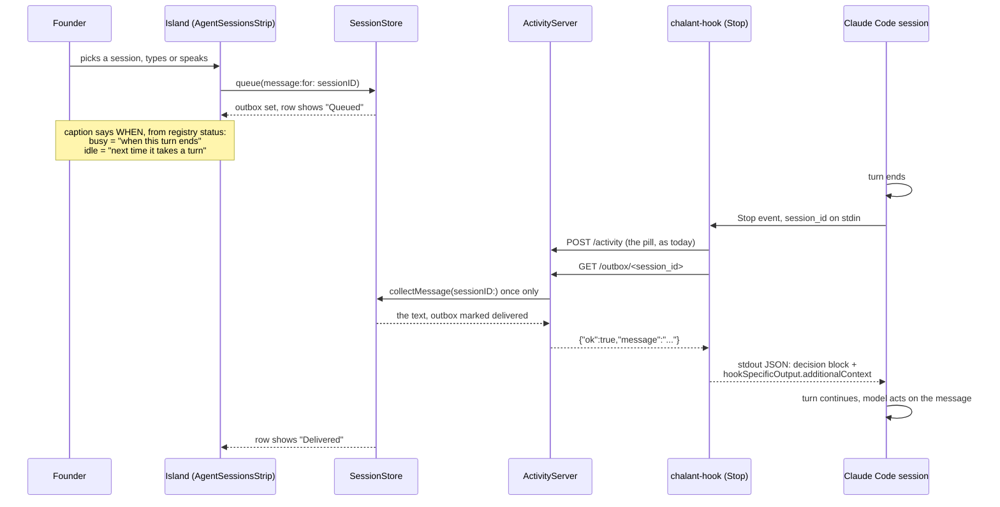
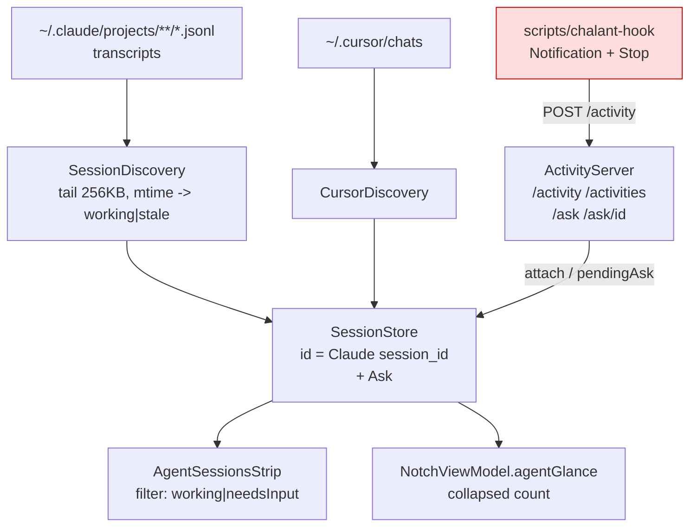
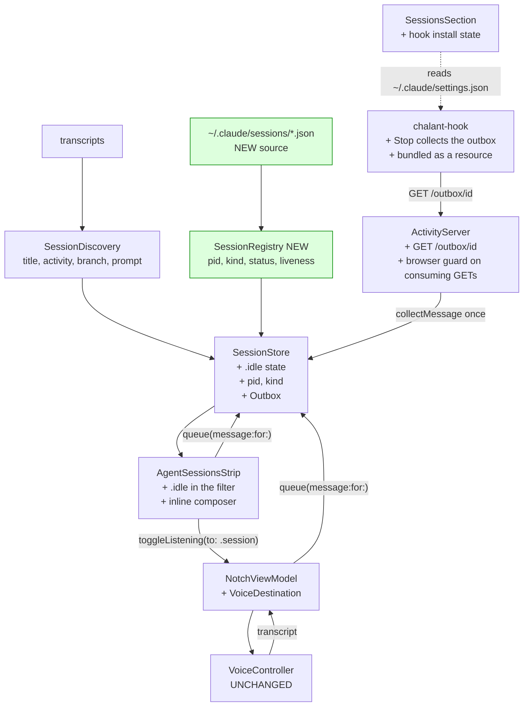

# Plan: choose a running agent session from the island, and send it a message

INNER-loop step 4 (architect). Input: `notch-messaging-evidence-2026-08-01.md`.
Method: dependency-graph sub-skill, then edge-case-deep-dive sub-skill.
Status: **PLAN ONLY. No product code was modified. The app was not launched.**

Cited to `file:symbol` against `feat/island-sessions-displays` @ `f5a3fcd`.

> **Tree caveat.** This was read and written while `composer-displays` had five
> files uncommitted (`NotchViewModel.swift`, `NotchWindowController.swift`,
> `Dashboard.swift`, `DashboardDisplays.swift`, `NotchRootView.swift`). That
> work landed as `56cd56c..f1799d1` while this document was being written, so
> line numbers in those five may have moved by a few. Everything here is cited
> by symbol name first and line second for that reason. **Re-resolve any line
> citation in those five files before editing it.** The only file both
> milestones touch is `NotchViewModel.swift`, and in different regions
> (displays owned the glance and geometry block, this owns the voice block and
> `agentGlance`).

---

## Summary

The ask is three things: pick a running session, send it a message typed or
spoken, and move the microphone to serve that. Two of the three are cheap
because the pieces already exist and point the right way. The third, the
microphone, is the one where the literal request would delete a working
feature, and this plan says so and proposes the nearest thing that is not
worse.

**The fact that makes this small:** `SessionStore.Session.id` is already Claude
Code's own `session_id` (`SessionStore.swift:41`), the transcript filename is
`<session_id>.jsonl` (`SessionDiscovery.jsonlFiles`), the registry file carries
the same `sessionId`, and `scripts/chalant-hook` already reads `session_id` off
stdin (`chalant-hook:51`). Four independent surfaces, one identifier, no join
to invent. The `/ask` route (`ActivityServer.swift:306-353`) already proves the
whole round trip end to end with that key.

**The shape of the feature is an inversion of one that already ships.** `Ask` is
agent asks, user answers on the island, agent polls and collects
(`SessionStore.attach` / `answer` / `pendingAsk` / `clearAsk`, and the CLI's own
comment at `scripts/chalant:57-59`: "Chalant cannot push an answer into a
running agent, so the agent comes and collects it"). This feature is user
speaks, island holds, agent collects. Same store, same server, same hook, same
once-only handover, direction flipped. **An outbox beside the existing ask.**

Three findings from reading change the shape of the work, and all three are
things nobody would discover from the evidence doc alone:

1. **`scripts/chalant-hook` is installed nowhere on this machine.** Checked
   `~/.claude/settings.json`, `~/.claude/settings.local.json`, and the project's
   `.claude/settings.json`: zero hits for `chalant-hook`. `Stop` is `null` in
   the user settings. So the injection path the whole feature depends on is a
   script that has never run. Building the composer without also building the
   install path ships a feature that does nothing on the founder's own Mac.
2. **`scripts/chalant-hook` is not in the app bundle.** `project.yml:17-24`
   bundles only the two MediaRemote resources. A shipped Chalant cannot tell a
   user where the hook is, because it does not carry one. The precedent for
   fixing that is two lines, right beside the perl adapter, resolved through
   `Bundle.main.url(forResource:)` (`MediaRemoteBridge.swift:62`).
3. **A live session that is waiting for you disappears from the island after
   five minutes.** `SessionDiscovery.refreshTrackedFile` calls anything whose
   transcript has been quiet past `staleWindow` (5 min) `.stale`, and both
   `AgentSessionsStrip.live` and `NotchViewModel.agentGlance` filter to
   `.working || .needsInput`. An idle session writes nothing, so it goes stale
   and vanishes. That is exactly the session you would most want to message, and
   it is currently invisible. The registry fixes it as a side effect.

**And the honest limit, unchanged from the evidence:** delivery happens at a
turn boundary and nowhere else. A busy session gets the message when its
current turn ends. An idle session has already fired its `Stop` hook, so it gets
the message the *next* time it takes a turn, which may be never. The interface
has to say which of those it is, before the send, not after. The registry's
`status: busy | idle` is the only thing on this machine that can tell them
apart, which is why liveness is workstream A and not an optional extra.

---

## What is settled, and what I am proposing

Marked plainly, because the founder has already been told once that a requested
feature was not buildable as asked.

| Claim | Status |
|---|---|
| `~/.claude/sessions/<pid>.json` exists, one file per live session, carrying `sessionId`, `pid`, `cwd`, `name`, `kind`, `status` | **Verified by me**, 4 files read on this machine, all 4 pids alive |
| Every registry `sessionId` has a transcript under `~/.claude/projects` and is in the freshest-12 window right now | **Verified by me**, 4 of 4. Not guaranteed in general, see EC-3 |
| A `Stop` hook returning `hookSpecificOutput.additionalContext` reaches the model and the conversation continues | **Confirmed in the evidence doc** against `code.claude.com/docs/en/hooks`. Not re-fetched here |
| `chalant-hook` is installed nowhere; `Stop` is null in user settings | **Verified by me** |
| `scripts/` is not bundled into the .app | **Verified by me**, `project.yml` |
| An idle live session goes `.stale` and leaves the strip | **Verified by reading**, `SessionDiscovery.staleWindow` + `AgentSessionsStrip.live` |
| `decision: "block"` is required alongside `additionalContext` for `Stop` | **Proposing belt and braces.** The evidence's own example carries both. Emitting both satisfies either reading, and `reason` is also the line the terminal user sees. See W-B note 4 |
| The payload field guarding a Stop-hook loop is `stop_hook_active` | **Believed, not verified.** The composer must confirm the exact key against a real payload. Once-only collection is the primary guard and does not depend on it |
| The registry is a stable contract | **No. It is undocumented.** This plan never lets it be the sole source of anything, precisely for that reason |

---

## Goals

1. A running Claude Code session can be picked from the expanded island and
   sent a message, typed or spoken, without leaving the island.
2. The island says, before the send, when that message will land, and says it
   differently for a busy session and an idle one.
3. A message is delivered exactly once, or the user is told it was not
   delivered. Never silently dropped, never delivered twice.
4. Voice keeps every destination it has today. Nothing a user can do with the
   microphone now stops working.
5. The island stops calling a live, waiting session "last seen".

## Non-goals

- Interrupting a running turn. No mechanism exists that does not require
  Accessibility, and the app deliberately holds none.
- A second messaging surface on the collapsed island. Composing needs a picker
  and a field; the collapsed island is between 40 and 200 points wide.
- Messaging Cursor sessions. `CursorDiscovery` rows carry `agent: .cursor` and
  ids prefixed `cursor:`; Cursor has no hook contract here. The affordance is
  absent on those rows, with a reason.
- Persisting a queued message across a Chalant restart. See EC-9.
- Writing the user's `~/.claude/settings.json` for them. See W-E and Open
  Question 2.

## Success criteria

- With the hook installed, typing a message to a **busy** session and watching
  its terminal shows the message arrive when that turn ends, and the island
  flips to Delivered at the same moment. Seen, not inferred.
- The same for a **spoken** message.
- A message queued for an **idle** session shows the honest caption before it
  is sent, and stays queued until that session takes a turn.
- Killing a session with a message queued shows "ended before reading this" on
  the island, with the text still recoverable.
- The microphone in the media row still runs Chalant verbs. The `.talk` hotkey
  and the collapsed long-press still run Chalant verbs.
- `xcodebuild test` stays green: 173 today, 173 + new.

---

## The mechanism, end to end



The only genuinely new object is the outbox. Everything else on that diagram
already exists and already runs.

---

## Architecture

### Before: what discovers a session today



Red: shipped, documented in the Sessions pane, and installed on no machine.

### After



Green: the two genuinely new things. `VoiceController` is untouched: the
transcript is a string, and where it goes is the caller's business.

### Why the registry is added and not substituted

The question was posed as either/or. It should not be, and here is the
accounting.

| | Transcripts | Registry |
|---|---|---|
| Human title (`aiTitle`) | yes | a derived folder name only |
| What it is doing now (`lastTool`) | yes | no |
| Last prompt, git branch, cwd | yes | cwd only |
| Actually alive | **no**, only "a file changed recently" | **yes**, plus a pid to check |
| busy vs idle | no | **yes** |
| Background agents, `blocked` | no | **yes** |
| Cursor sessions | via `CursorDiscovery` | never |
| Documented | no, but stable in practice and already shipped | **no, and undocumented** |

**Decision: keep the transcript scraper as the row source, add the registry as
a liveness overlay.** Three reasons, in order of weight:

1. Replacing the scraper deletes title, activity, last prompt and branch, which
   are the entire reason the sessions strip is worth looking at. The registry
   would give back a folder name.
2. The registry is undocumented. Sole-sourcing it means one Claude Code release
   that moves the directory blanks the whole sessions feature. As an overlay,
   the same release costs a busy/idle badge and nothing else, because
   `SessionRegistry` simply reports nothing and the shipped rules stand.
3. Cursor rows have no registry entry at all, and a registry-only store would
   drop them.

The cost of the overlay is one watcher and a join, and the join is free: the
key is identical on both sides, verified 4 for 4 on this machine.

---

## Dependency graph

### Touch set

1. `SessionStore.State` gains `.idle`
2. `SessionStore.Session` gains `pid`, `kind`, `outbox`
3. `SessionStore` gains `markLive`, `markGone`, `queue`, `collectMessage`,
   `failMessage`, `clearMessage`, `Session.canReceiveMessages`
4. `SessionStore.sort()` rank switch
5. `SessionRegistry` (new file)
6. `NotchViewModel.sessionRegistry` + `start()`
7. `NotchViewModel.agentGlance` filter
8. `NotchViewModel` voice block: `VoiceDestination`, `beginListening(to:)`,
   `toggleListening(to:)`, `endListening`, `agentMessageLogLine` (new static)
9. `ActivityServer.route` gains `GET /outbox/`, and a browser guard on
   consuming GETs (which also covers the existing `/ask/`)
10. `AgentSessionsStrip.live` filter, `rowLine` trailing button, new composer
11. `ExpandedView.MicButton` gains a `destination` (default `.chalant`)
12. `DashboardSections.SessionsSection` symbol/label switches + hook state card
13. `scripts/chalant-hook` Stop branch
14. `project.yml` bundles `scripts/chalant-hook`

No stored defaults key changes. No `Codable` field changes. No layout
migration: this adds **no** `IslandElement` (see W-C rationale).

```mermaid
graph TD
    T1["SessionStore.State + .idle"] --> C1["sort() rank switch"]
    T1 --> C2["DashboardSections.symbol"]
    T1 --> C3["DashboardSections.label"]
    T1 --> C4["AgentSessionsStrip.live filter"]
    T1 --> C5["NotchViewModel.agentGlance filter"]
    T1 --> C6["AgentSessions.rowLine glyph + a11y"]
    T1 --> C7["SessionStore.upsert :124<br/>questionOutstanding"]

    T2["Session + pid/kind/outbox"] --> C8["Session: Equatable"]
    T2 --> C9["canReceiveMessages"]

    T3["SessionRegistry NEW"] --> C10["markLive / markGone"]
    C10 --> T1
    T3 --> C11["NotchViewModel.start()"]

    T4["GET /outbox/id"] --> C12["collectMessage once"]
    T5["browser guard on<br/>consuming GETs"] --> C13["existing GET /ask/id"]

    T6["VoiceDestination"] --> C14["endListening branch"]
    T6 --> C15["MicButton call site"]
    T6 --> C16["talk hotkey ChalantApp:95"]
    T6 --> C17["long press NotchRootView:431"]
    T6 --> C18["logVoice body"]

    T7["chalant-hook Stop branch"] --> C19["every Claude session<br/>on the machine"]
    T8["project.yml resource"] --> C20["Bundle.main lookup"]

    style C1 fill:#fdd
    style C2 fill:#fdd
    style C3 fill:#fdd
    style C8 fill:#fdd
    style C4 fill:#ffd
    style C5 fill:#ffd
    style C6 fill:#ffd
    style C7 fill:#ffd
    style C13 fill:#ffd
    style C18 fill:#ffd
    style C19 fill:#ffd
```



Red: compile break. Yellow: silent behaviour change.

### Consumer table

| # | Consumer | Reached via | What changes | Class |
|---|---|---|---|---|
| 1 | `SessionStore.sort()` rank switch, `:233-241` | `.idle` added | exhaustive switch stops compiling | **compile break** (safe) |
| 2 | `DashboardSections.symbol(_:)` `:227-235` | `.idle` added | same | **compile break** (safe) |
| 3 | `DashboardSections.label(_:)` `:237-245` | `.idle` added | same | **compile break** (safe) |
| 4 | `SessionStore.Session: Equatable` | `Outbox` and `Kind` must be `Equatable` | synthesised, fails to compile if not | **compile break** (safe) |
| 5 | `AgentSessionsStrip.live` `AgentSessions.swift:27` | filter gains `.idle` | idle sessions appear in the strip that today do not. **Intended**: you cannot pick what is not listed | **silent** - verify visually |
| 6 | `NotchViewModel.agentGlance` `:335` | filter deliberately **not** changed | the collapsed count keeps meaning "things are happening". Adding idle would inflate the notch badge on the most-glanced surface | **none, by decision.** See Open Question 3 |
| 7 | `AgentSessions.rowLine` glyph and accessibility label `:81-84, :117-120` | ternaries on `needsInput` | an idle row currently renders identically to a working one, and the a11y label would say "working" about a session that is not | **silent-wrong if missed** |
| 8 | `SessionStore.upsert` `:123-124` | `questionOutstanding` overrides discovery | unchanged in form, but now three writers reach `state` (scraper, registry, ask) instead of two. The precedence rule has to be written down once | **silent** - see EC-1 |
| 9 | `ActivityServer.route` `GET /ask/<session>` `:334-353` | gains the browser guard | a page that guessed the token could previously consume a pending answer with a `fetch`. Same root as the new route, fixed once | **silent**, a hardening |
| 10 | `ChalantApp.swift:95-97` `.talk` hotkey | `toggleListening()` default arg | unchanged behaviour, but only because the default is `.chalant`. Get the default wrong and the hotkey silently routes to an agent | **silent-wrong if the default slips** |
| 11 | `NotchRootView` long press `:431` | `beginListening()` default arg | same | **silent-wrong if the default slips** |
| 12 | `NotchViewModel.endListening` `logVoice` `:941, :947` | new branch must not log the body | a message to an agent would otherwise be written verbatim into a preferences plist that is never cleared, exactly the bug `redactedForLog` exists to prevent | **silent-wrong** - EC-13 |
| 13 | `scripts/chalant-hook` | installed globally once, so it runs on **every** Claude Code session on the machine, including whatever is architecting and composing this milestone | a bug in the Stop branch is a bug in every agent the founder runs | **silent-wrong, blast radius maximal** |
| 14 | `ActivityStore` id space vs `SessionStore` id space | `chalant-hook:74` pushes `claude-$SESSION`; `/ask` and `/outbox` take the **bare** id | using the prefixed id on the outbox route 404s forever with nothing saying why | **silent-nothing** - EC-6 |
| 15 | `MessageCourier` staging | untouched | the "say send to confirm" flow for texting a **person** is a different thing from messaging an agent and stays separate. See Open Question 1 | none |
| 16 | `SessionStoreTests.swift`, 95 tests | `store.upsert(...)` call sites | new parameters must default, or 30 call sites break | **compile break if defaults are missed** |
| 17 | `DisplayConfigStore`, island geometry, `IslandLayout` | not touched | this plan adds no element and no stored layout field | none |

### The silent list, input to the edge-case pass

#5, #7, #8, #9, #10, #11, #12, #13, #14.

---

## Edge cases and failure modes

Severity ranked silent-wrong > silent-nothing > loud-wrong > cosmetic.

| # | Edge case | State that reaches it | Severity | Handling |
|---|---|---|---|---|
| EC-1 | Three writers race on `Session.state`: the scraper's rescan, the registry watcher, and `attach()` | every 20s, plus any fs event, plus any hook | **silent-wrong** (a waiting question loses its glyph, which is the bug fixed at `4d6ccff`, re-openable) | **W-A.** One precedence rule, written once in `SessionStore` and cited: an outstanding ask beats everything; then the registry; then the scraper. The registry never writes `state` when an ask is outstanding, mirroring `upsert:123-124` exactly |
| EC-2 | A message is queued for a session that is `idle` and never takes another turn | user messages a session sitting at its prompt | **silent-nothing**, and it is the shape of the feature, not a bug | **W-C.** Said before the send, not after: "waiting for input, this arrives the next time it takes a turn". Plus an Open Session button, which is `AgentSessionsStrip.go` already shipped. This is the honest answer, and it is not a good one. See "Not implementable as asked" |
| EC-3 | A live session whose transcript has fallen out of the freshest-12 window | a session left open all day with a busier one beside it (`SessionDiscovery.maxFilesToTrack = 12`) | **silent-nothing** - alive, messageable in principle, absent from the list | **W-A.** `markLive` creates a minimal row from registry data when the id is unknown: title from registry `name`, cwd from registry `cwd`, no activity. Registry is the liveness authority; the scraper only decorates |
| EC-4 | Registry directory does not exist (older Claude Code, or a fresh Mac) | any machine before this feature's Claude Code version | **silent-nothing** if it blanked the strip | **W-A.** `SessionRegistry.start()` returns early exactly as `SessionDiscovery.start()` does when `~/.claude/projects` is missing. The scraper's rules stand untouched, so the strip is exactly as good as today. Reconciliation only runs when a directory read **succeeded**; an unreadable directory must never be read as "every session ended" |
| EC-5 | A stale registry file: the process died without cleaning up | a `kill -9`, a crash | **silent-wrong** - the island offers to message a dead session | **W-A.** `kill(pid, 0)` on every entry. `pid` is in the filename and in the body; the body is the one to trust, and both are checked so a renamed file cannot lie |
| EC-6 | The hook asks `/outbox/claude-<id>` instead of `/outbox/<id>` | the hook already builds `claude-$SESSION` for the pill at `chalant-hook:74`, one line above | **silent-nothing** - permanent 404, message never delivered, nothing anywhere says why | **W-B.** The route takes the bare id. The hook's outbox curl uses `$SESSION`, and a comment sits between the two lines naming the trap. T-6 locks it |
| EC-7 | The message is handed to two hooks | a Stop hook that runs twice, or a retried curl | **silent-wrong** - the model acts on the same instruction twice | **W-B.** Collect is once-only, on the server, exactly as `/ask/<session>` does at `ActivityServer.swift:346-348`: read, clear, respond. The clear happens before the response is written |
| EC-8 | The Stop hook blocks forever, so the session never stops | any bug that makes the hook emit `decision: block` unconditionally | **loud-wrong** and expensive: an agent that cannot stop burns tokens | **W-B.** Two guards. Primary: the outbox is empty on the second Stop because collection cleared it, so the hook cannot block twice. Secondary: refuse to block when the payload says a Stop hook is already active (field believed to be `stop_hook_active`, to be confirmed against a real payload before it is relied on) |
| EC-9 | Chalant quits or crashes with a message queued | a relaunch, a crash, `./scripts/dev` | **silent-nothing** - the message is lost | **Deliberate: in memory, not persisted.** A persisted queue means a message typed on Monday arriving on Thursday, injected as instructions into an agent whose context has moved on. A lost message is visibly lost (the composer is empty on relaunch); a stale one is invisibly wrong. Named in the UI copy, not hidden |
| EC-10 | Two messages queued for one session before either is collected | the user thinks of something else | **silent-wrong** if the second replaced the first | **W-B.** `queue` appends, joined by a blank line, capped at `maxMessage`. The composer shows the whole pending text, so nothing is hidden. Overflow past the cap is refused with a count, never truncated silently |
| EC-11 | The session exits with a message still queued | closing the terminal, `Ctrl-C` | **silent-nothing** if the text just vanished | **W-A + W-B.** `markGone` flips the outbox to undelivered rather than clearing it, cancels the row's expiry timer (the same move `attach()` makes at `SessionStore.swift:191-192`), and flashes the glance. The row keeps the text with Copy and Dismiss |
| EC-12 | The destination sticks: a Chalant verb goes to an agent | speak to a session, then press the `.talk` hotkey | **silent-wrong**, and the worst outcome in this plan: a private note, a reminder, or a dictated text message injected into an agent's context | **W-D.** There is no mode. `beginListening(to:)` and `toggleListening(to:)` take the destination as a parameter defaulting to `.chalant`; `endListening` captures it at the top and resets to `.chalant` in the same statement, before any await. Every existing call site keeps the default and therefore keeps its behaviour |
| EC-13 | The spoken message body lands in the voice log | any spoken message to a session | **silent-wrong** (privacy) - `voiceLog` is a preferences array that is never cleared, which is the exact bug `redactedForLog` was written for | **W-D.** The session branch never passes the body to `logVoice`. It passes a shape, through a pure static beside `redactedForLog` so it is testable. T-5 locks it |
| EC-14 | A browser page consumes a queued message or a pending answer | a visited site issuing `fetch("http://localhost:4242/outbox/...")` | **silent-nothing**, gated behind guessing a 32-byte token | **W-B.** Consuming GETs refuse `request.fromBrowser`, the flag `ActivityServer.parse` already computes. One guard, applied to both `/outbox/` and the existing `/ask/`. The token remains the real wall; this is the second one |
| EC-15 | Message text breaks the hook's own JSON output | a message containing a quote, a newline, a backslash, or a lone surrogate | **silent-wrong** - malformed stdout, hook output ignored or misparsed | **W-B.** The hook builds its stdout with `json.dumps`, never string interpolation. The script already reaches for `python3` for precisely this reason (`chalant-hook:41-42`) and already has an `esc()` helper |
| EC-16 | Message text is unbounded | paste a file into the composer | **silent-wrong** - the whole thing becomes model context, and the island lays out a wall of text | **W-B.** `SessionStore.maxMessage = 2000`, trimmed and capped on the way in, mirroring `askFieldLimit`. Control characters other than newline and tab are stripped |
| EC-17 | A Cursor row is messaged | any Cursor session in the strip | **silent-nothing** - queued into a store nothing will ever collect | **W-C.** `canReceiveMessages` requires `agent == .claude`. The compose button is absent on Cursor rows, with a tooltip saying why |
| EC-18 | The hook is not installed | **today, on this machine** | **silent-nothing** - every message queues and nothing ever arrives | **W-E.** The composer is gated on the detected install state and says so, with a button that opens the Sessions pane. This is the difference between the feature working and the feature appearing to work |
| EC-19 | The Stop hook adds latency to every turn end on the machine | always, once installed | cosmetic in the good case | Loopback to a closed port returns `ECONNREFUSED` immediately, so Chalant being shut costs microseconds, not the timeout. `--connect-timeout 1 --max-time 2` bounds the pathological case where Chalant accepts and hangs. Only the Stop path adds the second curl; Notification keeps its one |
| EC-20 | The composer is dismissed mid-dictation | the user clicks away while listening | **silent-wrong** if the transcript then arrives at a destination that no longer exists | **W-D.** `voice.cancel()` exists (`VoiceController.swift:570`) and tears down without delivering. The composer calls it on dismiss when `state == .listening` and the destination is its own session |
| EC-21 | The registry watcher fires at high frequency | `statusUpdatedAt` is rewritten on every busy/idle transition | cosmetic (cost) | Debounced identically to `SessionDiscovery.scheduleDebouncedRescan` (0.5s), against a directory of four small files. Reuse the shape rather than invent one. `ponytail:` comment naming the ceiling |
| EC-22 | An idle session is messaged, then it goes busy on its own | the user types in the terminal at the same moment | cosmetic | The message is collected at the end of whatever turn that starts. This is the good case and needs no handling; named so nobody builds one |
| EC-23 | `agentGlance` and the strip disagree about how many sessions there are | always, once `.idle` is in the strip filter and not the glance | cosmetic | Deliberate, #6 above. The notch says "things are happening", the strip says "things exist". Named in a comment so a later reader does not "fix" it |
| EC-24 | The session id in the URL is percent-encoded, oversized, or contains a path traversal | a hostile local caller | loud-wrong at worst | Already handled by the shape of the existing route: `removingPercentEncoding`, then a dictionary lookup against known session ids. There is no filesystem path built from it. Capped at `ActivityServer.maxID` for symmetry with `capped(...)` |

**Deliberately deferred, with reasons:** EC-9 (persisting the queue is worse
than losing it), EC-22 (the good case), EC-23 (a decision, not a defect).
Everything in silent-wrong or silent-nothing is claimed by a workstream above.

---

## Workstreams

Five, each independently implementable and testable.

**Order:** W-E first, because without it nothing else can be seen to work on
this machine. Then W-A (the truth about liveness), W-B (the pipe), W-C (the
surface), W-D (the voice). W-C and W-D are the only pair with a hard edge:
W-D's mic button lives inside W-C's composer.

---

### W-E - the hook exists, is findable, and its state is visible

Smallest, and the reason the whole feature is currently invisible. Do it first.

**Files:** `project.yml`, `Chalant/Views/DashboardSections.swift`, one new small
type (put it in `SessionStore.swift` or its own file, composer's call, it is
about 25 lines).

1. `project.yml:17-24` - add `scripts/chalant-hook` with
   `buildPhase: resources`, beside the two MediaRemote entries. The precedent is
   right there and the lookup pattern is `MediaRemoteBridge.swift:62`.
2. New pure function, testable with no filesystem:
   ```swift
   /// Whether Claude Code is set up to hand this app a Stop event.
   ///
   /// Read from the user's own settings rather than assumed: the hook
   /// has shipped and been documented since 2026-08-01 and was
   /// installed on no machine, so every message queued would have sat
   /// there forever with nothing saying why.
   enum HookInstall {
       enum Status { case installed, missing, unreadable }
       static func status(settings: [String: Any]?) -> Status
   }
   ```
   `installed` iff some entry under `hooks.Stop[].hooks[].command` contains
   `chalant-hook`. Anything else is `missing`. A settings file that will not
   parse is `unreadable`, which must **not** render as `missing`: telling a user
   to install something they already have, because their JSON has a comma
   problem, is worse than saying nothing.
3. `SessionsSection` - replace the closing `SettingNote` at `:177-181` (the one
   that says "point Claude Code's Notification and Stop hooks at
   scripts/chalant-hook") with a card that shows the live status, the exact JSON
   to paste with the resolved bundle path already in it, and a Copy button.
   The pane already has `SettingCard`, `SettingNote`, `SettingDivider`.
4. `HookInstall.status` is exposed on the model so W-C can gate the composer.

**Contract:** `HookInstall.status(settings:)` is pure over a decoded dictionary.
Nothing else in this workstream has logic worth testing.

**The one runnable check:** `testTheHookReadsAsInstalledOnlyWhenAStopHookPointsAtIt`
in `SessionStoreTests.swift`. Feeds four dictionaries: a Stop hook naming
`chalant-hook` (installed), a Stop hook naming something else (missing), a
Notification-only install (missing, because Notification is not the injection
path), and `nil` (unreadable, not missing).

---

### W-A - liveness, from the registry Claude Code already writes

**Files:** new `Chalant/Features/SessionRegistry.swift` (~130 lines),
`Chalant/Features/SessionStore.swift`, `Chalant/NotchViewModel.swift` (two
lines), `Chalant/Views/AgentSessions.swift`,
`Chalant/Views/DashboardSections.swift`.

5. `SessionStore.State` gains `case idle`. Rank between `needsInput` and
   `working`? No: **after** `working`. A session that is doing something
   outranks one that is waiting for you to speak first, and `needsInput`
   already covers "it asked you a question". So the rank becomes
   `needsInput 0, working 1, idle 2, stale 3, failed 4, done 5`.
6. `SessionStore.Session` gains:
   ```swift
   /// The live process, when the registry knows of one. nil means
   /// "discovered from a transcript only", which is not proof of life.
   var pid: pid_t?
   /// interactive or background. A background agent has no terminal to
   /// go to, so the row's tap target differs.
   var kind: Kind?
   ```
   `Kind` is a two-case `String`-backed enum. Both `Equatable`, or `Session`'s
   synthesised conformance breaks (consumer #4).
7. `SessionStore.markLive(id:name:cwd:pid:kind:status:)` - the registry's one
   entry point:
   - unknown id: create the row from registry data alone (EC-3). Title is the
     registry `name`, `activity` nil.
   - known id: write **only** `pid`, `kind`, and `state`. Never touch `title`,
     `cwd`, `activity`, `lastPrompt`, `branch`; those belong to the scraper and
     a second upsert path would blank them on every registry tick.
   - an outstanding ask wins over both, the same test the scraper is held to at
     `:123-124`. Write the precedence rule once, in a comment above this
     function, and cite `4d6ccff` (the commit where a rescan cancelled a
     waiting question).
8. `SessionStore.markGone(_ ids: Set<String>)` - ids the registry reported last
   time and does not report now. Sets `.stale` (not `.done`: a killed session
   did not finish, and claiming an outcome we cannot know is the kind of lie
   this codebase does not tell), clears `pid`, and flips a pending outbox to
   undelivered (EC-11).
9. `SessionRegistry`, modelled directly on `SessionDiscovery`: a
   `DispatchSourceFileSystemObject` on the directory, a debounced rescan, and
   two **pure static** functions so the awkward part is testable without a
   running Claude Code:
   ```swift
   struct Entry: Equatable { sessionId, pid, cwd, name, kind, status }
   static func parse(_ data: Data, filename: String) -> Entry?
   static func state(for entry: Entry, alive: (pid_t) -> Bool) -> SessionStore.State?
   ```
   `state(for:)` returns `.working` for busy, `.idle` for idle, `nil` when the
   pid is dead. `parse` refuses an entry whose filename pid and body pid
   disagree (EC-5), and refuses a `cwd` that is not absolute, exactly as
   `SessionDiscovery.parseMetadata` does at `:318`.
10. `start()` returns early when the directory is absent (EC-4), the same guard
    as `SessionDiscovery.start():120-125`. Reconciliation runs only when the
    directory listing **succeeded**.
11. `NotchViewModel`: one `private lazy var sessionRegistry` beside
    `sessionDiscovery` at `:205`, one `sessionRegistry.start()` in `start()`
    beside `:492`.
12. `AgentSessionsStrip.live` `:27` gains `.idle`. `rowLine`'s glyph and
    accessibility label `:81-84, :117-120` gain the idle case: a hollow circle,
    and "waiting for input" rather than "working" (consumer #7).
13. `DashboardSections.symbol` / `.label` gain `.idle`: `"pause.circle"` and
    `"Waiting for input"`.
14. `NotchViewModel.agentGlance` `:335` **stays as it is**, with a comment
    saying the omission is deliberate (EC-23).

**Contract:** `SessionRegistry.parse` and `.state(for:alive:)` are pure.
`markLive` never writes a field the scraper owns. `markGone` never fires from a
failed directory read.

**The one runnable check:**
`testALiveSessionSittingAtItsPromptReadsAsIdleNotStale` - parse a real registry
JSON body, `state(for:alive: { _ in true })` with `status: "idle"` is `.idle`;
with a dead pid it is nil; and after `markLive` the row's `title` and `activity`
from a prior scraper `upsert` are still intact. That last assertion is the one
that catches the two-writers bug, which is the expensive one.

---

### W-B - the outbox, and the hook that collects it

**Files:** `Chalant/Features/SessionStore.swift`,
`Chalant/Features/ActivityServer.swift`, `scripts/chalant-hook`.

15. `SessionStore`:
    ```swift
    /// A message the user left for a session, waiting for that session
    /// to come and collect it.
    ///
    /// The mirror image of `Ask`, and deliberately the same shape: the
    /// island cannot reach into a running agent, so the agent comes and
    /// collects, exactly as it already does for an answer.
    struct Outbox: Equatable {
        var text: String
        var queuedAt: Date
        var deliveredAt: Date?
        /// The session went away before it read this.
        var undelivered: Bool
    }

    /// Longest message that may be queued. This becomes model context
    /// in another process, so it is bounded here rather than trusted.
    static let maxMessage = 2000

    @discardableResult func queue(message: String, for sessionID: String) -> Bool
    func collectMessage(sessionID: String) -> String?
    func failMessage(sessionID: String)
    func clearMessage(sessionID: String)
    ```
    plus on `Session`:
    ```swift
    /// Whether a message left here has somewhere to land. Cursor keeps
    /// no hook contract with this app, and a session the registry has
    /// stopped listing has no process to collect anything.
    var canReceiveMessages: Bool { agent == .claude && state != .stale }
    ```
16. `queue` validation, mirroring `attach()`'s at `:170-186`: trim, refuse
    empty, refuse an unknown session, refuse `!canReceiveMessages`, strip
    control characters other than newline and tab, append to an existing
    pending message joined by a blank line, refuse rather than truncate past
    `maxMessage` (EC-10, EC-16).
17. `collectMessage` is once-only: read the text, set `deliveredAt`, clear the
    text, return. The clear happens before the caller can write a response, the
    same ordering `clearAsk` gets at `ActivityServer.swift:348`.
18. `ActivityServer.route` gains:
    ```
    case ("GET", let path) where path.hasPrefix("/outbox/"):
    ```
    returning `{"ok":true,"message":"..."}` when there is one and
    `{"ok":true,"message":null}` when there is not. **Never a 404 for an empty
    outbox**: the hook runs on every turn end of every session, and a 404 as the
    normal case makes any real failure unreadable.
19. Consuming GETs refuse browser callers. `route` already computes
    `request.fromBrowser` at `:214-217` and already refuses non-GET from
    browsers at `:259-263`. Extend that to the two GETs that mutate,
    `/outbox/<id>` and the existing `/ask/<id>`, with the comment saying why a
    GET is being treated as a write here (EC-14). One guard, both routes: the
    sibling is fixed by the same line rather than left for later.
20. `scripts/chalant-hook`, Stop branch only:
    - after the existing pill curl, `GET /outbox/$SESSION` with
      `--connect-timeout 1 --max-time 2`. **`$SESSION`, not `claude-$SESSION`**;
      a comment between the two lines says so, because the line above it builds
      the prefixed form (EC-6).
    - a `python3` block reads the response and, when a message is present,
      prints exactly one JSON object on stdout built with `json.dumps`:
      ```json
      {"decision": "block",
       "reason": "A message arrived from Chalant.",
       "hookSpecificOutput": {"hookEventName": "Stop",
                              "additionalContext": "<the message>"}}
      ```
      Both fields, because the evidence's own example carries both and only one
      of the two readings of the docs is confirmed; `reason` is also the line
      the terminal user sees, which is worth having on its own (a message
      appearing from nowhere in someone's terminal is worse than one that names
      where it came from).
    - refuse to emit anything when the payload says a Stop hook is already
      active (EC-8, secondary guard).
    - every other path still exits 0 and prints nothing to stdout, which is the
      script's standing contract at `:24-26`.

**Contract:** exactly-once delivery. `queue` bounded and validating. The hook
prints either nothing or one well-formed JSON object, and never blocks twice.

**The one runnable check:** `testAQueuedMessageIsHandedOverExactlyOnce` -
`queue` then `collectMessage` returns the text, the second `collectMessage`
returns nil, `deliveredAt` is set, and a `queue` for a `.stale` session or a
`.cursor` session is refused. That single test covers EC-7, EC-10, EC-17 and
the `canReceiveMessages` gate.

---

### W-C - the surface: pick a session, compose to it

**Files:** `Chalant/Views/AgentSessions.swift` (all of it),
`Chalant/NotchViewModel.swift` (nothing, if the strip holds its own state).

**No new `IslandElement`.** The `sessions` element already exists, is already
placeable, already lists exactly the rows you would pick from, and already
renders a card beneath a row when that row has something to say (`AskCard`,
`AgentSessions.swift:65-69`). A second element would mean two elements that both
list sessions, plus a stored-layout migration (`IslandLayout.knownElements`) for
a surface that already has a home. The composer goes in the slot `AskCard`
occupies, under the row it belongs to.

**Not the collapsed island.** Composing needs a field and a picker; the
collapsed island is 40 to 200 points wide (`NotchRootView.collapsedSize`).
The collapsed island already carries the agent glance and already opens the
expanded island on a click, and the sessions strip is right there when it does.
That path is one click today and needs no code.

21. `AgentSessionsStrip` gains `@State private var composing: String?`, one at a
    time.
22. `rowLine` gains a trailing compose button, present only when
    `session.canReceiveMessages`. Precedent for a trailing action on a row:
    `ActivitiesStrip`'s clear button at `ExpandedView.swift:419`. **The row's
    tap keeps meaning "go to this session"** (`AgentSessions.go`, `:130-133`) -
    that is shipped behaviour and a second meaning on the same target would
    take it away.
23. A `ComposeCard` beneath the row, mirroring `AskCard`'s construction: a
    `TextField` (`chalantField()` exists, `Components.swift:105`), a send
    button, a mic button (W-D), and one status line. States, all six, with the
    copy written out because vagueness here is the whole failure mode:

    | Row state | Line under the field |
    |---|---|
    | busy | "Arrives when this turn ends." |
    | idle | "Waiting for input. This arrives the next time it takes a turn." + an Open session button |
    | hook missing (W-E) | "Claude Code is not set up to receive these yet." + an Open settings button, and the field disabled |
    | queued | "Queued." + Cancel |
    | delivered | "Delivered." then the card closes on its own |
    | undelivered | "<name> ended before reading this." + Copy + Dismiss |

24. `live` already gained `.idle` in W-A, so an idle session is pickable.
25. The card is one line of field plus one line of status, never more. The
    island is a glance surface and this is the row that could balloon it.

**Contract:** the composer never queues to a session that cannot receive; the
status line is derived from `state` and `outbox` and never from a timer.

**The one runnable check:** covered by W-B's `canReceiveMessages` assertions;
the view itself has no logic worth a test that a screenshot would not catch
better. This is stated rather than papered over: **W-C's real check is V3 in
the verification plan, and it is a photograph.**

---

### W-D - one microphone, a named destination, nothing lost

**What the microphone does today, established by reading before proposing
anything:**

- `MicButton` (`ExpandedView.swift:483-502`) calls `model.toggleListening()`.
- It is rendered inside `topRow` (`:267-282`), which is what `case .media`
  draws (`:213-214`). **So the mic is part of the media element**: remove media
  from the layout and the mic goes with it.
- `toggleListening` -> `startListening` -> quiets the room, `state = .listening`
  (the 380x192 listening view), `voice.begin()`.
- `endListening` -> `tab = .ask`, `state = .expanded`, then
  `voice.end { spoken in model.submit(spoken) }`.
- `submit` -> `ActionEngine.handle` -> reminders, timers, notes, focus, music,
  texting a person via `MessageCourier`, then Apple Intelligence.
- **There are three doors into that same pipeline**, not one: the mic button,
  the collapsed island's long press (`NotchRootView:411-433` ->
  `beginListening()`), and the `.talk` global hotkey (`ChalantApp:95-97`).

So "the microphone" is not a button. It is one of three entrances to a single
voice pipeline whose destination is `submit()`. **Moving it means choosing a
destination for a transcript, not moving a control.**

Three ways to read the ask, and what each costs:

| | What it means | What the user loses |
|---|---|---|
| Move it | the mic relocates into the composer and Chalant verbs lose their only visible affordance | reminders, timers, notes, focus and dictated texts by voice, except through an invisible hotkey. **This deletes a working feature** |
| Modal | one mic, a toggle between Chalant and a session | nothing, if the mode is always visible. But an invisible mode is exactly how a private note ends up in an agent's context |
| Destination per entrance | the composer has its own mic; the media-row mic keeps meaning Chalant | nothing at all |

**Recommendation: destination per entrance.** It is what the founder actually
asked for ("so the users can just speak and send messages to the agent
sessions") without being what they literally said, and it costs nothing. When
you are composing to a session, the mic in front of you sends there. When you
are not, the mic means what it has always meant.

**Files:** `Chalant/NotchViewModel.swift` (voice block only),
`Chalant/Views/ExpandedView.swift` (`MicButton` gains a parameter),
`Chalant/Views/AgentSessions.swift` (the composer's mic),
`Chalant/Views/NotchRootView.swift` (one line in `listeningContent`).

26. ```swift
    /// Where the next transcript goes. Passed in at every entrance
    /// rather than stored as a mode: a sticky destination would send
    /// the next reminder, note or text message into an agent's context
    /// with nothing on screen having changed.
    enum VoiceDestination: Equatable {
        case chalant
        case session(id: String, title: String)
    }
    ```
27. `beginListening(to:)` and `toggleListening(to:)` take it, **defaulting to
    `.chalant`**, so all three existing call sites keep their behaviour without
    being edited (consumers #10, #11).
28. `endListening` captures the destination at the top and resets to `.chalant`
    in the same statement, before any await:
    ```swift
    let destination = voiceDestination
    voiceDestination = .chalant
    if case .chalant = destination { tab = .ask }
    ```
    The `tab = .ask` move matters: today `endListening:925` sets it
    unconditionally, which would throw the user off the composer onto the answer
    surface mid-message.
29. The completion branches once. `.chalant` calls `submit(spoken)` and
    `logVoice` exactly as today. `.session` calls
    `sessions.queue(message: spoken, for: id)` and logs a **shape**, never the
    body (EC-13), through a new pure static beside `redactedForLog`:
    ```swift
    /// A message bound for an agent is the same class of thing as one
    /// bound for a person: the user's own words, going somewhere else.
    /// `voiceLog` is a preferences array that is never cleared, so the
    /// body never reaches it. Only where it went and how long it was.
    static func agentMessageLogLine(title: String, text: String) -> (String, String)
    ```
30. `MicButton` gains a `destination` with a `.chalant` default and a `help`
    string that names the destination, so the two mics are never ambiguous.
31. `listeningContent` gains one line naming the destination when it is a
    session. Speaking into a full-screen listening view with no idea where the
    words are going is the failure this prevents.
32. The composer calls `voice.cancel()` on dismiss while listening to its own
    session (EC-20). `cancel()` already exists at `VoiceController.swift:570`
    and tears down without delivering.

**`VoiceController` is not touched.** Device selection, the silence watchdog,
the file-rescue path, the generation counter, the failure copy: all of it is
about getting a transcript, and none of it cares where the transcript goes.

**Contract:** no mode. Every entrance names its destination. `endListening`
resets unconditionally. The body of a session-bound message never reaches
`voiceLog`.

**The one runnable check:** `testTheVoiceTrailNeverCarriesAnAgentMessagesBody` -
`agentMessageLogLine(title: "chalant", text: "the secret thing")` contains
neither "secret" nor "thing", contains "chalant", and reports a word count. Pure,
no `NotchViewModel` instance, beside the existing `redactedForLog` tests.

---

## Test plan

House style holds: pure statics and the injectable stores. `SessionStore` is
`@MainActor` but constructs nothing and touches no IO, and the existing 95 tests
already build it directly (`SessionStoreTests.swift:16`), so the outbox and the
liveness merge are testable for real rather than by proxy. Nothing here
constructs a `NotchViewModel`.

| # | Test | W | What it catches |
|---|---|---|---|
| T1 | `testALiveSessionSittingAtItsPromptReadsAsIdleNotStale` | W-A | The bug this feature is built on top of: a waiting session going stale and leaving the strip. Also asserts `markLive` left `title` and `activity` alone, which is the two-writers bug |
| T2 | `testARegistryEntryWhoseProcessIsGoneIsNotALiveSession` | W-A | EC-5. `state(for:alive: { _ in false })` is nil, and a filename/body pid mismatch parses as nil |
| T3 | `testTheRegistryGoingSilentNeverBlanksTheStrip` | W-A | EC-4 and the dangerous half of EC-11: `markGone(ids: [])` after a failed read changes nothing, and `markGone` for a real id sets `.stale` rather than dropping the row |
| T4 | `testAQueuedMessageIsHandedOverExactlyOnce` | W-B | EC-7, EC-10, EC-17 in one: second collect is nil, a second `queue` appends rather than replaces, a Cursor session and a stale session both refuse |
| T5 | `testTheVoiceTrailNeverCarriesAnAgentMessagesBody` | W-D | EC-13. Privacy, and the one failure here that cannot be undone once it has happened |
| T6 | `testTheHookReadsAsInstalledOnlyWhenAStopHookPointsAtIt` | W-E | EC-18, plus the `unreadable != missing` distinction |
| T7 | `testAMessageTooLongIsRefusedRatherThanTruncated` | W-B | EC-16. A silent truncation would hand a model half an instruction, which is worse than none |
| T8 | `testAnOutstandingQuestionStillOutranksTheRegistry` | W-A | EC-1, and a direct regression guard on `4d6ccff`, which fixed exactly this for the other writer |

**Not tested, deliberately, and said out loud:** the composer's six status
states, the hook script itself, and the end-to-end injection. The first is a
view with no logic; the second is bash calling curl calling another process; the
third needs a live Claude Code session. All three are covered by the
verification plan below, which is where they belong. **Claiming this feature
works from a green build alone would be dishonest**, and the branch's own
standing rule says so (`docs/PLAN.md:14-16`).

**Command:** `xcodebuild -scheme Chalant -destination 'platform=macOS' test`.
Baseline 173.

---

## Verification plan: what must be seen

`osascript` is blocked in this environment (session memory), so the app is
driven with `open -a` and the `com.cj.chalant.debug.submit` distributed
notification (`NotchViewModel:507-511`), never synthetic clicks.
`screencapture -D <n>` per display.

### V0 - install the hook, before anything (do this first)

The founder's `~/.claude/settings.json` has no Stop hook at all today. Add
`chalant-hook` to `hooks.Stop`, restart one Claude Code session, and confirm a
pill appears on the island when that session finishes a turn. **If that does not
work, nothing downstream in this plan can.** This is the one prerequisite the
whole milestone rests on and it has never been exercised on this machine.

### V1 - W-A, a waiting session stays on the island

1. Open a Claude Code session in a terminal and leave it at its prompt for six
   minutes. Open the island.
2. **Expected:** the row is still there, reading "Waiting for input". Today it
   is gone after five (`staleWindow`).
3. Type something in that terminal. **Expected:** the row flips to working
   within a second, without a rescan.
4. `Ctrl-C` the session. **Expected:** the row goes to "Last seen" within a
   second, not after five minutes.

### V2 - W-B, a message actually arrives

5. Session **busy** on a long build. Queue a message from the island. Watch the
   terminal. **Expected:** the message appears at the end of that turn, named as
   coming from Chalant, and the agent acts on it. Capture the terminal.
6. The island at the same moment. **Expected:** Queued, then Delivered.
7. Queue a second message before the first is collected. **Expected:** the
   composer shows both, one blank line between them, and both arrive together.
8. Queue a message for an **idle** session. **Expected:** it does not arrive.
   Press return in that terminal. **Expected:** it arrives at the end of the
   turn that starts. This is the case the caption promised, seen.

### V3 - W-C, the surface

9. The expanded island with three sessions running, one waiting. Capture.
   **Expected:** a compose button on every Claude row, none on a Cursor row.
10. Open the composer on a busy session and on an idle one. Two captures.
    **Expected:** two different captions, and the idle one carries the Open
    session button.
11. Kill a session with a message queued. Capture. **Expected:** "ended before
    reading this", the text still there, Copy and Dismiss.
12. With the hook uninstalled, open the composer. Capture. **Expected:** the
    field is disabled and says why. This is the state the founder's machine is
    in right now, so it is the first thing they will see.

### V4 - W-D, voice, and the regression guard that matters most

13. Composer open on a session, press its mic, speak. **Expected:** the
    listening view names the session; the transcript queues to it; the island
    does not jump to the Ask tab.
14. **Immediately after**, press the `.talk` hotkey and say "remind me to call
    amma at 6". **Expected:** a reminder. Not a message to the agent. This is
    EC-12 and it is the single most important thing to see in this plan.
15. Press the media-row mic and say "focus 25". **Expected:** focus starts.
16. `defaults read com.cj.chalant voiceLog`. **Expected:** the spoken message
    from step 13 appears as a shape, and its words do not appear at all.

### V5 - W-E and backward compatibility

17. Remove the Stop hook again, relaunch, open the Sessions pane. Capture.
    **Expected:** "not set up", the JSON snippet with the bundle path resolved,
    a Copy button.
18. Corrupt `~/.claude/settings.json` with a trailing comma. **Expected:** the
    pane says it cannot read the settings, not that the hook is missing.
19. Move `~/.claude/sessions` aside, relaunch. **Expected:** the strip works
    exactly as it does today, with no idle rows and no busy/idle badge, and
    nothing anywhere reads as broken. This is EC-4, and it is what protects the
    whole feature from an undocumented directory moving.

---

## Not implementable as asked

Three, stated plainly.

**1. "Send a message to a running agent" cannot interrupt a running turn.** No
hook fires mid-run; there is no local socket, no `claude send`, and the one
shipping mechanism that does this (`--remote-control`) routes through
Anthropic's bridge, not a local API. The nearest thing that is buildable is what
this plan builds: the message waits at the turn boundary. For a busy session
that is seconds to minutes and reads as natural. **For an idle session it may be
forever**, and no amount of interface design fixes that. What the interface can
do, and what W-C does, is say so before the send and put the terminal one click
away.

**2. A rejected alternative for the idle case, named so nobody rediscovers
it.** `claude --resume <session-id> -p "<message>"` would start a second process
against the same transcript. Two processes appending to one `.jsonl` is a
data-loss shape, and the evidence lists this as unestablished rather than
merely unattractive. It is not in this plan. If the founder wants it revisited,
the experiment is one command against a scratch session and a diff of the
transcript before and after, and it should be run against a throwaway session
and never a real one.

**3. "Move the microphone button over there" would delete a working feature.**
The mic is one of three entrances to the voice pipeline that runs reminders,
timers, notes, focus and dictated text messages, and it is the only visible one.
Relocating it to the composer leaves those behind an invisible hotkey. W-D does
what the request was for, by giving each entrance a destination instead of
giving the app a mode. **What the user loses: nothing.** What they gain over the
literal reading: the media-row mic keeps working, and there is no invisible
state that could send a private note to an agent.

---

## Open questions for the founder

1. **Should messaging an agent reuse the "say send to confirm" staging that
   texting a person uses?** Texting a human stages the message and requires the
   word "send" (`ActionEngine.handle:69-106`), because an unconfirmed message
   reaching a person cannot be taken back. An agent is not a person, the message
   is visible in the composer before it goes, and a confirmation step on every
   message would make the feature tedious. **Default if you say nothing: no
   confirmation step, send on return or on the mic release.**

2. **Should Chalant offer to write `~/.claude/settings.json` for you?** W-E
   shows the state and hands you the JSON. A one-click install means merging
   into another program's config: a backup, an atomic write, handling a
   `settings.json` that is a symlink, and merging with a Stop hook you already
   have. That is a real feature with a real way to ruin somebody's setup, and
   it should be its own round. **Default: copyable snippet only, this round.**

3. **Should the collapsed island's agent count include idle sessions?** W-A adds
   them to the strip (you cannot pick what is not listed) but deliberately not
   to the notch badge, so "3 agents" keeps meaning "three things are happening"
   rather than "three terminals are open". **Default: keep them out of the
   badge.**

4. **What happens to a message queued when Chalant quits?** This plan loses it,
   on purpose (EC-9): a message typed Monday and injected Thursday is worse than
   one that never went. If you want it persisted, say so and the plan grows an
   expiry, a "this has been waiting since Monday, still send it?" confirmation,
   and a defaults key. **Default: lost, visibly.**

5. **Sequencing.** The displays milestone landed as `56cd56c..f1799d1` while
   this was being written, so the conflict this question was raised about is
   already resolved. What remains is that a composer must re-resolve line
   citations in the five files that milestone touched before editing them.
   **No decision needed unless you want this milestone held for a round.**
